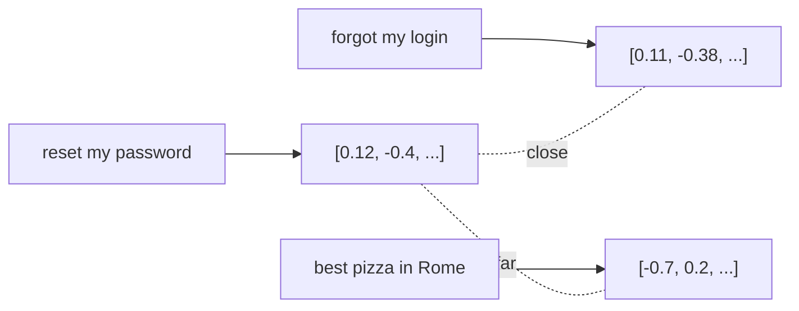

<LevelBadge level="intermediate" />

**Эмбеддинг** превращает фрагмент текста в список чисел (**вектор**), который улавливает его *смысл*. Тексты со схожим смыслом получают векторы, расположенные близко друг к другу, — даже если у них нет общих слов. Это и есть трюк, стоящий за **семантическим поиском** и [RAG](/docs/foundations/rag).

## Интуиция

Представьте, что каждое предложение размещено как точка в огромном многомерном пространстве, устроенном так, что **схожие смыслы располагаются рядом**. «Как мне сбросить пароль?» оказывается рядом с «Я забыл свой логин» и далеко от «лучшая пицца в Риме».

## Семантический поиск против поиска по ключевым словам

- **Поиск по ключевым словам** сопоставляет буквальные слова («пароль» находит «пароль»).
- **Семантический поиск** сопоставляет *смысл* — «я не могу войти» находит документ о сбросе пароля даже без слова «пароль».

Лучшие результаты часто даёт **сочетание** обоих (гибридный поиск).

## Как работает векторный поиск

1. **Эмбеддьте** ваши документы (обычно разбитые на **чанки**) и сохраните векторы в **векторной базе данных**.
2. Во время запроса **эмбеддьте запрос**.
3. Найдите **ближайшие** векторы (по косинусной близости / расстоянию).
4. Верните эти чанки — обычно чтобы передать их в [RAG](/docs/foundations/rag).

## Практические заметки

- **Чанкинг имеет значение.** Слишком большие = зашумлённые совпадения; слишком маленькие = потерянный контекст. Настраивайте.
- **Используйте одну модель эмбеддингов последовательно** — векторы от разных моделей несопоставимы.
- **Метаданные + фильтры** (дата, источник, тип) делают извлечение гораздо точнее.
- Векторная БД нужна не всегда — для небольших корпусов сгодится простой поиск в памяти.

## Дальше

- [Генерация с дополнением извлечением (RAG)](/docs/foundations/rag)
- [Дообучение против промптинга против RAG](/docs/foundations/finetune-vs-prompt-vs-rag)
- [Галлюцинации и как их уменьшить](/docs/foundations/hallucinations)
