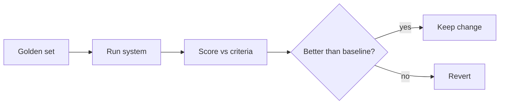

<LevelBadge level="advanced" />

Если вы выпускаете что-либо построенное на ИИ, **оценки (evals)** — это то, как вы узнаёте, что оно работает, и как вы узнаёте, что изменение сделало его лучше, а не хуже. Без них вы летите вслепую: правка промпта, которая помогает одному случаю, может незаметно сломать десять других.

## Минимально жизнеспособная оценка

Чтобы начать, фреймворк не нужен:

1. **Соберите эталонный набор.** 20–100 реальных входных данных с *правильными* или *приемлемыми* выходными данными (или с чёткими критериями). Охватите лёгкие случаи, хитрые и крайние случаи, которые вас уже кусали.
2. **Определите, что значит «хорошо»** для каждой задачи — точное совпадение, содержит ключевые факты, валидная JSON-схема, нет выдуманных чисел, тон и т. д.
3. **Прогоните и оцените** вашу текущую конфигурацию по этому набору.
4. **Измените одну вещь** (промпт, модель, извлечение), прогоните заново, **сравните**. Оставляйте изменение только если оценка улучшается.

## Выбор метрик

- **Детерминированные проверки** где возможно: схема валидна? содержит правильное значение? код проходит тесты? Они дёшевы и заслуживают доверия.
- **LLM в роли судьи** для размытого качества (полезность, тон): пусть модель оценивает результаты по рубрике. Полезно, но **калибруйте** — у судей есть искажения (длина, позиция). Сверьте судью с человеческими оценками на выборке.
- **Человеческая проверка** для среза с самыми высокими ставками.

## Когда их запускать

- **До/после любого изменения промпта или модели.**
- **При миграции модели** — новая модель может изменить поведение ([Ошибки и миграция](/docs/api/errors-and-rate-limits)).
- **В CI** для продакшен-систем, в качестве шлюза.

:::tip Разделяйте этапы
Для [RAG](/docs/foundations/rag) и [агентов](/docs/api/building-agents) оценивайте каждый этап (нашло ли извлечение нужный документ? был ли инструмент вызван правильно?) — а не только финальный ответ. Это локализует сбои.
:::

## Дальше

- [Галлюцинации и как их уменьшить](/docs/foundations/hallucinations)
- [Построение агентов на API](/docs/api/building-agents)
- [Выбор модели и провайдера](/docs/foundations/choosing-a-model-provider)
