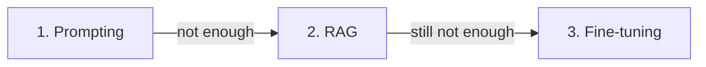

<LevelBadge level="intermediate" />

Когда модель делает не то, что вы хотите, есть три рычага — и люди первым делом хватаются за самый дорогой. Вот порядок, который действительно работает.

## Пробуйте в этом порядке

### 1. Промптинг — начинайте всегда здесь
Более чёткие инструкции, примеры, роль, ограничения вывода ([Основы промптинга](/docs/prompting/basics)). Это исправляет **большинство** проблем, не стоит ничего дополнительно и итерируется мгновенно. Большая часть «модель плохо справляется с X» на деле оказывается «промпт был расплывчатым».

### 2. RAG — когда нужны *ваши* знания
Если пробел — это **отсутствующая или свежая информация** (ваши документы, ваши данные, текущие факты), добавьте [RAG](/docs/foundations/rag). Это сохраняет знания обновляемыми и цитируемыми, не трогая модель.

### 3. Дообучение — крайнее средство, для *поведения/формата* в масштабе
Дообучение дополнительно тренирует модель на ваших примерах. Прибегайте к нему только когда промптинг + RAG не могут добиться стабильного **стиля, формата или поведения в задаче**, а у вас есть **много качественных примеров** и объём, который это оправдывает.

## Таблица решений

| Ваша проблема | Хватайтесь за |
|---|---|
| Расплывчатые/неверные результаты, неправильный формат | **Промптинг** |
| Не знает ваших данных / нужна актуальная информация | **RAG** |
| Нужен очень специфичный стиль/поведение, стабильно, в масштабе | **Дообучение** |
| Нужно совершать действия | (Не эти — это [использование инструментов/агенты](/docs/api/tool-use)) |

## Почему люди ошибаются

Дообучение *звучит* как «обучение модели», поэтому кажется настоящим решением. Но это самый медленный, самый дорогой, наименее гибкий вариант, он плохо **добавляет свежие знания** (это делает RAG), и его легко выполнить плохо. Сначала исчерпайте промптинг и RAG — обычно шаг 3 вам не понадобится.

:::tip Они сочетаются
Сильная система — это часто хороший **промпт** + **RAG** для знаний, а дообучение приберегается для узкой поведенческой потребности. Они не взаимоисключающие.
:::

## Дальше

- [Генерация с дополнением извлечением (RAG)](/docs/foundations/rag)
- [Основы промптинга](/docs/prompting/basics)
- [Оценка качества ИИ (Evals)](/docs/foundations/evals)
