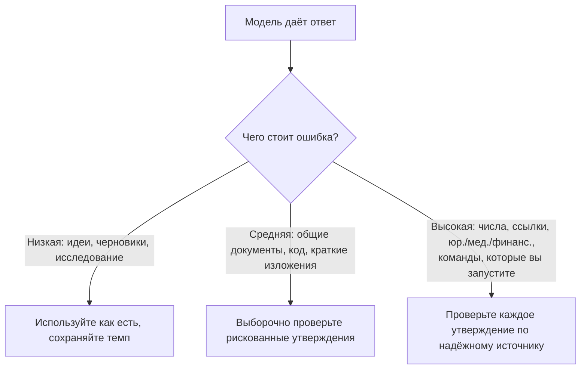

<LevelBadge level="intermediate" />

**Галлюцинация** — это когда модель с полной уверенностью утверждает что-то ложное. Она не лжёт и не сломана — это обратная сторона того, как работают LLM: они генерируют *правдоподобный* текст, а правдоподобное не всегда истинно (см. [Что такое LLM?](/docs/foundations/what-is-an-llm)). Полностью убрать это с помощью промпта нельзя, но можно резко снизить частоту и отловить остальное.

## Почему это происходит

Модель предсказывает вероятное продолжение. Когда она чего-то «не знает», *наиболее правдоподобным на вид* продолжением часто оказывается уверенный, грамотно оформленный — и неверный — ответ. Встроенного сигнала «я не уверена» нет, если только вы сами не создадите для него место.

## Зоны повышенного риска

Будьте максимально скептичны, когда вывод касается:

- **Цитат, ссылок и источников** — выдуманные статьи, фальшивые URL, неверно приписанные цитаты.
- **Конкретных чисел, дат и статистики** — правдоподобные, но придуманные цифры.
- **Узкоспециальных или совсем свежих фактов** — за пределами того, что модель надёжно усвоила.
- **Деталей API и библиотек** — методы или параметры, которых не существует.
- **Сведений о людях и юридических/медицинских деталей** — высокие ставки, легко ошибиться в нюансах.

## Набор инструментов для снижения

Комбинируйте их — каждый помогает:

1. **Опирайтесь на источники.** Вставьте исходный текст и скажите *«отвечай только по тексту выше; если этого там нет, так и скажи».* Это основная идея, лежащая в основе [RAG](/docs/foundations/rag).
2. **Дайте возможность отступить.** Явно разрешите *«Если не уверен, скажи „Я не знаю“»* — это резко снижает уверенные догадки.
3. **Просите рассуждения и цитаты.** *«Процитируй точное предложение, подтверждающее каждое утверждение».* Неподтверждённые утверждения становятся очевидными.
4. **Снижайте креативность** для фактологических задач там, где модель предоставляет управление температурой (см. [Управление сэмплингом](/docs/foundations/sampling-controls)).
5. **Используйте инструменты.** Для математики, актуальных данных или поиска дайте модели калькулятор/поиск/[инструмент](/docs/api/tool-use), а не полагайтесь на память.
6. **Перепроверяйте.** Задайте один и тот же вопрос двумя способами или сделайте второй проход с критикой первого.

## Готовый антигаллюцинационный промпт для копирования

Большая часть набора инструментов выше сводится к одной многоразовой обёртке. Вставьте свой источник в указанное место и задайте вопрос — она привязывает ответ к источнику, даёт модели возможность отступить и требует цитат за один раз:

```text
Ты отвечаешь ТОЛЬКО по приведённому ниже ИСТОЧНИКУ.
Правила:
- Если ответа нет в ИСТОЧНИКЕ, ответь точно: "В источнике это не указано."
- После каждого утверждения цитируй точное предложение из ИСТОЧНИКА, которое его подтверждает.
- Не добавляй внешние знания, оценки или предположения.

ИСТОЧНИК:
"""
[вставьте сюда документ, расшифровку или данные]
"""

ВОПРОС: [ваш вопрос]
```

Почему это работает: лазейка «В источнике это не указано» снимает давление, заставляющее угадывать, а правило цитирования предложения делает невозможным скрыть любое неподтверждённое утверждение. Убирайте блок ИСТОЧНИК, когда вам действительно нужны собственные знания модели — но тогда проверка снова ложится на вас.

## Образ мышления, который действительно вас защищает

:::warning Проверяйте то, что важно — всегда
Ни один промпт не делает вывод на 100% надёжным. Для всего значимого — числа в отчёте, ссылки, команды, которые вы запустите, медицинских/юридических/финансовых деталей — **сверяйте это с надёжным источником**. Относитесь к ИИ как к быстрому первому черновику, а не как к финальному авторитету. В этом суть [Ответственного использования](/docs/security/responsible-use).
:::

Простое правило: **цена ошибки определяет объём проверки.** Мозговой штурм? Доверяйте свободно. Публикуете статистику? Проверяйте каждый раз.



## Дальше

- [Генерация с дополнением из поиска (RAG)](/docs/foundations/rag)
- [Оценка качества ИИ (Evals)](/docs/foundations/evals)
- [Ответственное использование, этика и проверка](/docs/security/responsible-use)
