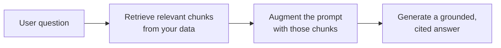

<LevelBadge level="intermediate" />

**RAG** заставляет модель отвечать на вопросы по **вашим** данным — документам, базе знаний, кодовой базе, — на которых она никогда не обучалась. Идея проста: **извлечь** релевантные фрагменты, **дополнить** ими промпт, затем **сгенерировать** ответ, заземлённый на этих фрагментах.

## Цикл

1. **Проиндексируйте** ваши данные: разбейте на чанки, [эмбеддьте](/docs/foundations/embeddings) их, сохраните в векторный (и/или ключевой) индекс.
2. **Извлеките** топ чанков, наиболее релевантных вопросу.
3. **Дополните**: поместите эти чанки в промпт с инструкцией вроде *«Отвечай только по контексту ниже; если этого там нет — так и скажи».*
4. **Сгенерируйте** — и в идеале **процитируйте**, из какого чанка взято каждое утверждение.

## Почему RAG вместо дообучения?

RAG сохраняет знания **свежими** (обновляете данные, а не модель), предоставляет **цитаты** и гораздо дешевле переобучения. Для большинства потребностей «отвечать по моим документам» это правильный первый инструмент — см. [Дообучение против промптинга против RAG](/docs/foundations/finetune-vs-prompt-vs-rag).

## Режимы сбоев (где умирает качество RAG)

- **Плохое извлечение = плохой ответ.** Если нужный чанк не извлечён, модель не может его использовать. Большинство проблем «RAG ошибается» — это проблемы *извлечения*.
- **Слишком грубый/мелкий чанкинг** — рушит релевантность ([эмбеддинги](/docs/foundations/embeddings)).
- **Нет инструкции по заземлению** — модель смешивает извлечённые факты со своими собственными догадками. Скажите ей отвечать *только* по контексту и признавать пробелы.
- **Впихивание слишком многого** — нерелевантные чанки разбавляют сигнал и стоят [токенов](/docs/foundations/tokens-and-context). Извлекайте мало качественных чанков.
- **Нет цитат** — вы не можете проверить, поэтому не можете доверять.

:::tip Оценивайте извлечение отдельно
Измеряйте «извлекли ли мы нужный чанк?» отдельно от «хорошо ли ответила модель?». Это быстро локализует проблему. См. [Evals](/docs/foundations/evals).
:::

## Дальше

- [Эмбеддинги и векторный поиск](/docs/foundations/embeddings)
- [Дообучение против промптинга против RAG](/docs/foundations/finetune-vs-prompt-vs-rag)
- [Плейбук исследований и синтеза](/docs/playbooks/research)
