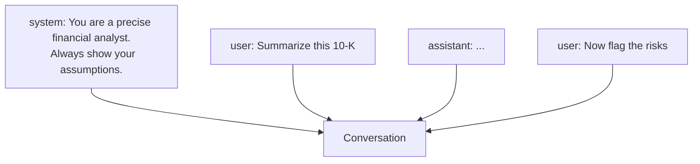

<LevelBadge level="beginner" />

Каждый разговор с ИИ построен из **сообщений**, и у каждого сообщения есть **роль**. Понимание трёх ролей объясняет, как управлять моделью — и почему одни инструкции закрепляются, а другие нет.

## Три роли

- **System** — настройка верхнего уровня для всего разговора: кем должна быть модель, правила, формат. Задаётся один раз, применяется на протяжении всего разговора.
- **User** — это вы: ваши вопросы и входные данные, ход за ходом.
- **Assistant** — ответы модели. (Вы также можете *вкладывать слова в уста ассистента* в качестве примеров — см. [few-shot](/docs/prompting/few-shot).)

## Почему системный промпт — ваш самый мощный рычаг

Системное сообщение задаёт рамку для **всего, что следует далее**. Это место, где вы устанавливаете роль модели, стандарты, тон и жёсткие правила, — и модель придаёт ему большой вес. Если вы хотите стабильного поведения на протяжении всего разговора (или приложения), помещайте его сюда, а не закапывайте в ход пользователя.

На практике:
- **Чат-приложения:** ваши аккаунтные [пользовательские инструкции](/docs/claude-app/custom-instructions) действуют как личный системный промпт.
- **Claude Code:** [CLAUDE.md](/docs/claude-code/claude-md) играет эту роль для вашего проекта.
- **API:** [параметр `system`](/docs/api/first-call).

Та же идея, три поверхности.

## Практические советы

- **Будьте конкретны в системном промпте** относительно роли, правил и формата вывода — это место с наивысшим рычагом, чтобы это сделать.
- **Держите ходы пользователя сфокусированными** на самой задаче; не вставляйте правила заново каждый ход.
- **Противоречивые инструкции?** Более поздняя, явная инструкция пользователя может переопределить расплывчатую системную — будьте последовательны, чтобы избежать сюрпризов ([Устранение неполадок](/docs/contribute/troubleshooting)).

## Дальше

- [Основы промптинга](/docs/prompting/basics)
- [Пользовательские инструкции и стили](/docs/claude-app/custom-instructions)
- [Токены, контекст и память](/docs/foundations/tokens-and-context)
