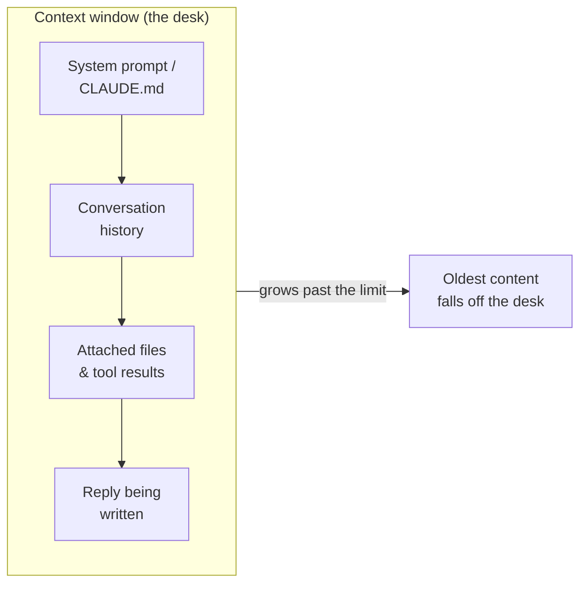

<LevelBadge level="beginner" />

Три идеи проясняют множество моментов из серии «почему оно так сделало?»: **токены**, **окно контекста** и **память**. Поймёте их — и вас перестанут удивлять дрейф, забывчивость и неожиданные счета.

<Callout
  type="objectives"
  items={[
    "Читать текст так, как это делает модель — в токенах, а не в словах или символах",
    "Представлять окно контекста как ограниченный стол и предугадывать, когда что-то с него падает",
    "Распознавать «гниль контекста» — почему модели могут терять середину длинного ввода",
    "Знать четыре реальных источника «памяти» и как осознанно её обеспечить"
  ]}
/>

## Токены: единица, в которой думают модели

Модели не читают символы или слова — они читают **токены**, куски текста размером примерно ¾ слова в английском. «Unbelievable» может быть 3–4 токена; распространённые слова — по одному; пробел, запятая или фрагмент кода тоже стоят токенов. Считаются и ваш ввод, *и* вывод модели, и именно в токенах измеряются [цены и лимиты](/docs/api/tokens-and-pricing).

Считать вручную не нужно, но грубое чутьё помогает: **~750 слов ≈ ~1 000 токенов**. Введите что-нибудь и понаблюдайте:

<TokenEstimator />

:::tip Почему соотношение меняется
Обычный английский держится около ¾ слова на токен. Код, JSON, нелатинские письменности, длинные URL и редкие слова разбиваются на *больше* токенов — так что файл на 500 строк или абзац по-китайски стоит дороже, чем подсказывает количество слов. Когда счёт или лимит вас удивляют, причина обычно в этом.
:::

## Окно контекста: рабочая память

**Окно контекста** — это максимальное число токенов, которое модель может учитывать за раз: *ваш системный промпт, весь диалог на текущий момент, любые прикреплённые файлы и пишущийся ответ* — всё вместе. Считайте это столом модели: большим, но конечным. Размеры окна различаются у разных моделей и продолжают расти — смотрите [Модели и цены](/docs/whats-new/models-and-pricing) для актуальных значений, а не заучивайте одно число.

Всё, что модель «знает» в данный момент, лежит на этом столе:

Когда диалог перерастает окно, **самое старое содержимое падает со стола**. Поэтому очень длинный чат может будто бы «забыть», как он начинался, или уплыть от вашей исходной инструкции.

## Гниль контекста: дело не только в том, *полно* оно или *пусто*

Более тонкая проблема: даже когда всё ещё помещается, модели обычно надёжнее используют **начало и конец** длинного ввода, чем **середину**. Закопайте единственное важное предложение в центр 50-страничной вставки — и его могут недооценить; этот сбой часто называют *«потеря в середине»*.

<VerifyNote lastVerified="2026-06-29" source="https://arxiv.org/abs/2307.03172">Эффект «потери в середине» — ухудшенное использование информации, размещённой в середине контекста, — был задокументирован Liu et al. (2023). Новые модели с длинным контекстом справляются с этим лучше, но практическая привычка ниже всё равно окупается.</VerifyNote>

<Steps
  items={[
    {title: "Начните с запроса", body: "Поместите саму инструкцию или вопрос в начало, до вставки длинного документа — а не закопанным после него."},
    {title: "Повторите в конце", body: "Повторите ключевую инструкцию одной строкой после длинного содержимого. Первая и последняя позиции — самые сильные."},
    {title: "Подрежьте перед вставкой", body: "Уберите нерелевантные разделы. Меньше шума в середине — значит оставшемуся сигналу достаётся больше внимания."},
    {title: "Делите, когда огромно", body: "Для очень больших вводов суммируйте или разбивайте на части вместо того, чтобы вываливать всё — или начните новый чат под новую подзадачу."}
  ]}
/>

Вот тот же запрос, выстроенный так, чтобы инструкция оказалась в сильных позициях:

<PromptCard title="Инструкция первой, повторённая последней">{`Задача: найди все места, где этот договор ограничивает нашу ответственность, и процитируй точную формулировку.

[... вставь сюда полный 40-страничный договор ...]

Напоминание о задаче: перечисли только положения об ограничении ответственности, с точными цитатами и номерами разделов. Игнорируй всё остальное.`}</PromptCard>

:::tip В Claude Code
Длинные агентные сессии упираются в тот же потолок. Claude Code управляет этим целенаправленно — уплотняя историю и позволяя вам направлять то, что остаётся в поле зрения. Смотрите [Управление контекстом](/docs/claude-code/context-management) и [Инженерия контекста](/docs/frontiers/context-engineering).
:::

## Память: её нет, если вы её не обеспечите

По умолчанию каждый диалог — это **чистый лист**. Модель не помнит ваш прошлый чат. Всё, что выглядит как память, — это одно из четырёх:

| Источник | Что это | Как вы этим управляете |
| --- | --- | --- |
| **Переотправляемая история** | Чат-приложения переотправляют диалог каждый ход, пока окно не заполнится | Начинать новые чаты; держать ветки сфокусированными |
| **Функции памяти** | Некоторые поверхности Claude переносят факты между чатами | Настройки [Памяти между чатами](/docs/claude-app/memory) |
| **Файлы, которые вы предоставляете** | Постоянный контекст, прикрепляемый осознанно | [Проекты](/docs/claude-app/projects), [CLAUDE.md](/docs/claude-code/claude-md) |
| **Ваш собственный код** | API **не хранит состояние** — вы переотправляете предыдущие сообщения | [Первый вызов API](/docs/api/first-call) |

Общая нить: *если хотите, чтобы модель что-то помнила, придётся снова и снова класть это на стол.*

## Почему это важно

Почти каждая проблема в духе «оно проигнорировало мою раннюю инструкцию» или «оно потеряло нить» сводится к одному из трёх: окно заполнилось, новая сессия началась с нуля, или ключевая деталь застряла в мёртвой середине длинной вставки. Зная это, вы будете выстраивать промпты и сессии так, чтобы важное оставалось *в поле зрения*.

## Проверь себя

<Quiz
  questions={[
    {
      q: "Примерно сколько токенов в 750 словах обычного английского?",
      options: ["Около 250", "Около 1 000", "Около 3 000", "Ровно 750"],
      answer: 1,
      explain: "Удобное правило: ~750 слов ≈ ~1 000 токенов для обычного английского. Код и нелатинские письменности дают больше."
    },
    {
      q: "Длинный чат начинает «забывать», как он начался. Наиболее вероятная причина:",
      options: [
        "Модель сломана",
        "Самое раннее содержимое выпало из окна контекста по мере роста диалога",
        "Модель навсегда выучила ваши ранние сообщения",
        "Токены были возвращены"
      ],
      answer: 1,
      explain: "Окно контекста конечно. Когда диалог его превышает, самые старые токены падают со «стола» — так что ранние инструкции могут исчезнуть из поля зрения."
    },
    {
      q: "Вам нужно вставить огромный документ плюс одну ключевую инструкцию. Лучшее размещение?",
      options: [
        "Инструкция только в точной середине документа",
        "Инструкция в самом начале И повторённая в конце",
        "Без инструкции — пусть модель догадается",
        "Инструкция в отдельном чате, который модель не видит"
      ],
      answer: 1,
      explain: "Модели надёжнее всего используют начало и конец длинного ввода («потеря в середине»). Начните с запроса и повторите его в конце."
    }
  ]}
/>

## Ключевые термины

<Flashcards
  title="Закрепите словарь"
  cards={[
    {front: "Токен", back: "Кусок текста, который модель фактически обрабатывает — примерно ¾ английского слова. Считаются и ввод, и вывод, а цена — за токен."},
    {front: "Окно контекста", back: "Максимум токенов, которые модель может учитывать за раз: системный промпт + история + файлы + ответ, всё вместе. Конечно — содержимое за пределом падает со стола."},
    {front: "Потеря в середине", back: "Склонность надёжнее использовать начало и конец длинного ввода, чем середину. Помещайте критичные инструкции в сильные позиции."},
    {front: "Отсутствие состояния", back: "API ничего не помнит между вызовами. Чтобы продолжить диалог, вы сами переотправляете предыдущие сообщения."}
  ]}
/>

:::note Выводы
- **Токены** — единица и мышления, и тарификации: ~1 000 на 750 английских слов, больше для кода и других письменностей.
- **Окно контекста** — конечный стол; длинные чаты забывают, потому что старое содержимое с него падает.
- Даже в пределах окна **начинайте с инструкции и повторяйте её в конце** — середина используется недостаточно.
- **По умолчанию памяти нет**. Обеспечьте её осознанно файлами, Проектами, CLAUDE.md или переотправкой истории.
:::

## Дальше

- [Что такое LLM?](/docs/foundations/what-is-an-llm)
- [Роли System, User и Assistant](/docs/foundations/roles)
- [Инженерия контекста](/docs/frontiers/context-engineering)
- [Токены, контекст и цены (API)](/docs/api/tokens-and-pricing)
