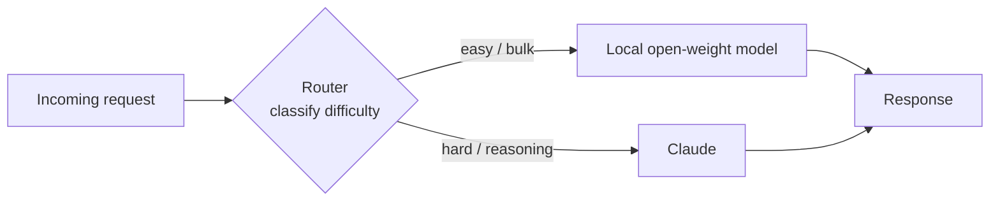

<LevelBadge level="advanced" />

Формулировка «frontier-модель **или** локальная модель» — это ложный выбор. Самые экономичные, уважающие приватность и отказоустойчивые системы в продакшене используют **обе** — небольшую модель с открытыми весами, работающую локально для простой, высокообъёмной или чувствительной работы, и frontier-модель вроде Claude в роли **умного слоя**, который берёт на себя сложные рассуждения. Эта страница — о долговечных *паттернах*, которые связывают эти две модели так, чтобы каждая делала то, в чём она лучше. Паттерны не зависят от провайдера — Claude просто отлично подходит на роль «рассуждающего», — и они переживут любое конкретное название модели.

<Callout type="objectives" items={[
  "Понять, ПОЧЕМУ гибрид (frontier + локальная) превосходит каждую модель по отдельности по стоимости, приватности и отказоустойчивости",
  "Изучить пять долговечных гибридных паттернов: маршрутизатор/big-little, черновик-затем-доработка, редактирование приватных данных, массовая пред-/постобработка и офлайн-резерв",
  "Для каждого паттерна: знать, когда к нему обращаться, какой компромисс вы принимаете и конкретный набросок",
  "Спроектировать собственный гибрид Claude+локальная модель по повторяемому четырёхшаговому методу",
  "Знать, что эти паттерны не зависят от провайдера — Claude встраивается как «умный слой», а не как привязка к поставщику",
]} />

## Почему гибрид, а не «или-или»

Локальная модель с открытыми весами (см. [Запуск моделей локально с Ollama](/docs/models/run-models-locally-ollama)) и frontier-модель хороши в *разных* вещах:

- **Локальная** приватна (данные никогда не покидают вашу машину), дёшева при масштабе (нет счёта за токены), имеет низкую задержку для небольших моделей и работает офлайн. Но у неё есть реальный **разрыв в возможностях** на самых сложных задачах рассуждения, длинного контекста и агентных задачах.
- **Claude (frontier)** лидирует именно на этих сложных задачах, но каждый вызов стоит токенов и отправляет данные в облачный API.

Идея, стоящая за каждым паттерном ниже: **большинство запросов просты, а сложные — в меньшинстве.** Если дешёвая локальная модель может справиться с основной массой, а frontier-модель вы резервируете для по-настоящему сложной доли, вы получаете большую часть качества frontier за долю стоимости — и можете держать чувствительные данные локально. Статья Microsoft *Hybrid LLM* формализовала это: обученный маршрутизатор, отправляющий простые запросы небольшой модели, сделал **до 40% меньше вызовов** к большой модели без снижения качества ответов ([arXiv 2404.14618](https://arxiv.org/abs/2404.14618)). Открытый фреймворк [RouteLLM](https://github.com/lm-sys/RouteLLM) сообщает о похожих результатах — качество, близкое к frontier, примерно за **половину стоимости** на распространённых бенчмарках за счёт маршрутизации около половины запросов на более дешёвую модель.

> Выбирайте свой гибрид по **ограничению**, а не по хайпу. Если вы ещё не знаете, какая модель подходит под какую задачу, начните с [Выбора модели](/docs/models/choosing-a-model) — а затем вернитесь и решите, *где проходит граница* между локальной и frontier.

---

## Паттерн 1 — Маршрутизатор / big-little

**Идея.** Поставьте тонкий **классификатор** перед каждым запросом. Он смотрит на задачу и решает: простое/массовое → локальная модель; сложное рассуждение → Claude. Заимствовано из дизайна процессоров «big.LITTLE», где телефон выполняет фоновую работу на крошечных экономичных ядрах и будит большое ядро только при тяжёлой нагрузке.

**Когда использовать.** У вас смешанный поток запросов — многие тривиальны, немногие по-настоящему сложны — и вы хотите платить цену frontier только за сложные. Это рабочая лошадка среди гибридов.

**Компромисс.** Маршрутизатор может *ошибиться*. Направьте сложную задачу локальной модели — и качество падает; направьте простую в Claude — и вы переплачиваете. Вы настраиваете порог, чтобы обменять стоимость на качество, и вам следует **измерить** этот порог на собственных данных с помощью небольшого eval'а (см. [Оценки](/docs/power-user/evals)).

**Набросок.** Маршрутизатор может быть как простым слоем правил (длина, ключевые слова, наличие кода), так и полноценной небольшой классифицирующей моделью. Дешёвый, прозрачный вариант — попросить саму **локальную** модель классифицировать сложность, а затем диспетчеризировать:

<PromptCard title="Промпт классификации маршрутизатора (запускается на локальной модели)">{`You are a request router. Classify the user request into exactly one tier.

Return ONLY a JSON object: {"tier": "...", "reason": "..."}

Tiers:
- "local"  → simple, mechanical, or high-volume: short rewrites, formatting,
             single-fact lookup, basic classification/extraction, boilerplate.
- "frontier" → hard reasoning, multi-step planning, long-context synthesis,
             ambiguous instructions, code that must be correct, anything where
             a wrong answer is costly.

Bias toward "local" when in doubt about a CHEAP, low-risk task,
and toward "frontier" when a mistake would be EXPENSIVE.

Request:
"""
{{REQUEST}}
"""`}</PromptCard>

Вывод маршрутизатора — это решение о маршрутизации, а не финальный ответ — держите его крошечным и быстрым. Для более богатой маршрутизации между многими инструментами или моделями та же логика «классифицируй-затем-диспетчеризируй» обобщается (и напоминает то, как модели выбирают между [инструментами](/docs/api/tool-use)).

---

## Паттерн 2 — Черновик-затем-доработка

**Идея.** Локальная модель создаёт **дешёвый первый черновик**; Claude **шлифует, исправляет или проверяет** его. Вы платите токенами frontier за доработку, а не за генерацию с нуля — и хороший черновик делает работу Claude короче и надёжнее.

**Когда использовать.** Открытая генерация, где грубый черновик намного дешевле идеального, но финальный вывод должен быть высокого качества: длинные тексты, код, структурированные документы, сводки, которые должны быть абсолютно точными.

**Компромисс.** Два вызова модели вместо одного добавляют задержку, а *плохой* черновик может закрепить дорабатывающую модель на своих ошибках. Выигрыш проявляется, когда составление черновика — дорогая часть, а доработка сравнительно дешева — проверьте на своих данных, что «локальный черновик + доработка frontier» действительно превосходит «frontier делает всё» по стоимости на приемлемый результат.

**Набросок.** Локальная модель составляет черновик → передаёте черновик в Claude с целенаправленной инструкцией: *«Вот черновик. Исправь ошибки, ужми и проверь утверждения; верни исправленную версию.»* Это та же интуиция, что стоит за **спекулятивным декодированием** на уровне токенов — маленькая модель-черновик предлагает, большая модель проверяет и оставляет только то, что выдерживает проверку ([NVIDIA: спекулятивное декодирование](https://developer.nvidia.com/blog/an-introduction-to-speculative-decoding-for-reducing-latency-in-ai-inference/)). На уровне задачи вы делаете то же самое вручную: дешёвое предложение, дорогая проверка.

---

## Паттерн 3 — Редактирование приватных данных

**Идея.** Локальная модель (или локальный NLP-инструментарий) **вырезает персональные данные (PII)** из текста *до* того, как что-либо отправится в облачный API. Claude рассуждает над отредактированной версией; при необходимости вы заново вставляете реальные значения локально на обратном пути.

**Когда использовать.** Вы хотите рассуждения frontier, но работаете с регулируемыми или чувствительными данными (здоровье, финансы, записи о клиентах), и сырые PII **не должны** покидать вашу среду. Редактирование позволяет использовать облачную модель для *формы* задачи, не раскрывая людей в ней.

**Компромисс.** Редактирование никогда не бывает идеальным — пропущенная сущность — это утечка, а чрезмерное редактирование уничтожает контекст, нужный модели для качественного ответа. Относитесь к редактору как к средству контроля безопасности: тестируйте его полноту (recall) и держите таблицу восстановления строго локально.

**Набросок.** Запустите локальный детектор/анонимайзер по входным данным, заменяя сущности на плейсхолдеры (`[PERSON_1]`, `[EMAIL_1]`), отправьте отредактированный текст в Claude, затем регидратируйте плейсхолдеры локально. Открытый [Presidio](https://github.com/microsoft/presidio) от Microsoft — распространённый строительный блок здесь: он обнаруживает и анонимизирует PII и может использовать подключаемый NLP-бэкенд, включая локальную модель для второго прохода по сложным случаям. Критичная, часто упускаемая деталь: редактируйте **всё**, что доходит до модели, включая извлечённые документы и результаты инструментов — а не только последнее сообщение пользователя.

---

## Паттерн 4 — Массовая пред-/постобработка

**Идея.** Локальная модель берёт на себя **высокообъёмную, повторяющуюся** работу — извлечение, классификацию, тегирование, нормализацию по тысячам элементов — а Claude обрабатывает только **немногие сложные случаи**, которые локальная модель помечает как низкоуверенные.

**Когда использовать.** Конвейерные нагрузки: классифицировать 100 тыс. тикетов поддержки, извлечь поля из горы документов, разметить поток контента. Прогонять каждый элемент через frontier-API было бы медленно и дорого; большинство элементов просты.

**Компромисс.** Вам нужен надёжный сигнал **уверенности / эскалации**, чтобы нужные элементы эскалировались. Слишком рьяно — переплатите; слишком робко — качество страдает на сложном хвосте. Самооценка уверенности локальной модели — это отправная точка, но её надо валидировать.

**Набросок.** Локальная модель обрабатывает весь пакет и прикрепляет оценку уверенности; элементы ниже порога (или не прошедшие проверку схемы/валидации) эскалируются в Claude для сложного решения. Это Паттерн 1, применённый к пакету вместо живого запроса — та же экономика «дешёвая берёт массу, frontier берёт хвост», которую эксплуатируют каскады, часто **40–70% экономии стоимости** при минимальной потере качества на простом большинстве.

---

## Паттерн 5 — Офлайн-резерв

**Идея.** Локальная модель — это **страховочная сеть**. Когда облачный API недоступен, ограничен по частоте запросов или недостижим, запросы переключаются *на* локальную модель вместо того, чтобы падать *напрочь*. Ухудшенные ответы лучше страниц с ошибками.

**Когда использовать.** Всё, где доступность важнее неизменно лучшего качества: внутренние инструменты, которые должны продолжать работать, функции на устройстве, продукты, которые не могут показать пользователям жёсткую ошибку во время сбоя провайдера.

**Компромисс.** Резервные ответы по определению **ниже по качеству** — вы обмениваете потолок frontier на «всё ещё работает». Сделайте деградацию явной (пометьте её, сузьте набор функций), а не молча подавайте более слабые ответы, будто они настоящие.

**Набросок.** Оберните вызовы в упорядоченную цепочку: попробовать Claude → при ошибке доступности (таймаут, 429/5xx) повторить с бэкоффом → если всё ещё сбой, направить на локальную модель. LLM-шлюзы вроде LiteLLM и OpenRouter реализуют именно этот паттерн цепочки резервов, включая кэширование распространённых промптов, чтобы офлайн-путь мог всё же выдать что-то полезное. Долговечный принцип: **держите локальную модель наготове как последнюю линию**, чтобы сбой ухудшал опыт, а не ломал его.

---

## Спроектируйте свой гибрид Claude+локальная модель

<Steps items={[
  {title: "Составьте карту распределения ваших запросов", body: "Соберите выборку реального трафика и разметьте, какая доля по-настоящему сложна, какая простая/массовая, а какая чувствительна. Форма этого распределения подскажет, какой паттерн окупается — длинный простой хвост благоприятствует маршрутизатору или массовой предобработке; небольшая чувствительная доля благоприятствует редактированию."},
  {title: "Выберите паттерн, соответствующий ограничению", body: "Смешанный живой трафик → Паттерн 1 (маршрутизатор). Высококачественная генерация в рамках бюджета → Паттерн 2 (черновик-затем-доработка). Регулируемые/чувствительные данные → Паттерн 3 (редактирование). Конвейер / пакетный объём → Паттерн 4 (массовая обработка). Критична доступность → Паттерн 5 (резерв). Многие системы комбинируют два или три."},
  {title: "Установите границу, затем измерьте её", body: "Решите, где заканчивается локальная модель и начинается Claude (порог маршрутизатора, отсечка по уверенности, политика редактирования). Прогоните небольшой eval на ВАШИХ данных, чтобы получить числа для компромисса стоимость-против-качества. Не доверяйте лидерборду или громкому заголовку вендора — измеряйте на своей задаче. См. страницу Оценок."},
  {title: "Добавьте наблюдаемость и предохранительный клапан", body: "Логируйте каждое решение о маршрутизации/эскалации и его исход, чтобы можно было перенастраивать границу по мере изменения моделей и трафика. Держите явный резерв (Паттерн 5), чтобы сбой провайдера деградировал плавно, а не ломал систему."},
]} />

<VerifyNote lastVerified="2026-06-28" source="https://docs.anthropic.com/en/docs/build-with-claude/models">
Конкретные названия моделей, размеры контекстных окон, цены за токен и лимиты частоты запросов меняются часто и **намеренно** здесь не повторяются — это волатильная часть. Прежде чем зафиксировать порог стоимости или качества для маршрутизатора или каскада, проверьте актуальную линейку моделей Claude и цены в источнике выше, а актуальные названия локальных моделей — в <a href="https://ollama.com/library">библиотеке Ollama</a>. Паттерны на этой странице долговечны; точные числа за границей — нет.
</VerifyNote>

<Quiz title="Проверьте себя" questions={[
  {q: "Каков ключевой экономический инсайт, благодаря которому работает каждый гибридный паттерн?", options: ["Локальные модели всегда лучше frontier-моделей", "Большинство запросов просты; только меньшинство действительно нуждается в рассуждениях frontier", "Frontier-модели дешевле за токен, чем локальные модели"], answer: 1, explain: "Основная масса реального трафика проста. Если дешёвая локальная модель обрабатывает простое большинство, а frontier-модель вы резервируете для сложного меньшинства, вы получаете большую часть качества за долю стоимости. Именно эту асимметрию эксплуатирует каждый паттерн здесь."},
  {q: "Вам нужно использовать frontier-модель для рассуждений над записями о клиентах, но сырые PII не могут покидать вашу среду. Какой паттерн подходит?", options: ["Маршрутизатор / big-little", "Редактирование приватных данных", "Офлайн-резерв"], answer: 1, explain: "Редактирование приватных данных вырезает PII локально до того, как что-либо достигнет облачного API, так что Claude рассуждает над отредактированной версией, а реальные значения остаются в вашей среде. Маршрутизатор решает, КУДА отправить работу; он не удаляет чувствительные данные."},
  {q: "Каков главный риск, специфичный для паттерна маршрутизатор / big-little?", options: ["Он всегда может использовать только одну модель", "Неверно направленная задача стоит качества (сложная отправлена локальной) или денег (простая отправлена frontier)", "Он требует, чтобы облачный API был доступен всё время"], answer: 1, explain: "Маршрутизатор — это классификатор, и он может ошибаться. Неверная маршрутизация сложной задачи к слабой модели вредит качеству; неверная маршрутизация простой к frontier тратит деньги. Вот почему вы настраиваете и измеряете порог маршрутизации на собственных данных."},
  {q: "Почему черновик-затем-доработка иногда НЕ окупается?", options: ["Он всегда даёт более низкое качество, чем один вызов frontier", "Два вызова добавляют задержку, а плохой локальный черновик может закрепить дорабатывающую модель на своих ошибках", "Frontier-модели не могут редактировать текст, который не они написали"], answer: 1, explain: "Черновик-затем-доработка выигрывает только тогда, когда составление черновика — дорогая часть, а доработка дёшева. Два вызова модели добавляют задержку, а слабый черновик может сбить дорабатывающую модель с пути — поэтому проверьте на своих данных, что локальный черновик + доработка frontier действительно превосходит «frontier делает всё»."},
]} />

<Flashcards title="Пять гибридных паттернов с одного взгляда" cards={[
  {front: "Маршрутизатор / big-little", back: "Классифицируйте каждый запрос, затем диспетчеризируйте: простое/массовое → локальная, сложное рассуждение → Claude. Рабочая лошадка среди гибридов. Компромисс: маршрутизатор может ошибиться — настраивайте порог на собственных данных."},
  {front: "Черновик-затем-доработка", back: "Локальная модель дёшево составляет черновик; Claude шлифует/проверяет. Платите токенами frontier за доработку, а не за генерацию. Компромисс: дополнительная задержка, и плохой черновик может закрепить дорабатывающую модель."},
  {front: "Редактирование приватных данных", back: "Локальная модель/NLP-инструмент вырезает PII до того, как что-либо достигнет облачного API; регидратируйте локально. Позволяет использовать рассуждения frontier над чувствительными данными. Компромисс: пропущенная сущность — это утечка; редактируйте результаты инструментов и извлечённые документы тоже, а не только сообщение пользователя."},
  {front: "Массовая пред-/постобработка", back: "Локальная берёт на себя высокообъёмное извлечение/классификацию по всему пакету; Claude обрабатывает только низкоуверенные эскалации. Паттерн 1, применённый к пакету. Нужен надёжный сигнал уверенности/эскалации."},
  {front: "Офлайн-резерв", back: "Локальная модель — страховочная сеть: когда облачный API недоступен или ограничен по частоте, переключитесь НА локальную вместо полного отказа. Ухудшенные ответы лучше ошибок. Сделайте деградацию явной."},
]} />

<Callout type="takeaways" items={[
  "Frontier против локальной — ложный выбор: лучшие системы используют обе, с Claude в роли независимого от провайдера «умного слоя» для сложного меньшинства работы",
  "Все пять паттернов держатся на одном инсайте: большинство запросов просты и дёшевы; резервируйте траты на frontier для по-настоящему сложной доли",
  "Маршрутизатор/big-little — рабочая лошадка; черновик-затем-доработка покупает качество в рамках бюджета; редактирование открывает чувствительные данные; массовая предобработка масштабирует конвейеры; офлайн-резерв покупает отказоустойчивость — и они компонуются",
  "У каждого паттерна есть граница (порог, отсечка по уверенности, политика редактирования) — измеряйте её на ВАШИХ данных небольшим eval'ом, а не по лидерборду",
  "Держите волатильные числа (названия моделей, цены, лимиты) за шагом проверки; паттерны долговечны, конкретика — нет",
]} />

## Источники и дополнительное чтение

- [Hybrid LLM: Cost-Efficient and Quality-Aware Query Routing (arXiv 2404.14618, ICLR 2024)](https://arxiv.org/abs/2404.14618)
- [RouteLLM — открытый фреймворк для развёртывания и оценки LLM-маршрутизаторов (GitHub, LMSYS)](https://github.com/lm-sys/RouteLLM)
- [RouteLLM: An Open-Source Framework for Cost-Effective LLM Routing (блог LMSYS)](https://www.lmsys.org/blog/2024-07-01-routellm/)
- [Microsoft Presidio — обнаружение, редактирование и анонимизация PII (GitHub)](https://github.com/microsoft/presidio)
- [Маскирование PII с помощью Presidio и LiteLLM — руководство](https://docs.litellm.ai/docs/tutorials/presidio_pii_masking)
- [An Introduction to Speculative Decoding (технический блог NVIDIA)](https://developer.nvidia.com/blog/an-introduction-to-speculative-decoding-for-reducing-latency-in-ai-inference/)
- [Резервы моделей — надёжный ИИ с автоматическим переключением (документация OpenRouter)](https://openrouter.ai/docs/guides/routing/model-fallbacks)
- [Anthropic — обзор моделей Claude](https://docs.anthropic.com/en/docs/build-with-claude/models)
