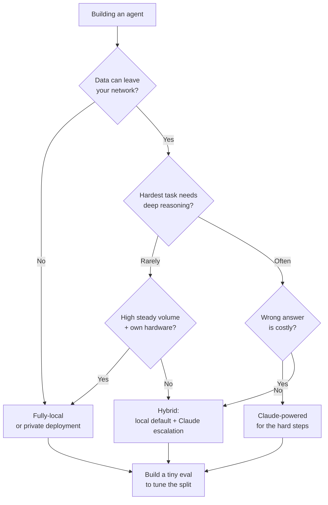

<LevelBadge level="intermediate" />

Вы создаёте агента. Первая настоящая развилка на пути: работает ли он на **полностью локальной** модели с открытыми весами (приватной, бесплатной в эксплуатации, вашей), на **Claude** (передовое качество, хостинг) или на **гибриде** обоих? Эта страница — руководство по принятию решения: факторы, которые действительно это решают, понятный поток «если X → склоняйтесь к Y» и честная реальность, что **гибрид обычно побеждает**: локальная модель для лёгких/чувствительных 90%, Claude для сложных 10%.

<Callout type="objectives" items={[
  "Назвать факторы, которые действительно решают: локально, Claude или гибрид",
  "Пройти понятный поток решения «если X → склоняйтесь к Y» для вашего агента",
  "Понять, почему гибрид (локальный по умолчанию + эскалация на Claude) часто побеждает любую из крайностей",
  "Уйти с крошечной оценкой (eval) в качестве решающего фактора — а не с рейтинговой таблицей",
]} />

<VerifyNote lastVerified="2026-06-28" source="https://artificialanalysis.ai/">
Устойчивые утверждения здесь — *разрыв в возможностях между лучшими открытыми и передовыми моделями существует, но продолжает сокращаться*, и *маршрутизация/каскад (сначала дешёвая модель, эскалация на сложном) экономит стоимость, сохраняя качество* — стабильны. Но **конкретные числа** (насколько велик разрыв в этом месяце, какая открытая модель лидирует, цены Claude за токен, точное число токенов/сек на данном железе) постоянно меняются. Относитесь к любой конкретной цифре как к скоропортящейся и проверяйте живой трекер вроде [Artificial Analysis](https://artificialanalysis.ai/), прежде чем на неё ставить.
</VerifyNote>

## Три варианта, на одном дыхании

- **Полностью локальный агент** — модель с открытыми весами (Llama, Qwen, Mistral, DeepSeek и т. д.), работающая на вашем собственном железе через Ollama/LM Studio/vLLM. Данные никогда не покидают вашу машину; нет стоимости за вызов; работает офлайн; ограничена вашим железом и потолком модели. → [Локальные AI-агенты](/docs/models/local-ai-agents)
- **Агент на базе Claude** — обращается к Claude API. Передовые рассуждения и использование инструментов, нет инфраструктуры, за которой нужно нянчиться, мгновенное масштабирование; но данные покидают вашу сеть, вы платите за вызов, и вам нужна связь.
- **Гибрид** — локальная модель обрабатывает рутинную/чувствительную основную массу; сложные или высокорисковые шаги эскалируются на Claude. Паттерн, к которому сходится большинство продакшн-агентов. → [Claude + локальные модели](/docs/models/claude-plus-local-models)

## Факторы, которые действительно это решают

Прогоните своего агента через них. Большинство решений улаживаются лишь первыми двумя-тремя.

| Фактор | Склоняется к **локальному**, когда… | Склоняется к **Claude**, когда… |
|---|---|---|
| **Чувствительность данных / приватность** | Данные регулируемы или не могут покидать вашу сеть | Данные нечувствительны или у вас есть соответствующее нормам соглашение о данных |
| **Сложность задачи и глубина рассуждений** | Задачи узкие, чётко очерченные, повторяющиеся | Задачи требуют глубоких многошаговых рассуждений, длинного контекста, хитрого использования инструментов |
| **Требования к надёжности** | Повтор или человек допустимы при промахе | Каждый шаг должен быть верным; сбои дорогостоящи |
| **Задержка** | Локальное железо отвечает достаточно быстро | Вы предпочтёте платить за скорость, чем выделять GPU |
| **Стоимость при вашем объёме** | Высокий, стабильный объём — фиксированное железо амортизируется | Низкий/скачкообразный объём — оплата за вызов бьёт простаивающие GPU |
| **Требование офлайн-работы** | Должно работать в изоляции / без связи | Постоянное подключение нормально |
| **Имеющееся железо** | У вас есть мощные GPU / единая память | У вас их нет, и вы не хотите их покупать/арендовать |
| **Бюджет на возню** | Вы можете настраивать, квантовать, оценивать, поддерживать | Вы хотите, чтобы оно «просто работало» без операций |

**Два фактора, которые обычно решают:** если данные *не могут* покидать вашу сеть, одно это толкает вас к локальному (или к приватному развёртыванию) вне зависимости от всего остального. Если могут, то **сложность задачи** — следующий поворотный фактор: лёгкую работу дёшево делать локально; сложные рассуждения — там, где [разрыв с передовыми моделями](/docs/models/choosing-a-model) всё ещё кусается.

<Callout type="info" items={[
  "Разрыв в возможностях между открытыми весами и передовыми моделями реален, но быстро сокращается — лучшие открытые модели превосходны на рутинных и многих задачах кодирования и всё ещё отстают на большинстве самых сложных агентных, долгосрочных и глубоко-рассуждающих задач.",
  "Именно эта асимметрия делает гибрид мощным: отправляйте лёгкое/чувствительное большинство локально, приберегайте Claude для той доли, которой действительно нужны передовые рассуждения.",
]} />

## Поток принятия решения

<Steps items={[
  {title: "Могут ли данные покидать вашу сеть?", body: "Если НЕТ → локальное (или приватное/VPC-развёртывание) — ваша базовая линия. Приватность — это жёсткое ограничение, а не предпочтение; оно доминирует над остальными факторами. Если ДА → продолжайте по потоку."},
  {title: "Насколько сложно самое сложное, что должен делать ваш агент?", body: "Если каждая задача узкая и повторяющаяся → хорошая локальная модель, вероятно, преодолеет планку; склоняйтесь к локальному. Если некоторые шаги требуют глубоких рассуждений, длинного контекста или деликатной оркестрации нескольких инструментов → склоняйтесь к Claude хотя бы для этих шагов."},
  {title: "Насколько дорого обходится неверный ответ?", body: "Если промах означает лишь повтор или взгляд человека → локальные допуски нормальны. Если единственный плохой шаг дорог или небезопасен → отдавайте предпочтение надёжности Claude там, где это важно."},
  {title: "Каковы ваш объём и железо?", body: "Высокий, стабильный объём на железе, которым вы уже владеете → локальное прекрасно амортизируется. Низкий или скачкообразный объём, нет GPU → оплата Claude за вызов избегает простаивающего железа."},
  {title: "Хотите ли вы на самом деле управлять инфраструктурой?", body: "Готовы квантовать, обслуживать, мониторить и переоценивать модели → локальное/гибрид жизнеспособны. Хотите ноль операций → Claude, или гибрид, где локальная часть предельно проста."},
  {title: "По умолчанию — гибрид, затем докажите, что он вам не нужен", body: "Локальная модель как рабочий по умолчанию; Claude как путь эскалации для сложной/высокорисковой доли. Начинайте отсюда, если только шаг 1 не вынуждает к чисто локальному или задача не является равномерно сложной (тогда чистый Claude)."},
]} />

## Почему гибрид часто побеждает

Большинство реальных рабочих нагрузок **асимметричны**: подавляющее большинство запросов лёгкие и/или чувствительные, и небольшое меньшинство по-настоящему сложны. Гибрид напрямую эксплуатирует эту форму.

- **Локальная модель обрабатывает лёгкие/чувствительные 90%** — быстро, бесплатно на марже, приватно, с возможностью офлайн. Основная масса вашего трафика никогда не касается API.
- **Claude обрабатывает сложные 10%** — многошаговые рассуждения, неоднозначные пограничные случаи, шаги, где важно быть правым. Вы платите передовые цены только за ту долю, которой нужно передовое качество.

Это паттерн **каскада / маршрутизации**: сначала попробуйте дешёвую (локальную) модель; эскалируйте на Claude, когда сигнал качества говорит, что локальный ответ недостаточно хорош, или маршрутизируйте заранее по классификатору сложности/чувствительности. Это хорошо зарекомендовавший себя способ сохранить большую часть качества, платя малую долю стоимости всё-передовое — и он вдобавок служит границей приватности, поскольку чувствительные случаи можно закрепить как «только локально».

<PromptCard title="Самопроверка, прежде чем зафиксироваться на одной крайности">{`Answer for YOUR agent:
1. Must any data stay on my machine?            (yes -> local baseline)
2. What % of tasks are genuinely HARD?          (high -> Claude leans heavier)
3. What's a wrong answer cost me?               (high -> Claude on those steps)
4. My volume + hardware?                        (high+own GPU -> local amortizes)
5. Can I babysit infra?                         (no -> Claude or simple hybrid)

If answers conflict -> you've just described a HYBRID.
Now build the tiny eval below and let DATA pick the split.`}</PromptCard>

Честная оговорка: гибрид — это **больше движущихся частей** — два пути модели, маршрутизатор и сигнал качества, которые нужно поддерживать. Если ваш агент равномерно прост *или* равномерно сложен, конфигурация с одной моделью проще и, вероятно, правильна. Тянитесь к гибриду, когда ваша рабочая нагрузка по-настоящему асимметрична.

<Flashcards title="Словарь руководства по выбору" cards={[
  {front: "Полностью локальный агент", back: "Агент на модели с открытыми весами на вашем собственном железе. Приватный, без стоимости за вызов, с возможностью офлайн; ограничен вашим железом и потолком модели."},
  {front: "Агент на базе Claude", back: "Агент, обращающийся к Claude API. Передовые рассуждения и использование инструментов, нет инфраструктуры, мгновенное масштабирование; данные покидают вашу сеть, и вы платите за вызов."},
  {front: "Гибрид (каскад / маршрутизация)", back: "Локальная модель обрабатывает лёгкое/чувствительное большинство; Claude обрабатывает сложное/высокорисковое меньшинство. Сначала-дёшево-потом-эскалация, либо маршрутизация по сложности/чувствительности заранее."},
  {front: "Решающий фактор, как правило", back: "Сначала чувствительность данных (могут ли они покидать сеть?), затем сложность задачи (насколько сложен самый сложный шаг?). Остальное — решающие фактора при равенстве."},
  {front: "Разрыв в возможностях", back: "Лучшие модели с открытыми весами отстают от передовых в основном на самых сложных задачах рассуждений/агентных. Реален, но сокращается — именно поэтому гибрид так эффективен."},
]} />

<Quiz title="Проверьте себя" questions={[
  {q: "Ваш агент обрабатывает данные, которые юридически не могут покидать вашу сеть. Что это подразумевает в первую очередь?", options: ["Использовать Claude — он выше качеством", "Полностью локальное или приватное развёртывание — базовая линия, вне зависимости от других факторов", "Выбрать то, что дешевле за токен"], answer: 1, explain: "Приватность — жёсткое ограничение. Если данные не могут покидать сеть, это доминирует над решением — локальное (или приватное/VPC-развёртывание) — ваша базовая линия, прежде чем вы взвесите что-либо ещё."},
  {q: "Почему гибридный агент часто побеждает при типичной, асимметричной рабочей нагрузке?", options: ["Передовые модели всегда дешевле в масштабе", "Локальная модель обрабатывает лёгкое/чувствительное большинство дёшево и приватно; Claude приберегается для сложного меньшинства, которому нужны передовые рассуждения", "Он устраняет необходимость в какой-либо оценке"], answer: 1, explain: "Большинство нагрузок асимметричны. Маршрутизация лёгких/чувствительных 90% на локальную модель и сложных 10% на Claude сохраняет большую часть качества за малую долю стоимости всё-передовое — и закрепляет чувствительные случаи за локальным."},
  {q: "Когда конфигурация с одной моделью (чисто локальная ИЛИ чисто Claude) — лучший выбор, чем гибрид?", options: ["Всегда — гибрид никогда не стоит того", "Когда рабочая нагрузка равномерно проста или равномерно сложна, так что дополнительный маршрутизатор и механизм сигнала качества не оправдывают себя", "Только когда у вас нет GPU"], answer: 1, explain: "Гибрид добавляет движущиеся части (два пути, маршрутизатор, сигнал качества). Если ваши задачи все лёгкие или все сложные, одна модель проще и обычно правильна. Гибрид окупается, когда рабочая нагрузка по-настоящему асимметрична."},
]} />

## Затем сделайте единственное, что всё улаживает: протестируйте

Каждый фактор выше сужает поле; **крошечная оценка выбирает победителя.** Не выбирайте по ощущениям или публичной рейтинговой таблице.

- Соберите **10–50 реальных случаев** из вашей фактической рабочей нагрузки, с известно-верными ответами (включите самые сложные и самые чувствительные случаи).
- Прогоните ваш шорт-лист — кандидатную локальную модель, Claude и (если уместно) гибридный маршрутизатор — по тем же случаям.
- Оцените качество, затем взвесьте **стоимость и задержку при вашем реальном объёме**. Прирост качества в 2%, стоящий 10×, может не оправдаться; прирост в 2% на шаге, который должен быть верным, может быть неоспоримым.
- Для гибрида оценка также подсказывает, **где провести линию** — что эскалируется на Claude, а что остаётся локальным.

Сохраните оценку. Когда выйдет новая модель с открытыми весами или изменится ценообразование, повторный прогон превращает нервотрёпную миграцию в пятиминутную проверку. → [Оценки (Evals)](/docs/power-user/evals)

<Callout type="takeaways" items={[
  "Решайте по порядку: сначала чувствительность данных (могут ли они покидать сеть?), затем сложность задачи (насколько сложен самый сложный шаг?). Остальное — задержка, объём, железо, бюджет на возню — решающие фактора при равенстве.",
  "Чисто локальное выигрывает на приватности, офлайне и стоимости при стабильном высоком объёме; Claude выигрывает на самых сложных рассуждениях, надёжности и масштабе без операций.",
  "Гибрид обычно побеждает при асимметричных нагрузках: локальное для лёгких/чувствительных 90%, Claude для сложных 10% — каскадируйте/маршрутизируйте и платите передовые цены только там, где они себя оправдывают.",
  "Разрыв с открытыми весами реален, но сокращается — именно это делает гибрид сегодня столь эффективным.",
  "Не решайте по ощущениям: постройте крошечную оценку на ВАШИХ данных, взвесьте стоимость и задержку при ВАШЕМ объёме и сохраните её для следующего релиза модели.",
]} />

## Источники и дополнительное чтение

- [Artificial Analysis](https://artificialanalysis.ai/) — независимые, часто обновляемые сравнения возможностей/цены/скорости по открытым и передовым моделям (место для перепроверки скоропортящихся деталей).
- [Anthropic — Обзор моделей](https://docs.anthropic.com/en/docs/about-claude/models) — текущая линейка Claude, контекст и возможности.
- [Anthropic — Цены API](https://www.anthropic.com/pricing) — текущие расходы за токен для расчёта вашей математики при объёме.
- [Ollama](https://ollama.com/) · [LM Studio](https://lmstudio.ai/) — запускайте модели с открытыми весами локально для локального/гибридного пути.
- [Meta — Llama](https://www.llama.com/) · [Mistral — Модели](https://docs.mistral.ai/getting-started/models/) — семейства с открытыми весами, часто используемые в локальных агентах.

## Далее

- Постройте локальную сторону → [Локальные AI-агенты](/docs/models/local-ai-agents)
- Свяжите гибрид → [Claude + локальные модели](/docs/models/claude-plus-local-models)
- Обрамите выбор широко → [Выбор модели](/docs/models/choosing-a-model)
- Сделайте решение измеримым → [Оценки (Evals)](/docs/power-user/evals)
