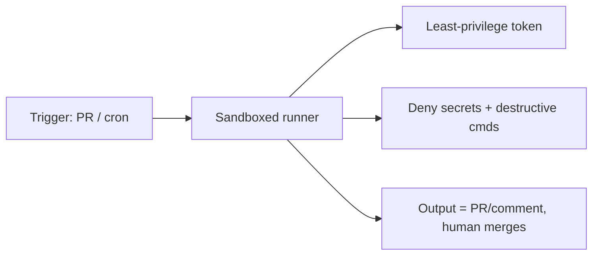

<LevelBadge level="advanced" />

Запуск Claude в [headless-режиме](/docs/claude-code/headless-and-agent-sdk) или [по расписанию](/docs/claude-code/background-tasks) — в CI, в cron-задаче, в pre-commit-хуке — убирает человека, который обычно перехватил бы плохое действие. Именно это удобство и является причиной, по которой такие запуски требуют максимально жёстких ограничений.

## Риски, характерные для запусков без присмотра

- **Некому сказать «нет»** рискованному вызову инструмента в нужный момент.
- **Окружающие учётные данные.** В CI часто есть мощные токены (для деплоя, реестра пакетов, облака). Агент там наследует их.
- **Недоверенный ввод.** Запуск, инициированный PR или issue, может обрабатывать контент, созданный атакующим ([инъекция](/docs/security/prompt-injection)).

## Чек-лист усиления защиты

- **Явно запрещайте секреты.** Блокируйте чтение `.env`, файлов с ключами и путей к учётным данным с помощью [правил запрета в разрешениях](/docs/claude-code/permissions). Не полагайтесь на то, что модель сама их обойдёт.
- **Никогда не используйте режим bypass/yolo на машине с реальным доступом.** Оставьте «пропуск всех запросов» для одноразовых песочниц.
- **Ограничивайте область действия токена.** Давайте запуску токен с минимальными привилегиями (по возможности только для чтения), а не свои учётные данные с полным доступом.
- **Песочница и эфемерность.** Запускайте в контейнере, который уничтожается после работы; без постоянного доступа к продакшену.
- **Списки разрешённых команд и доменов.** Разрешайте свои команды для тестов/линтинга/сборки; запрещайте сетевые или деструктивные.
- **Ограничивайте.** Максимум итераций, бюджет времени, бюджет на токены/стоимость — чтобы цикл или манипулируемый агент не вышел из-под контроля.
- **Делайте результаты проверяемыми, а не применяемыми автоматически.** Предпочитайте «открыть PR / оставить комментарий» вместо «запушить в main». Слияние выполняет человек.

## Пример: безопасный ревьюер в CI

Бот для ревью PR должен: получать код только для чтения, **не иметь** доступа к деплою/секретам, работать в контейнере и **оставлять комментарии** со своими находками — никогда не изменяя защищённые ветки. См. [пошаговое руководство по ревью PR](/docs/walkthroughs/pr-review-action).

## Далее

- [Разрешения и режимы разрешений](/docs/claude-code/permissions)
- [Защита агентов и инструментов](/docs/security/securing-agents)
- [Headless-режим и Agent SDK](/docs/claude-code/headless-and-agent-sdk)
