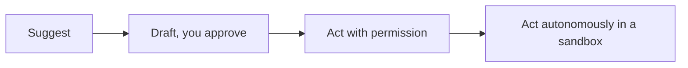

<LevelBadge level="all" />

Чтобы получить максимум от ИИ, нужно использовать его *ответственно*. Эта страница короткая, практичная и применима ко всем — от новичка до разработчика.

## Установка на проверку

Самая важная привычка: **соизмеряйте проверку со ставками.**

| Ставки | Пример | Насколько проверять |
|---|---|---|
| Низкие | Брейнсторминг, черновики | Доверяйте свободно, бегло просматривайте |
| Средние | Рабочее письмо, резюме | Прочитайте, проверьте факты на здравый смысл |
| Высокие | Публикуемая статистика, код, который вы запустите, юридические/медицинские/финансовые вопросы | Проверяйте каждое утверждение по доверенному источнику |

ИИ — это быстрый первый черновик, но никогда не окончательный авторитет — см. [Галлюцинации](/docs/foundations/hallucinations).

## Лестница автономии

Давайте ИИ больше независимости только по мере того, как растёт доверие:

Начните с «предложи, я одобрю» ([режим планирования](/docs/claude-code/plan-mode)); полную автономию оставьте для низкорисковой, изолированной в песочнице, обратимой работы ([Усиление защиты автономных запусков](/docs/security/hardening-autonomous-runs)).

## Конфиденциальность и данные

- Не вставляйте секреты, учётные данные или чужие персональные данные в инструмент, который вы не проверили.
- Узнайте политику вашего провайдера в отношении обработки данных и обучения, прежде чем делиться чувствительным материалом — см. [Конфиденциальность и обработка данных](/docs/foundations/privacy).
- Для регулируемых или конфиденциальных данных используйте соответствующие корпоративные/контролируемые настройки.

## Предвзятость, справедливость и пределы

Модели отражают закономерности в своих обучающих данных, которые могут нести **предвзятость**. Будьте особенно осторожны, когда вывод ИИ влияет на решения о людях (найм, кредитование, модерация). Сохраняйте ответственность человека за значимые решения и относитесь к ИИ как к помощнику в суждении, а не его замене.

## Не отдавайте своё мышление на аутсорс

:::tip Используйте ИИ, чтобы думать лучше, а не меньше
Лучшие пользователи остаются вовлечёнными — они подвергают вывод сомнению, учатся на нём и берут ответственность за результат. Для учёбы это означает [цикл объяснения изученного](/docs/playbooks/learning), а не копипаст. Вы отвечаете за то, что выпускаете с помощью ИИ.
:::

## Кратко о безопасности

Если ИИ когда-либо читает недоверенный контент (веб-страницы, письма, документы) или совершает действия, вы наследуете модель безопасности. Прочитайте [Prompt-инъекции](/docs/security/prompt-injection) и [Защита агентов](/docs/security/securing-agents).

## Далее

- [Объяснение prompt-инъекций](/docs/security/prompt-injection)
- [Галлюцинации и как их уменьшить](/docs/foundations/hallucinations)
- [Конфиденциальность и обработка данных](/docs/foundations/privacy)
