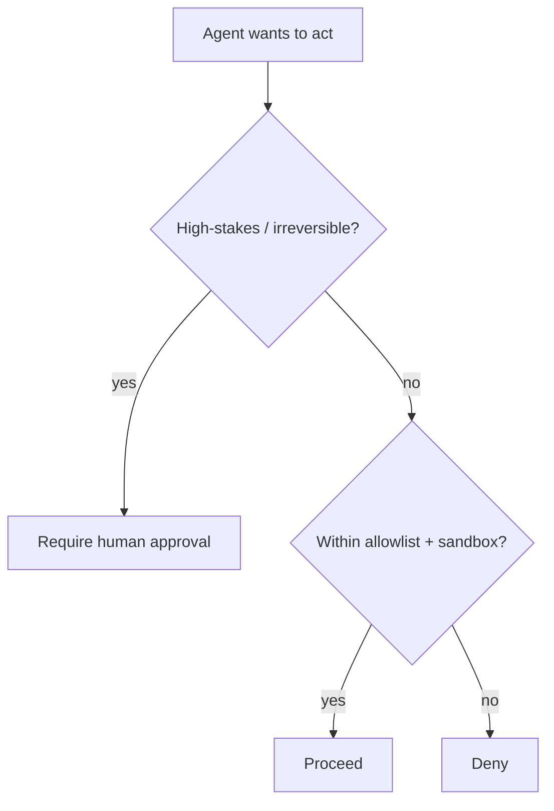

<LevelBadge level="advanced" />

В тот момент, когда ИИ может **совершать действия** (вызывать инструменты, выполнять код, обращаться к API), он наследует модель безопасности. Цель не в том, чтобы сделать модель неуязвимой к обману, — а в том, чтобы гарантировать, что **даже если её обманут, она не сможет причинить большого вреда**.

## Главный принцип: минимальные привилегии

Давайте агенту **минимальный** доступ, необходимый для его задачи, и ничего сверх этого.

- Суммаризатору документов нужно **чтение**, а не запись или сеть.
- Ревьюеру нужно читать код и оставлять комментарий — а не пушить или деплоить.
- Ограничивайте область действия инструментов, API-ключей и доступа к файлам для каждой задачи. Узко ограниченный агент, в которого внедрили [инъекцию](/docs/security/prompt-injection), может нанести лишь узкий ущерб.

## Проблема «запутавшегося заместителя»

Агент часто действует **от вашего имени** (вашими токенами, вашими сессиями). Если ввод, контролируемый атакующим, направляет его, атакующий заимствует ваши привилегии — это «запутавшийся заместитель» (confused deputy). Защита: не давайте агенту окружающие полномочия, которые ему не нужны, и требуйте явных, ограниченных по области действия учётных данных для чувствительных инструментов.

## Слои защиты

1. **Песочница** для выполнения кода и доступа к файлам — контейнеры, эфемерные директории, без доступа к более широкой системе или секретам.
2. **Список разрешённого** для опасной поверхности: какие команды, какие домены, какие пути. Остальное запрещайте. (В Claude Code это [разрешения](/docs/claude-code/permissions).)
3. **Человек в контуре** для необратимых или ответственных действий: отправка денег, писем, удаление, деплой, изменение конфигурации продакшена.
4. **Разделяйте зоны доверия.** Не позволяйте одному агенту одновременно держать секреты, читать недоверенный контент и делать произвольные исходящие вызовы.
5. **Логируйте и проверяйте**, какие инструменты агент фактически вызывал.

## У инструментов есть схемы — проверяйте их

Входные данные инструментов, которые производит модель, могут быть ошибочными или подделанными. **Проверяйте** аргументы перед выполнением и **возвращайте ошибки в виде результатов**, чтобы агент восстанавливался, а не повторял вызовы вслепую.

## Далее

- [Объяснение prompt-инъекций](/docs/security/prompt-injection)
- [Усиление защиты автономных запусков](/docs/security/hardening-autonomous-runs)
- [Проверка стороннего кода](/docs/security/reviewing-third-party-code)
