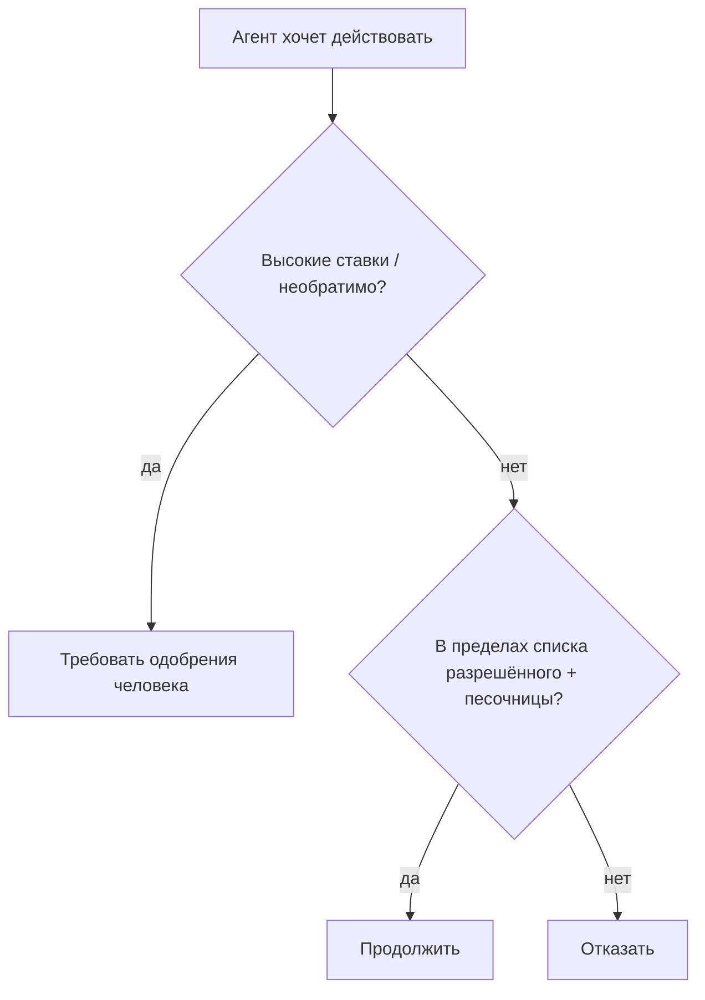

<LevelBadge level="advanced" />

<Callout type="objectives" items={["Применяйте минимальные привилегии — давайте агенту только тот доступ, который нужен для его задачи", "Распознавайте проблему «запутавшегося заместителя»: агент заимствует ваши полномочия", "Выстраивайте пять слоёв защиты, которые сокращают радиус поражения, когда агента обманывают", "Решайте, какие действия требуют человека в контуре", "Проверяйте входные данные инструментов, чтобы неверный или подделанный аргумент не смог выполниться"]} />

В тот момент, когда ИИ может **совершать действия** (вызывать инструменты, выполнять код, обращаться к API), он наследует модель безопасности. Цель не в том, чтобы сделать модель неуязвимой к обману, — а в том, чтобы гарантировать, что **даже если её обманут, она не сможет причинить большого вреда**.

## Главный принцип: минимальные привилегии

Давайте агенту **минимальный** доступ, необходимый для его задачи, и ничего сверх этого.

- Суммаризатору документов нужно **чтение**, а не запись или сеть.
- Ревьюеру нужно читать код и оставлять комментарий — а не пушить или деплоить.
- Ограничивайте область действия инструментов, API-ключей и доступа к файлам для каждой задачи. Узко ограниченный агент, в которого внедрили [инъекцию](/docs/security/prompt-injection), может нанести лишь узкий ущерб.

## Проблема «запутавшегося заместителя»

Агент часто действует **от вашего имени** (вашими токенами, вашими сессиями). Если ввод, контролируемый атакующим, направляет его, атакующий заимствует ваши привилегии — это «запутавшийся заместитель». Защита: не давайте агенту окружающие полномочия, которые ему не нужны, и требуйте явных, ограниченных по области действия учётных данных для чувствительных инструментов.

## Слои защиты

Комбинируйте их — ни одного по отдельности недостаточно. Каждый слой исходит из того, что расположенные выше могут отказать.

<Steps items={[
  {title: "Изолируйте выполнение и доступ к файлам в песочнице", body: "Запускайте код и файловые операции в контейнерах или эфемерных директориях без доступа к более широкой системе или секретам. Если агента обманут, он играет в закрытом ящике."},
  {title: "Формируйте список разрешённого для опасной поверхности", body: "Решите, какие команды, какие домены и какие пути разрешены, — остальное запрещайте. В Claude Code это разрешения (/docs/claude-code/permissions)."},
  {title: "Человек в контуре для высоких ставок", body: "Требуйте явного одобрения для необратимых или ответственных действий: отправить деньги, отправить письмо, удалить, задеплоить или изменить конфигурацию продакшена."},
  {title: "Разделяйте зоны доверия", body: "Не позволяйте одному агенту одновременно держать секреты, читать недоверенный контент и делать произвольные исходящие вызовы — именно это сочетание и есть путь для утечки данных."},
  {title: "Логируйте и проверяйте вызовы инструментов", body: "Записывайте, какие инструменты агент фактически вызывал и с какими аргументами, чтобы вы могли проводить аудит поведения и замечать отклонения."}
]} />

## Зафиксируйте список разрешённого письменно

«Сформировать список разрешённого для опасной поверхности» легко одобрить кивком и легко пропустить. В Claude Code это конкретно: `settings.json`, который разрешает узкий набор команд и доменов, необходимых для задачи, и запрещает остальное. Начинайте с ограничений и расширяйте только тогда, когда реальная задача блокируется.

<PromptCard title="Блок разрешений Claude Code с минимальными привилегиями">{`{
  "permissions": {
    "allow": [
      "Read",
      "Edit",
      "Bash(npm test:*)",
      "Bash(npm run build:*)",
      "Bash(git status)",
      "Bash(git diff:*)"
    ],
    "deny": [
      "Bash(git push:*)",
      "Bash(rm:*)",
      "Bash(curl:*)",
      "Read(./.env)",
      "Read(./secrets/**)"
    ]
  }
}`}</PromptCard>

Список `deny` побеждает `allow`, поэтому блокировка `.env` и `secrets/**` действует, даже если предоставлен широкий `Read`. См. [permissions](/docs/claude-code/permissions) для полного синтаксиса правил и приоритетов.

## У инструментов есть схемы — проверяйте их

Входные данные инструментов, которые производит модель, могут быть ошибочными или подделанными. **Проверяйте** аргументы перед выполнением и **возвращайте ошибки в виде результатов**, чтобы агент восстанавливался, а не повторял вызовы вслепую.

<Flashcards title="Прокачайте основные термины" cards={[{front: "Минимальные привилегии", back: "Давайте агенту только тот доступ, который нужен именно для его задачи, — и ничего сверх этого. Узко ограниченный агент, которого обманули, может нанести лишь узкий ущерб."}, {front: "Запутавшийся заместитель", back: "Агент действует от вашего имени (вашими токенами, вашими сессиями). Если ввод, контролируемый атакующим, направляет его, атакующий заимствует ваши привилегии."}, {front: "Песочница", back: "Запускайте код и доступ к файлам в изолированном контейнере или эфемерной директории без пути к более широкой системе или секретам, чтобы обманутый агент оставался в ящике."}, {front: "Зоны доверия", back: "Держите секреты, недоверенный контент и исходящую сеть в разных агентах. Один агент, держащий всё три, — это путь для утечки данных."}, {front: "Человек в контуре", back: "Обязательный шлюз одобрения человеком перед необратимыми или ответственными действиями — отправить деньги, удалить, задеплоить, изменить конфигурацию продакшена."}]} />

<Quiz title="Проверьте себя" questions={[
  {
    q: "Что предписывает делать принцип минимальных привилегий при настройке агента?",
    options: ["Дать ему широкий доступ, чтобы он никогда не блокировался посреди задачи", "Дать ему только тот доступ, который нужен именно для его задачи", "Дать ему те же разрешения, что и у человека, который его запускает"],
    answer: 1,
    explain: "Минимальные привилегии означают минимальный доступ, необходимый для задачи. Узко ограниченный агент, в которого внедрили инъекцию, может нанести лишь узкий ущерб."
  },
  {
    q: "Почему агент, действующий вашими токенами, представляет риск «запутавшегося заместителя»?",
    options: ["Он путает, какую модель вызвать", "Ввод, контролируемый атакующим, может направить его на использование ваших привилегий", "Он назначает других агентов заместителями без спроса"],
    answer: 1,
    explain: "Агент держит ваши полномочия. Если ввод, контролируемый атакующим, направляет его, атакующий фактически заимствует ваши привилегии — проблема «запутавшегося заместителя»."
  },
  {
    q: "В блоке разрешений Claude Code какая запись надёжно не даёт агенту прочитать файл с секретами?",
    options: ["Запись allow для Read", "Запись deny для пути к секретам, поскольку deny побеждает allow", "Удаление инструмента Bash"],
    answer: 1,
    explain: "Deny имеет приоритет над allow, поэтому deny на secrets/** действует, даже когда предоставлен широкий Read."
  }
]} />

<Callout type="takeaways" items={["Сначала минимальные привилегии: ограничивайте область действия инструментов, ключей и доступа к файлам для каждой задачи, чтобы обманутый агент мог нанести лишь узкий ущерб", "Агент действует от вашего имени — не давайте ему окружающих привилегий, которые ему не нужны (проблема «запутавшегося заместителя»)", "Комбинируйте пять слоёв: песочница, список разрешённого, человек в контуре, разделение зон доверия, логирование и проверка", "В Claude Code правила deny побеждают правила allow — явно блокируйте пути .env и secrets", "Проверяйте аргументы инструментов перед выполнением и возвращайте ошибки в виде результатов, чтобы агент восстанавливался, а не повторял вызовы вслепую"]} />

## Далее

- [Объяснение prompt-инъекций](/docs/security/prompt-injection)
- [Усиление защиты автономных запусков](/docs/security/hardening-autonomous-runs)
- [Проверка стороннего кода](/docs/security/reviewing-third-party-code)
