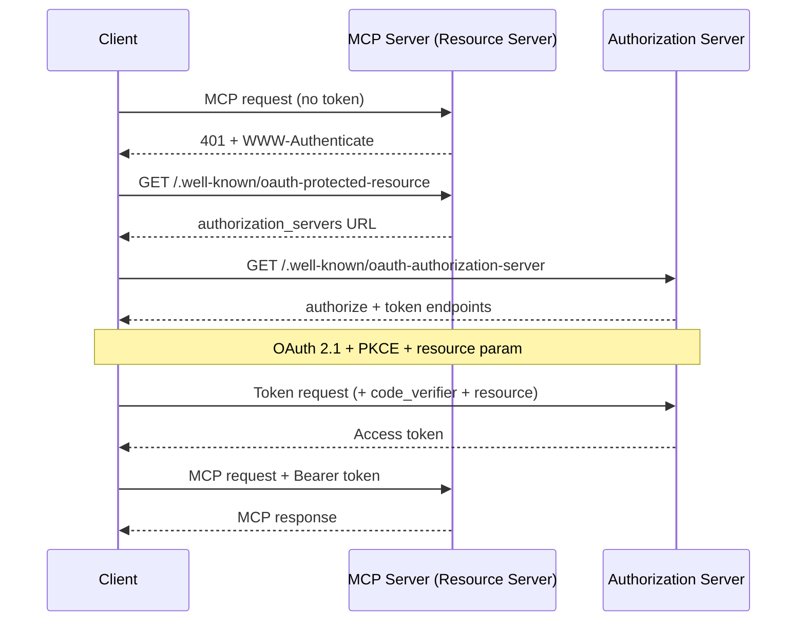
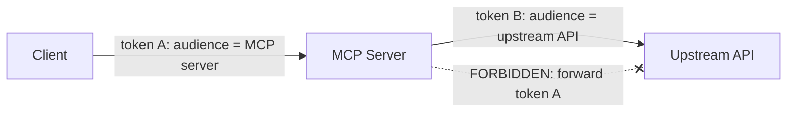

<LevelBadge level="advanced" />

<Callout type="objectives" items={["Понять, почему удалённый (HTTP) MCP-сервер является сервером ресурсов OAuth 2.1, а не просто эндпоинтом с API-ключом", "Проследить рукопожатие обнаружения: 401 → Protected Resource Metadata → Authorization Server Metadata → токен", "Объяснить привязку токена к аудитории (RFC 8707) и почему она не даёт токену одного сервиса работать на другом", "Назвать ловушку запутанного заместителя и единственное правило, которое её закрывает: никогда не пробрасывать токен клиента в вышестоящий API", "Применить короткий чек-лист усиления безопасности перед тем, как выставить MCP-сервер в интернет"]} />

[MCP](/docs/claude-code/mcp) превратился из новинки в способ по умолчанию, которым агенты добираются до инструментов — а значит, MCP-серверы теперь стоят перед реальными данными и реальными действиями. Локальный сервер, который вы запускаете через **STDIO**, доверяет своему окружению: он читает учётные данные из переменных окружения, и защищать сетевую границу не нужно. В тот момент, когда вы делаете тот же сервер **удалённым** (HTTP), любой, кто может дотянуться до URL, может попытаться его вызвать. Это превращает задачу в проблему авторизации, и спецификация MCP отвечает на неё **OAuth 2.1** — а не самодельной схемой с API-ключами.

Эта страница о удалённом случае. Если ваш сервер работает только через STDIO, спецификация прямо говорит: *не* следуйте потоку OAuth — берите учётные данные из окружения и идите дальше.

<VerifyNote lastVerified="2026-07-07" source="https://modelcontextprotocol.io/specification/2025-06-18/basic/authorization" />

## Три роли

OAuth разбивает задачу на три стороны. MCP аккуратно ложится на них:

<Flashcards title="Кто есть кто в потоке MCP OAuth" cards={[{front: "MCP-сервер = сервер ресурсов", back: "Защищаемая сущность. Он принимает запросы с токеном доступа, проверяет токен и возвращает данные — или 401, если токен отсутствует или неверен. Он НЕ выполняет вход пользователя."}, {front: "MCP-клиент = OAuth-клиент", back: "Хост вашего агента (Claude Code, десктопное приложение, ваш собственный код). Он получает токен от имени пользователя и прикрепляет его к каждому запросу заголовком Bearer."}, {front: "Сервер авторизации (AS)", back: "Сторона, которая фактически общается с пользователем, получает согласие и выдаёт токены. Может размещаться вместе с сервером или быть отдельным поставщиком идентификации. Его внутреннее устройство находится вне области MCP."}]} />

Ключевой сдвиг в мышлении: **MCP-сервер сам никогда не обрабатывает вход.** Он лишь проверяет токены, выданные кем-то другим. Именно это разделение позволяет поставить готового поставщика идентификации перед сервером, который вы написали.

## Рукопожатие обнаружения

Клиент не должен заранее быть настроен на то, где аутентифицироваться. MCP делает обнаружение автоматическим, управляемым `401`:

<Steps items={[
  {title: "Клиент вызывает сервер без токена", body: "Самый первый запрос уходит пустым. Сервер отклоняет его с HTTP 401 Unauthorized и заголовком WWW-Authenticate, указывающим на URL его resource-metadata."},
  {title: "Клиент запрашивает Protected Resource Metadata (RFC 9728)", body: "Он делает GET на /.well-known/oauth-protected-resource у сервера. Поле authorization_servers в документе называет как минимум один сервер авторизации, который клиент может использовать."},
  {title: "Клиент запрашивает Authorization Server Metadata (RFC 8414)", body: "Он делает GET на /.well-known/oauth-authorization-server у AS, чтобы узнать эндпоинты authorize и token и поддерживаемые возможности."},
  {title: "Опционально: динамическая регистрация клиента (RFC 7591)", body: "Если у клиента нет client ID для этого AS, он может сделать POST на /register, чтобы получить его без участия человека — это критично, потому что клиент не может знать каждый MCP-сервер заранее."},
  {title: "Авторизация OAuth 2.1 с PKCE + resource", body: "Клиент генерирует верификатор/challenge PKCE, открывает браузер по URL authorize, включая параметр resource, пользователь даёт согласие, и клиент обменивает возвращённый код (вместе с верификатором) на токен доступа."},
  {title: "Клиент повторяет запрос с токеном", body: "Теперь каждый запрос несёт Authorization: Bearer <token>. Сервер проверяет его и отвечает."}
]} />

Обратите внимание: на стороне клиента **нет захардкоженной конфигурации аутентификации** — `401` запускает всё остальное. В этом весь смысл: агент может подключиться к серверу, который он никогда не видел, и разобраться, как аутентифицироваться.

## Привязка к аудитории: несущее правило

Вот тот сценарий отказа, ради предотвращения которого существует привязка к аудитории. Скажем, у пользователя есть токен, выданный для `calendar.example.com`. Вредоносный (или просто небрежный) MCP-сервер на `evil.example.com` обманом заставляет клиент отправить *этот* токен ему. Если `evil` его примет, он может тут же вызвать API календаря от имени пользователя. Токен одного сервиса сработал на другом. Граница безопасности OAuth только что рухнула.

Решение — **Resource Indicators (RFC 8707)**:

<Steps items={[
  {title: "Клиент объявляет цель", body: "Как в запросе на авторизацию, так и в запросе на токен клиент ОБЯЗАН включить параметр resource, установленный в канонический URI MCP-сервера, который он намеревается вызвать — например resource=https://mcp.example.com. Он отправляет его, даже если не уверен, что AS его поддерживает."},
  {title: "AS привязывает токен к этой аудитории", body: "Когда это поддерживается, AS помечает токен так, чтобы он был действителен только для этого конкретного сервера ресурсов."},
  {title: "Сервер проверяет аудиторию", body: "Прежде чем выполнять любую работу, MCP-сервер ОБЯЗАН убедиться, что токен был выдан именно ЕМУ — проверяя claim аудитории (RFC 9068). Токен, отчеканенный для кого-то другого, получает 401, точка."}
]} />

<PromptCard title="Параметр resource в запросе на авторизацию (URL-кодированный)">{`&resource=https%3A%2F%2Fmcp.example.com`}</PromptCard>

Канонические URI строги: `https://mcp.example.com` и `https://mcp.example.com:8443/mcp` допустимы; `mcp.example.com` (без схемы) и `https://mcp.example.com#frag` (фрагмент) — нет. Для совместимости предпочитайте форму без завершающего слэша.

## Запутанный заместитель: никогда не пробрасывайте токен

Это та ошибка, которая превращает благонамеренный MCP-сервер в прокси атакующего. Это та же самая [проблема запутанного заместителя](/docs/security/securing-agents#the-confused-deputy-problem) из безопасности агентов, заострённая до одного конкретного правила.

MCP-серверу часто нужно вызвать **вышестоящий API** (GitHub, сервис базы данных, другой SaaS). Возникает соблазн взять токен, который передал вам клиент, и переслать его наверх. **Не делайте этого.** Спецификация категорична: MCP-сервер **НЕ ДОЛЖЕН** пробрасывать токен, полученный от клиента.

Почему это опасно: токен клиента был выдан с *вашим* сервером в качестве аудитории. Если вы перешлёте его, вышестоящий API может доверять ему так, будто он пришёл от вас, или предположить, что вы уже проверили его — и теперь токен, ограниченный одним переходом, выполняет работу за два перехода, вне чьей-либо модели согласия.

<Callout type="warning" items={["Если ваш MCP-сервер вызывает вышестоящий API, он действует как ОТДЕЛЬНЫЙ OAuth-клиент для этого API и получает СВОЙ СОБСТВЕННЫЙ токен от вышестоящего сервера авторизации. Два независимых токена, две независимые аудитории. Токен клиента останавливается у вашей двери."]} />

## Предполётный чек-лист усиления безопасности

Прежде чем удалённый MCP-сервер коснётся публичного интернета:

<Steps items={[
  {title: "Отдавайте всё по HTTPS", body: "Все эндпоинты AS ДОЛЖНЫ работать по HTTPS. Redirect URI ДОЛЖНЫ быть HTTPS или localhost — ничего иного."},
  {title: "Проверяйте аудиторию на каждом запросе", body: "Отклоняйте любой токен, выданный не специально для этого сервера. Это единственная проверка, которая останавливает переиспользование токенов между сервисами."},
  {title: "Требуйте PKCE", body: "Клиенты ДОЛЖНЫ использовать PKCE, чтобы перехваченный код авторизации был бесполезен без соответствующего верификатора."},
  {title: "Жёстко фиксируйте точные redirect URI", body: "AS ДОЛЖЕН точно сопоставлять redirect URI с предварительно зарегистрированными значениями, а клиенты ДОЛЖНЫ использовать и проверять параметр state — оба защищают от фишинга через открытые редиректы."},
  {title: "Короткоживущие токены + ротация refresh", body: "Выдавайте короткоживущие токены доступа, чтобы ограничить ущерб от утечки; для публичных клиентов ротируйте refresh-токены. Храните токены безопасно и никогда не логируйте их."},
  {title: "Никогда не помещайте токены в URL", body: "Токены идут в заголовок Authorization, никогда в строку запроса, где они попали бы в логи и referrer'ы."},
  {title: "Наложите базовые меры безопасности агентов", body: "Привязка к аудитории — это транспортный шлюз; всё равно применяйте наименьшие привилегии, песочницу и человека в контуре из /docs/security/securing-agents. Аутентификация говорит КТО — она не говорит, что запрос безопасен."}
]} />

## Проверьте себя

<Quiz title="Проверьте себя" questions={[
  {
    q: "Удалённый MCP-сервер получает запрос без токена доступа. Что спецификация требует сделать в первую очередь?",
    options: [
      "Запросить у пользователя имя и пароль",
      "Вернуть HTTP 401 с заголовком WWW-Authenticate, указывающим на URL его resource-metadata",
      "Молча проксировать запрос в его вышестоящий API",
      "Самому выдать клиенту токен"
    ],
    answer: 1,
    explain: "Сервер — это сервер ресурсов, а не страница входа. На запрос без токена он отвечает 401 + WWW-Authenticate, что запускает обнаружение клиентом сервера авторизации."
  },
  {
    q: "От чего защищает привязка токена к аудитории (RFC 8707)?",
    options: [
      "От медленной проверки токена",
      "От того, что токен, выданный для одного сервиса, будет принят и переиспользован на другом сервисе",
      "От того, что пользователи забывают пароли",
      "От больших контекстных окон"
    ],
    answer: 1,
    explain: "Параметр resource привязывает токен к конкретному серверу, для которого он был отчеканен. Затем сервер проверяет claim аудитории и отклоняет любой токен, выданный кому-то другому — закрывая дыру переиспользования между сервисами."
  },
  {
    q: "Вашему MCP-серверу нужно вызвать вышестоящий API GitHub. Что он должен сделать с токеном доступа, который прислал ему клиент?",
    options: [
      "Переслать этот же токен в GitHub, чтобы сэкономить один round trip",
      "Ничего с GitHub — получить собственный отдельный токен как OAuth-клиент к GitHub и никогда не пробрасывать токен клиента",
      "Залогировать токен, чтобы его можно было воспроизвести позже",
      "Поместить токен в URL запроса к GitHub"
    ],
    answer: 1,
    explain: "Проброс токена клиента наверх — это ловушка запутанного заместителя, и он явно запрещён. Сервер действует как собственный OAuth-клиент к вышестоящему API с отдельным токеном, привязанным к аудитории этого API."
  },
  {
    q: "Для STDIO (локального) MCP-сервера — как спецификация предписывает обращаться с учётными данными?",
    options: [
      "Запускать полный браузерный поток OAuth 2.1 при каждом старте",
      "Брать их из окружения — поток авторизации OAuth предназначен для HTTP-транспортов, а не STDIO",
      "Захардкодить их в клиенте",
      "Полностью пропустить аутентификацию для всех транспортов"
    ],
    answer: 1,
    explain: "Спецификация говорит, что STDIO-транспорты НЕ ДОЛЖНЫ следовать HTTP-потоку авторизации и вместо этого читать учётные данные из окружения. OAuth здесь предназначен именно для удалённых, HTTP-серверов."
  }
]} />

## Источники и дополнительное чтение

- [Спецификация авторизации MCP (2025-06-18)](https://modelcontextprotocol.io/specification/2025-06-18/basic/authorization) — нормативный поток, роли и требования MUST/SHOULD, которые резюмирует эта страница.
- [Рекомендации по безопасности MCP](https://modelcontextprotocol.io/specification/2025-06-18/basic/security_best_practices) — проброс токена, запутанный заместитель и почему они запрещены.
- [RFC 8707 — Resource Indicators for OAuth 2.0](https://www.rfc-editor.org/rfc/rfc8707.html) — параметр `resource` и привязка к аудитории.
- [RFC 9728 — OAuth 2.0 Protected Resource Metadata](https://datatracker.ietf.org/doc/html/rfc9728) — как сервер ресурсов объявляет свои серверы авторизации.
- [RFC 8414 — OAuth 2.0 Authorization Server Metadata](https://datatracker.ietf.org/doc/html/rfc8414) и [RFC 7591 — Dynamic Client Registration](https://datatracker.ietf.org/doc/html/rfc7591).
- [Черновик OAuth 2.1](https://datatracker.ietf.org/doc/html/draft-ietf-oauth-v2-1-13) — PKCE, безопасность коммуникаций и требования к обращению с токенами.
- Связанное на AILmanac: [Защита агентов и инструментов](/docs/security/securing-agents) · [Внедрение промптов](/docs/security/prompt-injection) · [MCP в Claude Code](/docs/claude-code/mcp).
