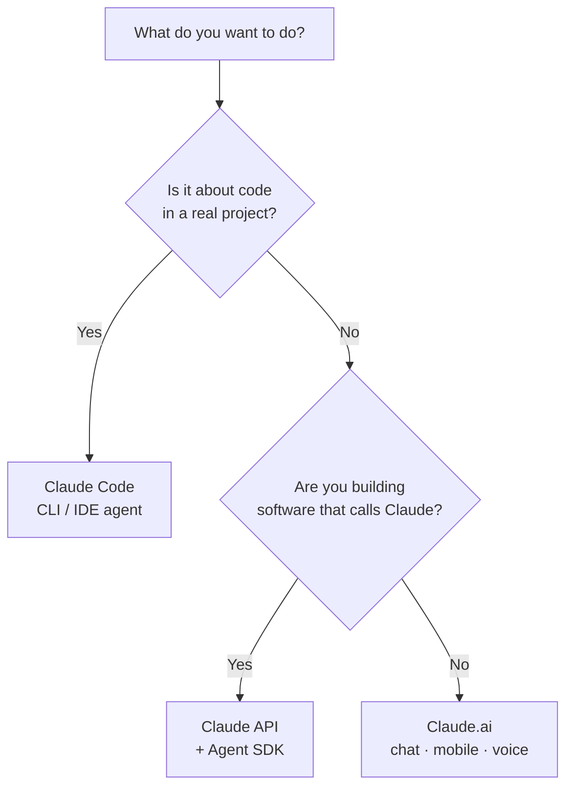

<LevelBadge level="beginner" />

«Claude» бывает в нескольких вариантах. Выбирайте по тому, **что вы пытаетесь сделать**, а не по тому, о каком вы слышали.

## Решение за 30 секунд

## Claude.ai — чат-приложения

**Для:** письма, исследований, анализа, обучения, планирования, повседневных вопросов. **Кому:** всем, без настройки.

Вы также получаете его на **мобильном** ([iOS/Android](/docs/claude-app/mobile)) и через **[голос](/docs/claude-app/voice-mode)** — отлично подходит, чтобы фиксировать идеи на ходу. Усильте его с помощью [Проектов](/docs/claude-app/projects), [кастомных инструкций](/docs/claude-app/custom-instructions) и [Артефактов](/docs/claude-app/artifacts). → Начните с [Начала работы с Claude.ai](/docs/claude-app/getting-started).

## Claude Code — агентный инструмент для кодинга

**Для:** работы *внутри кодовой базы* — чтения, редактирования, выполнения команд, исправления тестов. **Кому:** разработчикам (и технически любопытным). Он действует с вашими файлами с вашего разрешения. → [Что такое Claude Code](/docs/claude-code/what-is-claude-code).

## API и Agent SDK — встройте Claude в собственное ПО

**Для:** приложений, автоматизаций и агентов, которые вызывают Claude программно. **Кому:** разработчикам, выпускающим продукт или конвейер. → [Ваш первый вызов API](/docs/api/first-call).

## Они работают вместе

Это не конкурирующие продукты — большинство людей постепенно переходят между ними:

| Вы хотите… | Используйте |
|---|---|
| Набросать письмо, резюмировать PDF, провести мозговой штурм | Claude.ai (или голос/мобильный) |
| Отрефакторить модуль, добавить тесты, исправить баг | Claude Code |
| Добавить ИИ-функцию в *ваше* приложение | API / Agent SDK |

:::tip Не уверены? Начните с чата
[Claude.ai](/docs/claude-app/getting-started) не требует никакой настройки и обучает вас тому, как Claude «думает». Эти навыки переносятся на всё остальное.
:::

## Дальше

- [Ваши первые 5 минут](/docs/start-here/your-first-5-minutes)
- [Пути обучения](/docs/start-here/learning-paths)
- [Выбор модели Claude](/docs/api/choosing-a-model) (когда начнёте строить)
