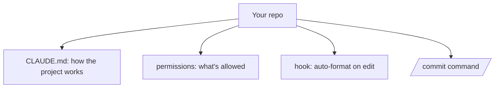

<LevelBadge level="intermediate" />

Давайте превратим свежий чекаут в конфигурацию Claude Code, которая *знает ваш проект и уважает ваши правила* — примерно за 20 минут. Мы соберём вместе ключевые возможности, объяснив назначение каждой.

## Итоговое состояние



## Шаг 1 — Сгенерируйте и подрежьте CLAUDE.md

Запустите `/init`, чтобы набросать [CLAUDE.md](/docs/claude-code/claude-md), а затем **сократите его** до того, что соответствует действительности: стек, как запускать/тестировать/линтить, реальные соглашения и предохранители («запускай тесты перед завершением», «не трогай `/generated`»). *Почему:* это настройка с наибольшей отдачей — Claude читает её каждую сессию.

Возьмите заготовку из раздела [Шаблоны CLAUDE.md](/docs/templates/claude-md).

## Шаг 2 — Настройте разрешения

Добавьте файл `.claude/settings.json` ([справочник](/docs/claude-code/settings)), который заранее разрешает безопасные повторяющиеся команды и запрещает опасные:

```json
{
  "permissions": {
    "allow": ["Read", "Bash(npm run test:*)", "Bash(npm run lint)", "Bash(git diff:*)"],
    "ask": ["Write", "Bash(npm install:*)"],
    "deny": ["Read(./.env)", "Bash(git push --force:*)"]
  }
}
```

*Почему:* меньше прерываний на безопасных действиях и жёсткие стопы на рискованных. См. [Разрешения](/docs/claude-code/permissions).

## Шаг 3 — Добавьте хук форматирования

Автоматически форматируйте после каждого редактирования ([хуки](/docs/claude-code/hooks)):

```json
{ "hooks": { "PostToolUse": [ { "matcher": "Edit|Write",
  "hooks": [ { "type": "command", "command": "npx prettier --write \"$CLAUDE_FILE_PATH\" 2>/dev/null || true" } ] } ] } }
```

*Почему:* единообразное форматирование гарантированно — а не «пожалуйста, не забудь».

## Шаг 4 — Добавьте команду `/commit`

Поместите рецепт `/commit` из [Библиотеки слэш-команд](/docs/templates/slash-commands) в `.claude/commands/`. *Почему:* одно слово для повторяемого рабочего процесса.

## Шаг 5 — Используйте режим планирования для первой настоящей задачи

Поставьте реальную цель в [режиме планирования](/docs/claude-code/plan-mode), просмотрите план, а затем дайте ему выполниться. *Почему:* доверие выстраивается за счёт разделения размышления и действия.

## Проверьте, что всё работает

- Новая сессия → Claude ссылается на ваши соглашения без подсказки (CLAUDE.md работает).
- Редактирование файла → он форматируется (хук работает).
- Рискованная команда → она запрашивает подтверждение или отклоняется (разрешения работают).
- `/commit` → аккуратное сообщение в стиле Conventional Commit (команда работает).

## Дальше

- [Напишите свой первый навык](/docs/walkthroughs/first-skill)
- [Рецепты хуков и settings.json](/docs/templates/hooks-settings)
- [Программирование и разработка ПО](/docs/playbooks/coding)
