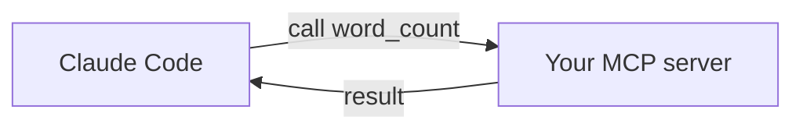

<LevelBadge level="advanced" />

<VerifyNote lastVerified="2026-06-20" source="https://modelcontextprotocol.io">
API SDK для MCP и конфигурация развиваются — сверяйтесь с официальной документацией MCP и документацией MCP для Claude Code.
</VerifyNote>

Давайте предоставим Claude собственный инструмент, собрав крошечный [MCP](/docs/claude-code/mcp)-сервер и подключив его. Мы сделаем его минимальным, чтобы *подключение* было понятным — а затем вы подставите свою реальную логику.

## Что мы создаём

stdio-сервер с одним инструментом, `word_count`, который Claude может вызывать. Тот же шаблон масштабируется до «выполни запрос к моей БД», «открой тикет» и т. д.



## Шаг 1 — Сервер

`server.py` (Python; версия на TypeScript есть в [каркасах MCP](/docs/templates/mcp-config)):

```python
from mcp.server.fastmcp import FastMCP

mcp = FastMCP("text-tools")

@mcp.tool()
def word_count(text: str) -> int:
    """Count the words in a piece of text."""
    return len(text.split())

if __name__ == "__main__":
    mcp.run()  # stdio transport
```

## Шаг 2 — Объявите его

Добавьте в `.mcp.json` в корне репозитория:

```json
{ "mcpServers": {
  "text-tools": { "command": "python", "args": ["server.py"] }
} }
```

## Шаг 3 — Подключите и протестируйте

Запустите Claude Code в репозитории. Спросите: *«Используй сервер text-tools, чтобы посчитать слова в строке: ''the quick brown fox''.»* Claude должен вызвать `word_count` и сообщить `4`. Если он не видит инструмент, проверьте, что сервер чисто запускается сам по себе и что путь в `.mcp.json` указан верно.

## Шаг 4 — Сделайте его настоящим

Замените `word_count` на свою реальную возможность — запрос к БД, вызов внутреннего API, операцию с файлами. Добавьте валидацию входных данных и возвращайте ошибки как результаты.

## Чек-лист безопасности

:::warning Сервер — это код и доступ
- **Минимум привилегий** — только те данные/действия, которые ему нужны ([Защита агентов](/docs/security/securing-agents)).
- **Проверяйте входные данные**, которые отправляет модель.
- Недоверенные данные, которые он возвращает, могут нести [инъекцию промпта](/docs/security/prompt-injection).
- **Проверяйте** любой сторонний сервер перед подключением.
:::

## Дальше

- [MCP-серверы в Claude Code](/docs/claude-code/mcp)
- [Конфигурация MCP и каркасы серверов](/docs/templates/mcp-config)
- [Использование инструментов / вызов функций](/docs/api/tool-use)
