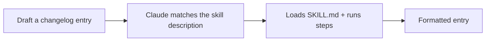

<LevelBadge level="intermediate" />

<VerifyNote lastVerified="2026-06-20" source="https://code.claude.com/docs/en/skills">
Структура навыков и их обнаружение могут меняться — сверяйтесь с официальной документацией по навыкам.
</VerifyNote>

Давайте соберём рабочий [навык](/docs/claude-code/skills) с нуля и докажем, что он активируется. Мы сделаем небольшой навык «запись в чейнджлог» — универсальный и переиспользуемый.

## Шаг 1 — Создайте папку

```bash
mkdir -p .claude/skills/changelog-entry
```

(Используйте `~/.claude/skills/…` для личного навыка во всех проектах.)

## Шаг 2 — Напишите SKILL.md

`.claude/skills/changelog-entry/SKILL.md`:

```markdown
---
name: changelog-entry
description: Use when the user wants to turn recent git commits into a Keep a Changelog entry.
---

# Changelog Entry

When asked for a changelog entry:
1. Run `git log --oneline -20` to see recent commits.
2. Group them into Added / Changed / Fixed / Removed (Keep a Changelog style).
3. Write concise, user-facing bullets (not raw commit messages).
4. Output only the formatted entry.
```

**`description` — это триггер**: пишите его в формате «Use when…», чтобы Claude загружал навык в нужный момент.

## Шаг 3 — (Необязательно) добавьте вспомогательный скрипт

Навыки могут поставляться со скриптами. Добавьте `scripts/recent.sh` и сошлитесь на него из SKILL.md, если хотите детерминированный сбор данных:

```bash
#!/usr/bin/env bash
git log --oneline -20
```

## Шаг 4 — Докажите, что он срабатывает

Начните сессию и скажите: *«Набросай запись в чейнджлог по недавней работе.»* Claude должен распознать намерение, загрузить навык и выполнить его шаги. Если он не активируется, ваше `description`, вероятно, недостаточно конкретно описывает, *когда* его использовать, — уточните его.



## Шаг 5 — Поделитесь им

Соберите его (вместе с другими) в [плагин](/docs/claude-code/plugins-marketplaces), чтобы ваша команда установила его в один шаг, — или внесите его в [наборы навыков](/docs/templates/skills) AILmanac.

## Подводные камни

- **Расплывчатое описание** → никогда не срабатывает (или срабатывает всегда). Будьте конкретны.
- **Слишком много в одном навыке** → пусть он делает одну понятную работу.
- **Секреты в общем навыке** → никогда; см. [Проверка стороннего кода](/docs/security/reviewing-third-party-code).

## Дальше

- [Навыки: экспертиза по требованию](/docs/claude-code/skills)
- [Шаблоны SKILL.md](/docs/templates/skills)
- [Соберите и подключите свой первый MCP-сервер](/docs/walkthroughs/first-mcp-server)
