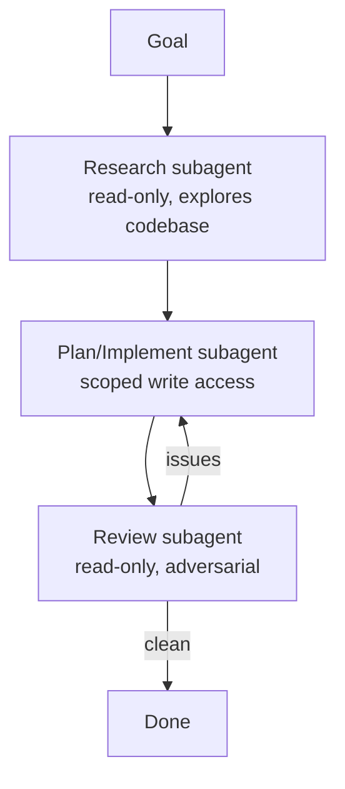

<LevelBadge level="advanced" />

Большие задачи решаются лучше, когда вы разбиваете их на сфокусированных [субагентов](/docs/claude-code/subagents), а не впихиваете всё в один контекст. Давайте спроектируем конвейер исследование → реализация → проверка.

## Общая форма

У каждого субагента есть **собственный контекст** и **подобранный набор инструментов** — и в основную сессию возвращается только *результат*, что сохраняет её чистой.

## Шаг 1 — Определите агентов

Через интерфейс `/agents` определите трёх, каждому — точное `description` (чтобы основной агент делегировал корректно) и ограниченный набор инструментов:

- **researcher** — только чтение/поиск. Картирует релевантный код и возвращает находки.
- **implementer** — может редактировать файлы и запускать тесты; получает находки исследователя на вход.
- **reviewer** — только чтение, в режиме оппонента: ищет баги, упущенные случаи и нарушения соглашений.

## Шаг 2 — Оркеструйте через передачи

Основная сессия передаёт вывод каждого этапа следующему: исследование → реализация (с использованием исследования) → проверка (реализации). Добавьте **контрольную точку проверки**: если рецензент находит проблемы, вернитесь к исполнителю до завершения.

## Шаг 3 — Знайте, когда этого делать НЕ стоит

:::warning Параллельность/мультиагентность не бесплатна
- **Последовательные зависимости** (реализация требует исследования) остаются последовательными — не разветвляйте там, где важен порядок.
- **Совместная запись в файлы** может конфликтовать — изолируйте через [git worktrees](/docs/claude-code/worktrees) или сериализуйте.
- Для небольших задач накладные расходы на координацию превышают выгоду. Применяйте это для **крупной, декомпозируемой** работы.
:::

## Шаг 4 — Проверка

Хороший мультиагентный прогон показывает: сфокусированный основной контекст (тяжёлое чтение произошло в исследователе), реализацию, отражающую исследование, и проверку, которая действительно что-то поймала (или убедительно дала добро). Если рецензент лишь штампует одобрение, сделайте его промпт **оппонирующим** («попробуй найти, что не так»).

## Идём дальше

Тот же шаблон, но программно, — это [Создание агентов на API](/docs/api/building-agents) и продуктовые поверхности вроде [Cowork и команд агентов](/docs/api/cowork-and-agent-teams).

## Дальше

- [Субагенты и параллельные агенты](/docs/claude-code/subagents)
- [Git Worktrees](/docs/claude-code/worktrees)
- [Создание агентов на API](/docs/api/building-agents)
