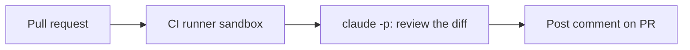

<LevelBadge level="advanced" />

<VerifyNote lastVerified="2026-06-20" source="https://code.claude.com/docs/en/sdk">
Headless-флаги и детали интеграции с CI развиваются — сверяйтесь с официальной документацией Claude Code / Agent SDK.
</VerifyNote>

Классическая автоматизация с высокой отдачей: пусть Claude **проверяет каждый пулреквест** и публикует находки в виде комментария — запускаясь в [headless](/docs/claude-code/headless-and-agent-sdk)-режиме в CI. Вот общая форма с предохранителями, которые делают её безопасной.

## Что она делает

На каждом PR: вытащить дифф, попросить Claude проверить его на баги/граничные случаи/нарушения соглашений и опубликовать комментарий. Решают по-прежнему люди; Claude лишь даёт быстрый первый проход.



## Рабочий процесс (набросок)

```yaml
name: Claude PR review
on: pull_request
permissions:
  contents: read
  pull-requests: write   # to comment — NOT write to code
jobs:
  review:
    runs-on: ubuntu-latest
    steps:
      - uses: actions/checkout@v4
        with: { fetch-depth: 0 }
      - name: Review the diff
        env:
          ANTHROPIC_API_KEY: ${{ secrets.ANTHROPIC_API_KEY }}
        run: |
          git diff origin/${{ github.base_ref }}...HEAD > /tmp/diff.patch
          claude -p "Review this diff for correctness bugs, missing edge cases, and
          security issues. Report ONLY high-confidence findings as a Markdown
          checklist with file:line. Diff:" < /tmp/diff.patch > /tmp/review.md
      # then post /tmp/review.md as a PR comment (e.g. with the gh CLI or an action)
```

(Точный вызов headless может отличаться — см. документацию. Принцип таков: подайте дифф, захватите Markdown, опубликуйте его.)

## Предохранители (прочитайте [Защита автономных запусков](/docs/security/hardening-autonomous-runs))

:::warning Минимум привилегий в CI
- **Только комментарии.** Выдайте `pull-requests: write`, а **не** `contents: write` — бот не должен пушить код.
- **Ограничьте область токена**; никогда не открывайте доступ к деплою/секретам джобу, который читает недоверенное содержимое PR.
- **Считайте содержимое PR недоверенным** — оно может нести [инъекцию промпта](/docs/security/prompt-injection); не позволяйте джобу совершать значимые действия.
- **Ограничьте стоимость** — большие диффы стоят [токенов](/docs/api/tokens-and-pricing); рассмотрите проверку только изменённых файлов.
:::

## Делайте его полезным, а не шумным

- Просите **только находки с высокой уверенностью** — стену придирок проигнорируют.
- Оставляйте его как **первый проход**, а решение о мерже принимают люди.

## Дальше

- [Headless-режим и Agent SDK](/docs/claude-code/headless-and-agent-sdk)
- [Защита автономных запусков](/docs/security/hardening-autonomous-runs)
- [Программирование и разработка ПО](/docs/playbooks/coding)
