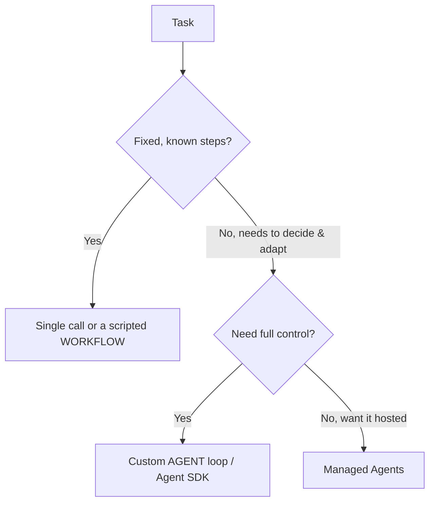

<LevelBadge level="advanced" />

<VerifyNote lastVerified="2026-06-20" source="https://platform.claude.com/docs/en/docs/agents-and-tools">
智能体工具链（Agent SDK、托管选项）演进很快——请在官方文档中确认当前可用的选项。
</VerifyNote>

<Callout type="objectives" items={["明确智能体到底是什么：一个运行在循环中的模型", "运用决策测试来选择单次调用、工作流还是智能体", "用合适的护栏设计一个最简的智能体循环", "知道何时该使用 Claude Agent SDK，而不是自己手写", "让智能体更健壮：为其设定上限、处理失败、限制权限、对其进行评估"]} />

**智能体（agent）** 是一个运行在循环中的模型：它通过调用 [工具](/docs/api/tool-use)、观察结果并决定下一步来追求目标，直到完成。在构建它之前，先选择 *能解决问题的最简单方案*。

## 决策测试（不要过度构建）

并非每个任务都需要智能体。先沿着这棵决策树走一遍——大多数任务在最顶端就停下了。

三个选项，从最简单的开始：

- **单次调用** — 一个提示词就能解决。适用于大多数任务。最便宜、最可靠。
- **工作流** — 你在代码中编排一系列固定的调用（确定性的控制流）。当步骤已知时使用。
- **智能体** — 由模型动态决定步骤。仅当路径确实无法硬编码时才使用。

<Callout type="warning">
当 *自适应* 本身就是目的时才动用智能体——而不是因为它听起来很厉害。你能掌控的工作流更易于测试和调试。
</Callout>

## 设计循环

一个最简的自定义智能体只有四个活动部件。按以下顺序构建它们：

<Steps items={[
  {title: "系统提示词", body: "声明目标、约束以及可用的工具。这是模型在每一轮推理时所依据的内容。"},
  {title: "循环", body: "发送消息 → 如果响应是 tool_use，则运行该工具，追加 tool_result，然后重复 → 直到得出最终答案或满足停止条件。"},
  {title: "护栏", body: "添加最大迭代次数上限、token/成本预算，以及在任何操作运行之前对工具输入进行校验。"},
  {title: "上下文管理", body: "随着历史增长进行摘要或裁剪——这与上下文管理（/docs/claude-code/context-management）中讲述的是同一思路。"}
]} />

**[Claude Agent SDK](/docs/claude-code/headless-and-agent-sdk)** 为你提供了这个循环——工具、权限、上下文处理一应俱全，无需你自己手写。

<Callout type="tip">
在自己动手写循环之前，先问问 Agent SDK 是否已经涵盖了它。它内置了循环、权限和上下文处理，让你可以专注于工具和目标。
</Callout>

## 让它更健壮

一个能调用工具的循环，也可能行为失当。四个习惯能让智能体保持可信赖：

- **为一切设定上限**：迭代次数、时间、成本。智能体可能陷入循环。
- **优雅地处理工具失败**（将错误作为结果返回）。
- **最小权限 + 人在回路** 应对高风险操作——参见 [保护智能体安全](/docs/security/securing-agents)。
- 在信任它之前，先在真实案例上 **评估** 它——参见 [评测](/docs/foundations/evals)。

<Callout type="takeaways" items={["智能体是一个在循环中调用工具以达成目标的模型——只在路径无法硬编码时才使用它", "决策顺序：单次调用 → 工作流 → 智能体 → 托管智能体；优先选择能解决问题的最简单方案", "一个最简循环 = 系统提示词 + tool_use/tool_result 循环 + 护栏 + 上下文管理", "Claude Agent SDK 已为你内置了循环、工具、权限和上下文处理", "健壮性 = 为迭代次数/时间/成本设定上限、处理工具失败、最小权限 + 人在回路，并在信任前进行评估"]} />

## 自我检测

<Quiz title="自我检测" questions={[
  {
    q: "在这一语境下，哪一项最能描述智能体？",
    options: [
      "一个返回完整答案的单次提示词",
      "一个运行在循环中的模型，调用工具并决定下一步，直到完成",
      "一系列由你在代码中编排的固定 API 调用",
      "一个无需任何配置的托管服务"
    ],
    answer: 1,
    explain: "智能体是一个运行在循环中的模型：它通过调用工具、观察结果并决定下一步来追求目标，直到完成。"
  },
  {
    q: "任务的步骤是固定且已知的。你应当选择什么？",
    options: [
      "一个自定义智能体循环，以获得最大的控制力",
      "托管智能体，这样它就是被托管的",
      "单次调用或一个脚本化的工作流",
      "一个多智能体团队"
    ],
    answer: 2,
    explain: "当步骤固定且已知时，单次调用或脚本化的工作流（确定性的控制流）是正确且最简单的选择。"
  },
  {
    q: "自定义智能体在什么时候才真正站得住脚？",
    options: [
      "只要它听起来比工作流更厉害就行",
      "当自适应本身就是目的，且路径确实无法硬编码时",
      "对于任何调用了不止一个工具的任务",
      "仅当你无法使用 Agent SDK 时"
    ],
    answer: 1,
    explain: "当自适应本身就是目的时才动用智能体——而不是因为它听起来很厉害。你能掌控的工作流更易于测试和调试。"
  },
  {
    q: "在循环中，当模型以 tool_use 作出响应时会发生什么？",
    options: [
      "你停止循环并返回部分答案",
      "你运行该工具，追加 tool_result，然后重复",
      "你丢弃该消息并重新发送系统提示词",
      "你立即对历史进行摘要"
    ],
    answer: 1,
    explain: "循环：发送消息 → 如果是 tool_use，运行该工具，追加 tool_result，重复 → 直到得出最终答案或满足停止条件。"
  },
  {
    q: "以下哪一项不是让智能体保持健壮的护栏？",
    options: [
      "最大迭代次数上限和 token/成本预算",
      "通过将错误作为结果返回来处理工具失败",
      "授予智能体全部权限，使其永不被阻挡",
      "对高风险操作采用最小权限加人在回路"
    ],
    answer: 2,
    explain: "健壮的智能体对高风险操作采用最小权限加人在回路——这与授予全部权限恰恰相反。你还应当为迭代次数/时间/成本设定上限、优雅地处理工具失败，并在信任之前进行评估。"
  }
]} />

## 下一步

- [工具使用](/docs/api/tool-use) · [无头模式与 Agent SDK](/docs/claude-code/headless-and-agent-sdk)
- [托管智能体](/docs/api/managed-agents) · [Cowork 与智能体团队](/docs/api/cowork-and-agent-teams)
- [保护智能体与工具安全](/docs/security/securing-agents)
