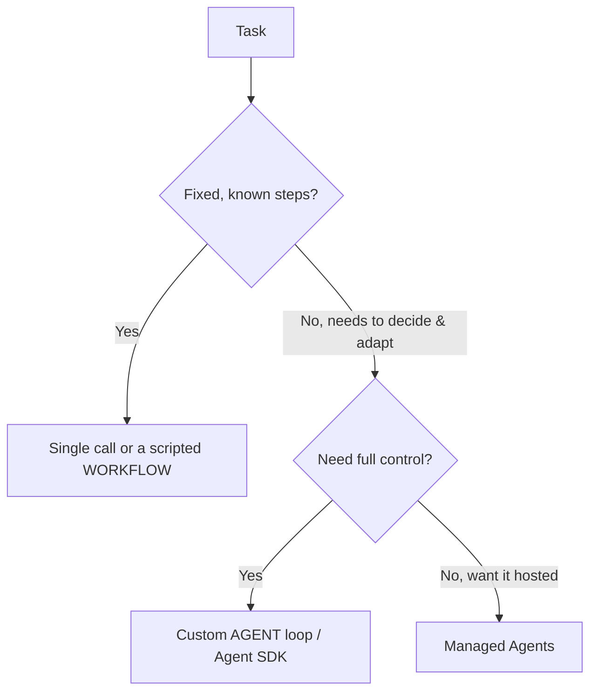

<LevelBadge level="advanced" />

<VerifyNote lastVerified="2026-06-20" source="https://docs.anthropic.com/en/docs/agents-and-tools">
智能体工具链（Agent SDK、托管选项）演进很快——请在官方文档中确认当前可用的选项。
</VerifyNote>

**智能体（agent）** 是一个运行在循环中的模型：它通过调用 [工具](/docs/api/tool-use)、观察结果并决定下一步来追求目标，直到完成。在构建它之前，先选择 *能解决问题的最简单方案*。

## 决策测试（不要过度构建）

- **单次调用** — 一个提示词就能解决。适用于大多数任务。最便宜、最可靠。
- **工作流** — 你在代码中编排一系列固定的调用（确定性的控制流）。当步骤已知时使用。
- **智能体** — 由模型动态决定步骤。仅当路径确实无法硬编码时才使用。

> 当 *自适应* 本身就是目的时才动用智能体——而不是因为它听起来很厉害。你能掌控的工作流更易于测试和调试。

## 设计循环

一个最简的自定义智能体：

1. **系统提示词**：目标、约束以及可用的工具。
2. **循环**：发送消息 → 如果出现 `tool_use`，运行该工具，追加 `tool_result`，重复 → 直到得出最终答案或满足停止条件。
3. **护栏**：最大迭代次数上限、token/成本预算，以及对工具输入的校验。
4. **上下文管理**：随着历史增长进行摘要/裁剪（与 [上下文管理](/docs/claude-code/context-management) 同理）。

**[Claude Agent SDK](/docs/claude-code/headless-and-agent-sdk)** 为你提供了这个循环——工具、权限、上下文处理一应俱全，无需你自己手写。

## 让它更健壮

- **为一切设定上限**：迭代次数、时间、成本。智能体可能陷入循环。
- **优雅地处理工具失败**（将错误作为结果返回）。
- **最小权限 + 人在回路** 应对高风险操作——参见 [保护智能体安全](/docs/security/securing-agents)。
- 在信任它之前，先在真实案例上 **评估** 它——参见 [评测](/docs/foundations/evals)。

## 下一步

- [工具使用](/docs/api/tool-use) · [无头模式与 Agent SDK](/docs/claude-code/headless-and-agent-sdk)
- [托管智能体](/docs/api/managed-agents) · [Cowork 与智能体团队](/docs/api/cowork-and-agent-teams)
- [保护智能体与工具安全](/docs/security/securing-agents)
