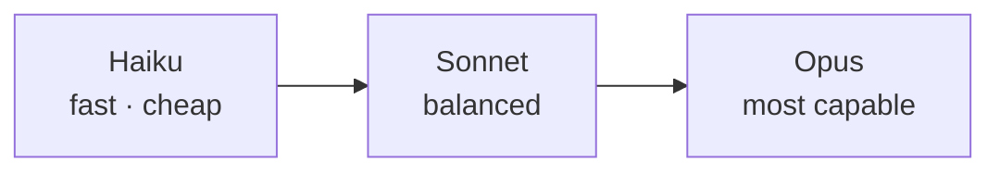

<LevelBadge level="beginner" />

Anthropic 提供了一系列处于不同能力/成本/速度定位的模型。选好模型的关键在于让模型与任务匹配——并且不为你用不到的能力多花钱。

## 当前的模型

<ModelTable />

## 试一试：哪个模型合适？

回答三个问题，获得一个起步建议：

<ModelPicker />

## 心智模型：一条能力阶梯

- **从 Sonnet 开始。** 它是默认的主力——具备强大的推理与编码能力，且成本合理。大多数任务都应从这里起步。
- **仅在 Sonnet 力不从心、且质量比成本更重要时（高难度推理、棘手的智能体、棘手的代码）才升级到 Opus。**
- **对于高并发、对延迟敏感或简单的工作（分类、抽取、路由、廉价的子智能体），降级到 Haiku。**

## 实际该如何选择

1. **默认使用 Sonnet** 并上线。
2. **遇到质量瓶颈？** 只在困难的子集上尝试 Opus。
3. **成本或延迟吃不消？** 看看 Haiku 是否足以胜任那一步。
4. **混合使用模型。** 用 Haiku 做廉价的前/后处理，用 Sonnet/Opus 攻克核心难题。这种"模型分层"是最有力的成本杠杆之一——参见 [成本与延迟](/docs/foundations/cost-and-latency)。

:::tip 不要只凭基准测试来选
公开的基准测试是一个起点提示，而不是针对 *你的* 任务的定论。在两个模型上，用你的少量真实输入跑一个小型 [评测](/docs/foundations/evals)——只需几分钟，胜过靠猜。
:::

## 查找确切的模型 ID

始终传入当前的 API 模型 ID（例如在你的 `messages.create` 调用中）。从 [上面的模型表](/docs/whats-new/models-and-pricing) 或官方模型页面获取它——并且最好从配置中读取，而不是在多处硬编码，这样模型升级就只需改一行。

## 下一步

- [Token、上下文与定价](/docs/api/tokens-and-pricing)
- [你的第一次 API 调用](/docs/api/first-call)
- [当前模型与定价](/docs/whats-new/models-and-pricing)
