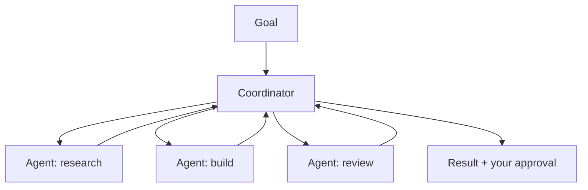

<LevelBadge level="advanced" />

<VerifyNote lastVerified="2026-06-20" source="https://docs.anthropic.com">
Cowork 与智能体团队是快速演进中的 2026 年产品形态——名称、可用性和能力经常变化。请在 Anthropic 官方文档/公告中确认当前细节。
</VerifyNote>

在单个智能体之外，Anthropic 一直在推出 **产品级** 的形态，让智能体得以开展持续的协作工作：**Cowork**（一个智能化的桌面工作空间）与 **智能体团队**（多个智能体协作）。本页是一份高层概览——由于这些内容演进很快，请对照官方文档核实具体细节。

## Claude Cowork

可以把它理解为 **一个工作空间，智能体在其中与你并肩开展真实的、多步骤的工作**——在比单轮对话更长的时间跨度上操作文件和工具，并由你监督。它是在 API 上构建智能体的面向消费者/专业用户的"近亲"：循环已经为你提供好，你负责指引目标。

## 智能体团队

当一个智能体不够用时，**多个智能体协作**——分解一个目标，每个智能体各司其职、各持工具，协同朝着结果迈进。在概念上它与 Claude Code 的 [子智能体](/docs/claude-code/subagents) 相似，但作为一种产品形态，面向持续的多智能体协作，而非单个被委派的子任务。

## 这与本站其余内容的关系

- 以编程方式自己构建 → [构建智能体](/docs/api/building-agents) + [Agent SDK](/docs/claude-code/headless-and-agent-sdk)。
- 在编码会话内部进行委派 → [子智能体](/docs/claude-code/subagents)。
- 托管的循环/状态/调度 → [托管智能体](/docs/api/managed-agents)。

## 不变的要点：监督

:::warning 自主性越强，越要谨慎
多智能体、长时间跨度的工作会同时放大价值 *与* 风险。在有重大后果的操作上保持人在回路，严格收紧工具访问权限，并核验输出——参见 [负责任地使用](/docs/security/responsible-use) 与 [保护智能体安全](/docs/security/securing-agents)。
:::

## 下一步

- [子智能体与并行智能体](/docs/claude-code/subagents)
- [托管智能体](/docs/api/managed-agents)
- [负责任地使用、伦理与核验](/docs/security/responsible-use)
