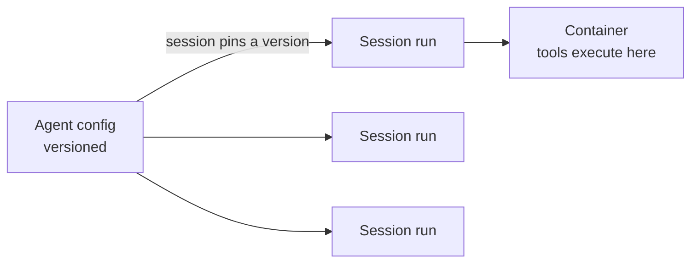

<LevelBadge level="advanced" />

<VerifyNote lastVerified="2026-06-26" source="https://platform.claude.com/docs/en/docs/agents-and-tools">
托管智能体的能力和可用性会发生变化——该 API 处于 beta 阶段。在基于它进行构建之前，请先在官方文档中确认端点、字段名和访问权限。
</VerifyNote>

<Callout type="objectives" items={["理解托管的（Anthropic 托管的）智能体循环为你接管了哪些工作", "区分两个核心对象：带版本的 Agent 与单次运行的 Session", "用保险库（Vaults）安全注入密钥——而模型永远看不到它们", "用定时部署（Scheduled Deployments）把智能体放到 cron 计划上——无需自己托管调度器", "明白托管何时优于自定义循环，以及仍然适用的护栏"]} />

如果[构建你自己的智能体循环](/docs/api/building-agents)所需的基础设施超出了你想要拥有的范围，那么**托管的**（Anthropic 托管的）智能体会替你运行这个循环——这样你就可以专注于智能体的*职责*，而不是 session 管道、重试、状态和调度。

## 两个对象：Agent 与 Session

这是其他一切所依附的心智模型。它们被刻意分开。

- **Agent** 是一份*持久化、带版本的配置*——模型、系统提示、工具、MCP 服务器和技能。你只创建它一次。每次更新都会生成一个新的不可变版本。
- **Session** 是一个*运行时实例*——一次执行，通过 ID 指向某个 agent。配置存在于 agent 上，永远不在 session 上。

<Callout type="tip">
Session 会**固定**到它们被创建时所对应的 agent 版本：正在运行的 session 保持其版本，新的 session 获取最新版本。这就是你在不破坏进行中工作的情况下发布配置变更的方式。
</Callout>

## "托管"为你带来了什么

与其手工编写并托管循环，你得到的是托管的构建模块：

- **Sessions**——你为每次执行创建并可恢复的持久化运行；通过 SSE 流式传输事件。
- **Environments**——容器基础设施，可以是 `cloud`（Anthropic 托管）或 `self_hosted`（工具在你自己的 VPC 中执行）。每个 session 对应一个容器，即智能体的工作区。
- **Memory stores**——跨 session 的持久化状态，带版本控制和脱敏，无需你接入数据库。
- **Vaults**——用于 MCP 认证和其他服务的密钥。
- **Scheduled deployments**——按 cron 计划无人值守运行的智能体。

<PromptCard title="创建一个 agent（带版本的配置），然后针对它运行一个 session">{`# 1. Create the agent once
POST /v1/agents        -> returns $AGENT_ID
# 2. Each execution is a session pinned to that agent
POST /v1/sessions      { "agent": "$AGENT_ID" }`}</PromptCard>

## Vaults：模型永远看不到的密钥

一个自主智能体常常需要一个 API 密钥——但*模型*永远不应该读到它。保险库凭据（`mcp_oauth`、`static_bearer`、`environment_variable`）在出口处被替换：一个 `environment_variable` 凭据会在执行时被注入到沙箱中，并且*对模型永不可见*。

<Callout type="warning">
这是赋予智能体强大访问权限的安全模式。不要把密钥粘贴到系统提示或消息中——它们会成为模型（以及你的日志）可见的上下文的一部分。把它们放进保险库。
</Callout>

## 定时部署：放在 cron 上的智能体

一个**部署（deployment）**为某个 agent 附加一个 cron 计划。当计划触发时，它会启动一个全新的 session 并完成其任务——无需你构建或托管调度器。适合每晚的数据同步、每周的合规扫描或每日摘要。

<Steps items={[
  {title: "定义计划", body: "POST /v1/deployments，带上 agent、environment_id、initial_events（必须包含一个 user.message），以及一个 schedule：一个 POSIX cron 表达式加上一个 IANA 时区。"},
  {title: "每次触发 = 一次运行", body: "每次触发尝试都会创建一条运行记录（drun_ 前缀）。成功会带有 session_id；失败会带有 error.type（例如 environment_archived、session_rate_limited）。通过 GET /v1/deployment_runs?deployment_id=... 列出运行记录。"},
  {title: "控制生命周期", body: "暂停（pause）会抑制未来的触发（手动运行仍然有效）；取消暂停（unpause）会在下一次发生时恢复，且不会回补错过的触发；归档（archive）是终态。"},
  {title: "按需触发", body: "POST /v1/deployments/{id}/run 会立即启动一个 session——即使在暂停期间也可以——其 trigger_context.type 为 manual。"}
]} />

<PromptCard title="一个每周合规扫描，纽约时间周五 20:00">{`POST /v1/deployments
{
  "name": "Weekly compliance scan",
  "agent": "$AGENT_ID",
  "environment_id": "$ENVIRONMENT_ID",
  "initial_events": [
    {"type": "user.message", "content": [{"type": "text", "text": "Run the compliance scan and summarize findings."}]}
  ],
  "schedule": {"type": "cron", "expression": "0 20 * * 5", "timezone": "America/New_York"}
}`}</PromptCard>

<Callout type="tip">
Cron 是 `minute hour day-of-month month day-of-week`，分钟级粒度。DST（夏令时）采用挂钟时间语义：在春季向前调整时不存在的时间会被跳过；在秋季向后回拨时出现两次的时间会触发两次。对于任何敏感的任务，请选择一个能避开这些边界的时区和小时。
</Callout>

## 何时选择托管 vs 自定义

| 何时选择**托管**…… | 何时选择**自定义循环 / SDK**…… |
|---|---|
| 你希望托管、状态、调度和密钥都被处理好 | 你需要对循环和工具的完全控制 |
| 你在快速做原型 | 你有严格的自定义基础设施/合规需求 |
| 运维简单性比控制权更重要 | 你要深度嵌入到自己的技术栈中 |

这是一道光谱——单次调用 → 工作流 → 自定义智能体（SDK）→ 托管。从任务所允许的最简单方式开始；只在需要时才向上移动。

## 同样的护栏依然适用

无论是否托管，一个自主智能体仍然会采取行动。请坚持**最小权限**、**有界的成本/迭代次数**，以及**对高风险步骤的人工审批**——参见[保护智能体](/docs/security/securing-agents)和[强化自主运行](/docs/security/hardening-autonomous-runs)。

<Callout type="takeaways" items={["托管智能体替你接管循环、session、环境、记忆、保险库和调度，让你专注于职责", "Agent 是带版本的配置；Session 是固定到某个版本的一次运行——配置存在于 agent 上，而非 session 上", "保险库的 environment_variable 凭据在执行时注入且对模型永不可见——这是给智能体密钥的安全方式", "定时部署是一个 cron 表达式 + IANA 时区；每次触发创建一次运行，而取消暂停不会回补错过的触发", "托管位于「单次调用 -> 工作流 -> 自定义 -> 托管」中的托管那一端；自主性护栏依然适用"]} />

## 自我检测

<Quiz title="自我检测" questions={[
  {
    q: "Agent 和 Session 之间有什么区别？",
    options: [
      "它们是同一个对象的两个名称",
      "Agent 是带版本的配置；Session 是固定到某个 agent 版本的一次运行时执行",
      "Session 持有模型和系统提示；Agent 只是一个 ID",
      "Agent 运行工具；Session 存储密钥"
    ],
    answer: 1,
    explain: "Agent 是持久化、带版本的配置（模型、提示、工具、MCP、技能）。Session 是单次执行的实例，它引用 agent 并在创建时固定到其版本。"
  },
  {
    q: "你应该如何给一个托管智能体提供它所需的 API 密钥？",
    options: [
      "把它放进系统提示，让智能体可以读取它",
      "在 session 的第一条用户消息中传入它",
      "把它存储为保险库凭据，在执行时注入且对模型永不可见",
      "把它硬编码进工具定义中"
    ],
    answer: 2,
    explain: "保险库凭据（例如 environment_variable 类型）在出口处被替换且对模型永不可见——而提示或消息中的密钥会成为可见上下文的一部分。"
  },
  {
    q: "一个定时部署被暂停了两天然后取消暂停。那些在暂停期间本应触发的触发会怎样？",
    options: [
      "它们会被回补——每一次错过的运行都会在取消暂停时执行",
      "它们不会被回补；部署只是在下一次计划发生时恢复",
      "部署会被自动归档",
      "所有错过的运行都会排队并相隔一分钟运行"
    ],
    answer: 1,
    explain: "取消暂停会在下一次发生时恢复，且不会回补错过的触发。（即使在暂停期间，你仍可随时用手动触发强制运行一次。）"
  }
]} />

## 下一步

- [在 API 上构建智能体](/docs/api/building-agents)
- [Cowork 与智能体团队](/docs/api/cowork-and-agent-teams)
- [无头模式与 Agent SDK](/docs/claude-code/headless-and-agent-sdk)
- [保护智能体](/docs/security/securing-agents)
