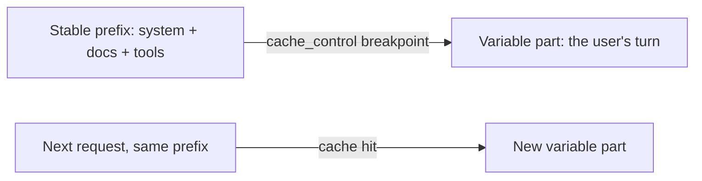

import Tabs from '@theme/Tabs';
import TabItem from '@theme/TabItem';

<LevelBadge level="advanced" />

<VerifyNote lastVerified="2026-06-21" source="https://platform.claude.com/docs/en/build-with-claude/prompt-caching">
缓存机制、适用条件，以及缓存令牌与新令牌的定价都会变化——请在官方提示缓存文档中确认。
</VerifyNote>

如果你的许多请求共享一大块不变的内容——一段很长的系统提示、一份大文档、一份工具目录——那么**提示缓存**可以让 API 复用已处理过的前缀，而不必在每次调用时重新读取它。这会同时降低被缓存部分的**成本**和**延迟**。

<Callout type="objectives" items={["思维模型：在稳定前缀之后设一个缓存断点，并在多次调用间复用","如何在 Python 和 TypeScript 中用 cache_control 标记断点","决定成败的唯一不变量——前缀必须逐字节完全一致","如何读取 usage 字段来确认你确实拿到了缓存命中","缓存在哪里收益最大，以及如何把它与批处理和模型选型搭配使用"]} />

## 工作原理（思维模型）

你在稳定前缀之后标记一个**缓存断点**。首次调用时它会被处理并缓存；后续共享**完全相同前缀**的调用会命中缓存，并为此支付远低于原本的费用。



<Flashcards title="缓存术语" cards={[{front:"缓存断点","back":"放在稳定前缀之后的 cache_control 标记。直到（含）被标记块为止的所有内容都会被缓存。"},{front:"缓存写入","back":"第一次调用为填充缓存所支付的少量附加费。"},{front:"缓存读取","back":"之后每一次使用相同前缀的调用，都以输入价格的一小部分把它读回。"},{front:"悄无声息的失效因子","back":"提示顶部附近一个会变化的值（时间戳、用户名、被重排的工具列表），它改变了前缀，悄悄把命中率拉到了零。"}]} />

## 标记断点（可直接复制粘贴）

在**最后一个稳定块**上添加 `cache_control`——这里是一段很长的系统提示。用户的回合排在它之后并可自由变化；直到（含）被标记块为止的所有内容都会被缓存。

<Steps items={[{title: "找出稳定前缀", body: "找到那一大块不变的内容——一段很长的系统提示、一份大文档，或一份在许多请求间复用的工具目录。"},{title: "为它的最后一个块附加 cache_control", body: "用类型为 ephemeral 的 cache_control 标记最后一个稳定块，使直到（含）它为止的前缀都被缓存。"},{title: "让可变部分跟随其后", body: "把用户的回合放在被标记块之后——它在每次调用时自由变化，并按全价计费。"},{title: "确认命中", body: "从响应的 usage 中读取 cache_read_input_tokens。大于零就表示你拿到了缓存命中。"}]} />

<Tabs groupId="lang">
<TabItem value="python" label="Python">

```python
import anthropic

client = anthropic.Anthropic()

message = client.messages.create(
    model="claude-sonnet-5",
    max_tokens=1024,
    system=[
        {
            "type": "text",
            "text": LARGE_STABLE_PROMPT,  # long, unchanging — the cached prefix
            "cache_control": {"type": "ephemeral"},
        }
    ],
    messages=[{"role": "user", "content": "Summarize the key points."}],  # varies per call
)

print(message.usage.cache_read_input_tokens)  # > 0 means you got a hit
```

</TabItem>
<TabItem value="ts" label="TypeScript">

```ts
import Anthropic from "@anthropic-ai/sdk";

const client = new Anthropic();

const message = await client.messages.create({
  model: "claude-sonnet-5",
  max_tokens: 1024,
  system: [
    {
      type: "text",
      text: LARGE_STABLE_PROMPT, // long, unchanging — the cached prefix
      cache_control: { type: "ephemeral" },
    },
  ],
  messages: [{ role: "user", content: "Summarize the key points." }], // varies per call
});

console.log(message.usage.cache_read_input_tokens); // > 0 means you got a hit
```

</TabItem>
</Tabs>

第一次调用会支付少量的**写入**附加费来填充缓存；之后每一次使用相同前缀的调用都会以输入价格的一小部分把它读回。前缀必须足够长才符合条件——几千个令牌，具体取决于模型——否则它会悄无声息地不被缓存。

## 决定成败的那条不变量

:::warning 缓存是前缀精确匹配的
缓存命中要求被缓存的前缀**逐字节完全一致**。最常见的 bug 是：提示顶部附近有一个*悄无声息的失效因子*——一个时间戳、一个会变的用户名、一份被重排过的工具列表——它改变了前缀，悄悄把你的命中率拉到了零。
:::

**把所有稳定的内容放在最前，所有可变的内容放在最后，**并让前缀保持真正恒定。

## 验证它是否真的生效

不要想当然——从响应的 `usage` 中把它读回来：

- **`cache_creation_input_tokens`** —— 本次调用写入缓存的令牌数（即第一次请求）。
- **`cache_read_input_tokens`** —— 由缓存提供的令牌数（即节省下来的部分）。
- **`input_tokens`** —— 未缓存的剩余部分，按全价计费。

如果在多次本应共享前缀的重复请求中 `cache_read_input_tokens` 始终为**零**，那就是有悄无声息的失效因子在作祟——对两次调用渲染出的提示字节做 diff 即可找到它。

## 在哪里收益最大

- 跨用户复用的长**系统提示**。
- **RAG / 文档问答**，对同一份原文反复查询。
- 在多轮中拥有固定工具目录和指令的**智能体**。

将缓存与面向离线工作负载的**批处理**搭配使用，并与为模型选对规格（[选择模型](/docs/api/choosing-a-model)）相结合，可获得最大的综合节省——参见[成本与延迟](/docs/foundations/cost-and-latency)。

<Quiz title="自我检测" questions={[{q:"缓存命中对被缓存的前缀有什么要求？",options:["它至少要有一个令牌长","它必须与之前的前缀逐字节完全一致","它必须排在用户的回合之后"],answer:1,explain:"缓存命中要求被缓存的前缀逐字节完全一致。任何改动——一个时间戳、一份被重排的工具列表——都会让它失效。"},{q:"哪个 usage 字段告诉你令牌是由缓存提供的（即你节省的部分）？",options:["input_tokens","cache_creation_input_tokens","cache_read_input_tokens"],answer:2,explain:"cache_read_input_tokens 是由缓存提供的令牌数。cache_creation_input_tokens 是第一次调用时写入的部分；input_tokens 是按全价计费的未缓存剩余部分。"},{q:"相对于缓存断点，每次调用中可变的内容应该放在哪里？",options:["放在稳定前缀之前","放在最后——被标记块之后","贯穿地穿插在整个系统提示中"],answer:1,explain:"把所有稳定的内容放在最前，所有可变的内容放在最后。用户的回合排在被标记块之后，并在每次调用时自由变化。"}]} />

<Callout type="takeaways" items={["在稳定前缀之后标记一个缓存断点；第一次调用写入它，之后的调用以低价把它读回。","缓存命中需要一个逐字节完全一致的前缀——把稳定内容放在前面，可变内容放在后面。","提示顶部附近悄无声息的失效因子（时间戳、用户名、被重排的工具）会悄悄把命中率拉到零。","用 usage 验证：cache_read_input_tokens > 0 表示命中；在重复请求中始终为零则说明有失效因子在作祟。","缓存对复用的系统提示、RAG 和智能体收益最大；并把它与批处理和模型选型结合使用。"]} />

## 下一步

- [令牌、上下文与定价](/docs/api/tokens-and-pricing)
- [流式输出与多轮对话](/docs/api/streaming)
- [在 API 上构建智能体](/docs/api/building-agents)
