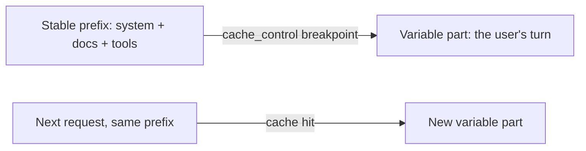

<LevelBadge level="advanced" />

<VerifyNote lastVerified="2026-06-20" source="https://docs.anthropic.com/en/docs/build-with-claude/prompt-caching">
缓存机制、适用条件，以及缓存 token 与新鲜 token 的定价会变化——请在官方提示词缓存文档中确认。
</VerifyNote>

如果你的许多请求共享一大块不变的内容——一段很长的系统提示词、一份大文档、一份工具目录——那么 **提示词缓存** 让 API 得以复用已处理过的前缀，而不必每次调用都重新读取。这会同时削减被缓存部分的 **成本** 和 **延迟**。

## 工作原理（心智模型）

你在稳定前缀之后标记一个 **缓存断点**。首次调用时它会被处理并缓存；后续共享 **完全相同前缀** 的调用将命中缓存，并为该部分支付远低于原本的费用。

## 决定成败的那条不变量

:::warning 缓存是前缀精确匹配的
缓存命中要求被缓存的前缀 **逐字节完全一致**。最常见的 bug 是：提示词顶部附近有一个 *悄无声息的失效因子*——一个时间戳、一个会变的用户名、一份被重排过的工具列表——它改变了前缀，悄悄把你的命中率拉到了零。
:::

**把所有稳定的内容放在最前，所有可变的内容放在最后，** 并让前缀保持真正恒定。

## 在哪里收益最大

- 跨用户复用的长 **系统提示词**。
- **RAG / 文档问答**，对同一份原文反复查询。
- 在多轮中拥有固定工具目录和指令的 **智能体**。

将缓存与面向离线工作负载的 **批处理** 搭配使用，并与为模型选对规格（[选择模型](/docs/api/choosing-a-model)）相结合，可获得最大的综合节省——参见 [成本与延迟](/docs/foundations/cost-and-latency)。

## 下一步

- [Token、上下文与定价](/docs/api/tokens-and-pricing)
- [流式输出与多轮对话](/docs/api/streaming)
- [在 API 上构建智能体](/docs/api/building-agents)
