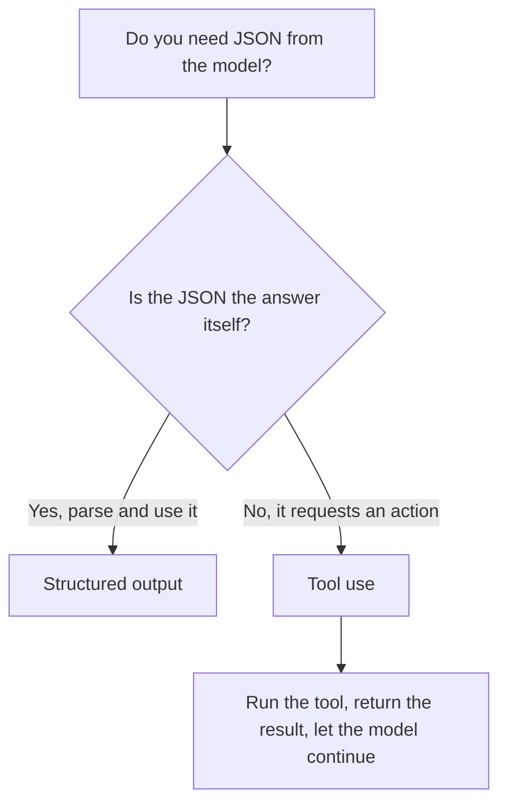

<LevelBadge level="intermediate" />

<VerifyNote lastVerified="2026-06-20" source="https://platform.claude.com/docs/en/docs/build-with-claude/structured-outputs">
强制套用 schema 的确切机制在演进——请在官方文档中确认当前的做法（输出配置 / 解析辅助方法）。
</VerifyNote>

<Callout type="objectives" items={["解释为什么由 schema 强制的输出胜过提示要 JSON 再碰运气", "提供一份 JSON Schema，并把响应解析为类型化的对象（Pydantic / Zod）", "凭意图而非机制把结构化输出与工具使用区分开", "应用四条建议，写出收得紧、可靠的 schema", "用一个一问到底的经验法则挑出合适的工具"]} />

当 Claude 的输出要喂给其他软件时，你需要 **可靠的结构**——每一次都是符合已知形态的有效 JSON。不要靠"请用 JSON 回复"再寄希望；要用平台的结构化输出支持。

本课带你从*为什么靠提示再碰运气会失败*，走到*如何强制套用一份 schema 并把它解析为类型化的对象*——以及当结构化输出和工具使用看起来一模一样时，如何把它们区分开。请从上到下逐节读完，然后用接近文末的小测验来检验自己。

## 可靠的方式

为输出提供一份 **JSON Schema**，让 API/SDK 强制套用它，然后解析为类型化的对象（例如 Python 中的 Pydantic、TypeScript 中的 Zod）。SDK 的解析辅助方法会交给你一个类型化的结果，而不是一段你还得自己 `JSON.parse` 并校验的字符串。

<Steps items={[
  {title: "定义形态", body: "把你需要的输出建模为一份 JSON Schema——在 Python 中用 Pydantic 的 BaseModel，在 TypeScript 中用 Zod schema。"},
  {title: "请求符合 schema 的输出", body: "让模型返回符合该 schema 的数据，从而由 API/SDK 强制套用它，而不是听天由命。"},
  {title: "解析为类型化的对象", body: "使用 SDK 的解析辅助方法直接得到类型化的结果——无需手动 JSON.parse 再加上自己手写的校验。"}
]} />

```python
# Conceptual shape — see the official docs for the current API surface.
from pydantic import BaseModel

class Ticket(BaseModel):
    title: str
    priority: str   # "low" | "medium" | "high"
    tags: list[str]

# Request the model to return data conforming to Ticket's JSON schema,
# then parse the response into a Ticket instance.
```

想要一个可以直接套用的具体请求吗？下面就是你交给模型的内容的形态——把其中的模型换成你自己的 schema 即可。

<PromptCard title="请求符合 schema 的输出">{`Return the data conforming to this JSON Schema:

{
  "title": "string",
  "priority": "low | medium | high",
  "tags": ["string"]
}

Do not include any prose outside the JSON.`}</PromptCard>

## 为什么不直接在提示词里要 JSON？

你 *可以* 在提示词里要 JSON，对于简单情形它也管用——但它可能漂移：多出的散文、一个尾随逗号、一个缺失的字段。由 schema 强制的输出消除了这类 bug，而一旦下游系统依赖它，这一点就至关重要。

<Callout type="warning" items={["提示式 JSON 在演示里管用，到了生产环境就出问题：故障只有在下游系统去解析它时才会暴露。", "需要警惕的三种经典漂移：JSON 周围多出的散文、一个尾随逗号、一个缺失的必填字段。"]} />

## 结构化输出 vs. 工具使用

两种功能都会给模型一份 **JSON Schema**，所以它们看起来很像——人们常常选错。区别在于*意图*，而非机制：

| | **结构化输出** | **[工具使用](/docs/api/tool-use)** |
|---|---|---|
| 你想要什么 | **最终答案**，以固定的形态 | 让模型 **调用某种能力**（调用函数、获取数据、执行动作） |
| 谁来消费它 | 直接由你的代码消费 | 你的代码运行工具，再把结果喂回给模型 |
| 回合形态 | 一次响应，结束 | 一个循环：模型发问，你执行，模型继续 |
| 典型用途 | 抽取、分类、解析 | 智能体、实时查询、副作用 |

一个快速的经验法则：



如果 JSON *就是* 交付物，使用结构化输出。如果 JSON 是模型在请求你的代码*去做*某件事，那就是工具使用。智能体常常两者都用：用工具来执行动作，用结构化输出来返回干净的最终结果。

## 提示

<Callout type="tip" items={["让 schema 收得紧——对固定选项使用枚举；标注必填字段。", "描述字段——字段描述就像迷你提示词一样引导模型。", "仍然在边界处校验——防御性解析是廉价的保险。", "对于抽取类任务，结构化输出 + 清晰的 schema 每次都胜过自由格式。"]} />

<Callout type="takeaways" items={["把一份 JSON Schema 交给 API/SDK 并解析为类型化的对象——不要靠提示再碰运气。", "提示要 JSON 可能漂移（多出的散文、尾随逗号、缺失字段）；强制 schema 消除了这类 bug。", "结构化输出 vs. 工具使用的区别在于意图：JSON 就是答案，还是 JSON 在请求一个动作。", "收得紧的 schema、带描述的字段，以及边界处的校验，让抽取和分类变得可靠。"]} />

## 固化这些术语

<Flashcards cards={[
  {front: "结构化输出", back: "你为最终答案把一份 JSON Schema 交给 API/SDK，并把响应解析为类型化的对象（Pydantic / Zod）。JSON 就是交付物。"},
  {front: "工具使用", back: "你把一份 JSON Schema 交给模型，让它得以调用某种能力。你的代码运行工具，再把结果喂回去——这是一个循环，而非一次性的答案。"},
  {front: "JSON Schema", back: "两种功能都依赖的形态。在 Python 中你用 Pydantic 的 BaseModel 来建模；在 TypeScript 中用 Zod schema。"},
  {front: "解析辅助方法", back: "直接返回类型化结果的 SDK 辅助方法，从而省去手动 JSON.parse 再加上自己手写的校验。"},
  {front: "一问到底的经验法则", back: "这份 JSON 本身就是答案吗？是 → 结构化输出。不是，它在请求一个动作 → 工具使用。"}
]} />

<Quiz title="检验自己" questions={[
  {
    q: "从 Claude 获得结构化 JSON 的可靠方式是什么？",
    options: [
      "在提示词里要求「用 JSON 回复」，失败时重试",
      "提供一份 JSON Schema，让 API/SDK 强制套用它，然后解析为类型化的对象",
      "生成自由文本，再写一个正则把字段抽取出来"
    ],
    answer: 1,
    explain: "提供一份 JSON Schema 并让 API/SDK 强制套用它，然后解析为类型化的对象，例如 Pydantic（Python）或 Zod（TypeScript）。"
  },
  {
    q: "一旦下游系统依赖它，为什么提示要 JSON 会有风险？",
    options: [
      "它比强制 schema 更慢",
      "它可能漂移——多出的散文、一个尾随逗号，或一个缺失的字段",
      "它比工具使用花更多 token"
    ],
    answer: 1,
    explain: "提示式 JSON 对简单情形管用，但可能漂移；由 schema 强制的输出消除了这类 bug。"
  },
  {
    q: "真正区分结构化输出与工具使用的是什么？",
    options: [
      "结构化输出使用 JSON Schema，工具使用不用",
      "意图：结构化输出是以固定形态给出的最终答案，工具使用则是调用某种能力",
      "工具使用是给 Python 的，结构化输出是给 TypeScript 的"
    ],
    answer: 1,
    explain: "两者都会给模型一份 JSON Schema，所以它们看起来很像。区别在于意图，而非机制——是最终答案，还是调用某种能力。"
  },
  {
    q: "关于设计 schema，哪一条是可靠的建议？",
    options: [
      "为了灵活，把字段都设为可选，并跳过枚举",
      "对固定选项使用枚举、标注必填字段，并且仍然在边界处校验",
      "信任 schema，永远不校验解析后的输出"
    ],
    answer: 1,
    explain: "让 schema 收得紧（枚举、必填字段），像迷你提示词一样描述字段，并且仍然在边界处校验，作为廉价的保险。"
  }
]} />

## 下一步

- [工具使用 / 函数调用](/docs/api/tool-use) — 工具同样使用 JSON schema
- [你的第一次 API 调用](/docs/api/first-call)
- [可复用的提示词模板](/docs/templates/prompts)
