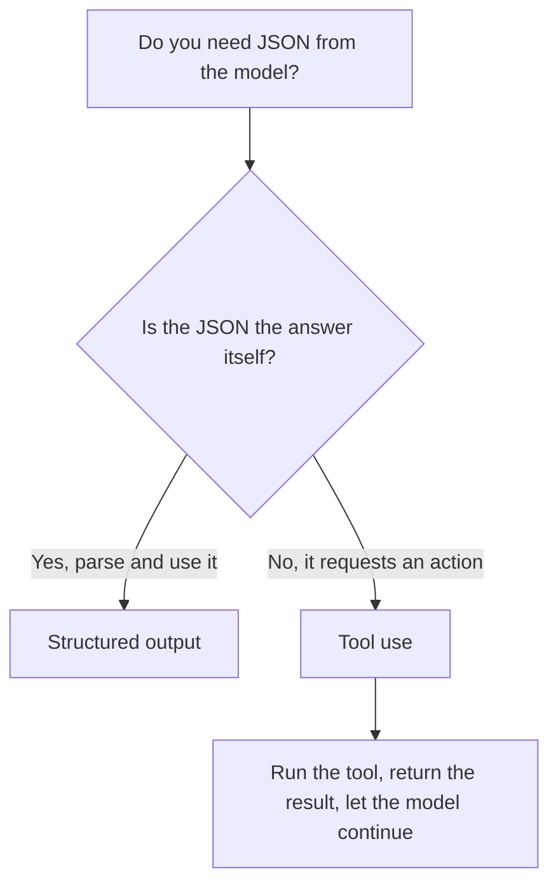

<LevelBadge level="intermediate" />

<VerifyNote lastVerified="2026-06-20" source="https://docs.anthropic.com/en/docs/build-with-claude/structured-outputs">
强制套用 schema 的确切机制在演进——请在官方文档中确认当前的做法（输出配置 / 解析辅助方法）。
</VerifyNote>

当 Claude 的输出要喂给其他软件时，你需要 **可靠的结构**——每一次都是符合已知形态的有效 JSON。不要靠"请用 JSON 回复"再寄希望；要用平台的结构化输出支持。

## 可靠的方式

为输出提供一份 **JSON Schema**，让 API/SDK 强制套用它，然后解析为类型化的对象（例如 Python 中的 Pydantic、TypeScript 中的 Zod）。SDK 的解析辅助方法会交给你一个类型化的结果，而不是一段你还得自己 `JSON.parse` 并校验的字符串。

```python
# Conceptual shape — see the official docs for the current API surface.
from pydantic import BaseModel

class Ticket(BaseModel):
    title: str
    priority: str   # "low" | "medium" | "high"
    tags: list[str]

# Request the model to return data conforming to Ticket's JSON schema,
# then parse the response into a Ticket instance.
```

## 为什么不直接在提示词里要 JSON？

你 *可以* 在提示词里要 JSON，对于简单情形它也管用——但它可能漂移：多出的散文、一个尾随逗号、一个缺失的字段。由 schema 强制的输出消除了这类 bug，而一旦下游系统依赖它，这一点就至关重要。

## 结构化输出 vs. 工具使用

两种功能都会给模型一份 **JSON Schema**，所以它们看起来很像——人们常常选错。区别在于*意图*，而非机制：

| | **结构化输出** | **[工具使用](/docs/api/tool-use)** |
|---|---|---|
| 你想要什么 | **最终答案**，以固定的形态 | 让模型 **调用某种能力**（调用函数、获取数据、执行动作） |
| 谁来消费它 | 直接由你的代码消费 | 你的代码运行工具，再把结果喂回给模型 |
| 回合形态 | 一次响应，结束 | 一个循环：模型发问，你执行，模型继续 |
| 典型用途 | 抽取、分类、解析 | 智能体、实时查询、副作用 |

一个快速的经验法则：



如果 JSON *就是* 交付物，使用结构化输出。如果 JSON 是模型在请求你的代码*去做*某件事，那就是工具使用。智能体常常两者都用：用工具来执行动作，用结构化输出来返回干净的最终结果。

## 提示

- **让 schema 收得紧。** 对固定选项使用枚举；标注必填字段。
- **描述字段。** 字段描述就像迷你提示词一样引导模型。
- 仍然在边界处 **进行校验**——防御性解析是廉价的保险。
- 对于 **抽取** 类任务，结构化输出 + 清晰的 schema 每次都胜过自由格式。

## 下一步

- [工具使用 / 函数调用](/docs/api/tool-use) — 工具同样使用 JSON schema
- [你的第一次 API 调用](/docs/api/first-call)
- [可复用的提示词模板](/docs/templates/prompts)
