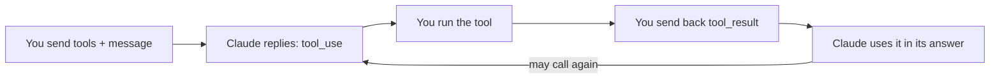

import Tabs from '@theme/Tabs';
import TabItem from '@theme/TabItem';

<LevelBadge level="intermediate" />

<VerifyNote lastVerified="2026-06-20" source="https://platform.claude.com/docs/en/docs/build-with-claude/tool-use">
工具使用的请求/响应形态稳定但仍在演进——请在官方工具使用文档中确认字段。
</VerifyNote>

**工具使用** 让 Claude 调用 *你* 定义的函数——搜索、计算器、你的数据库、任意 API——并使用其结果。它是每一个 [智能体](/docs/api/building-agents) 的基础。

<Callout type="objectives" items={["四步智能体循环是如何工作的，从工具定义到最终答案","如何用 Python 定义一个工具，包含名称、描述和 JSON-Schema 输入","为什么工具描述充当提示词，塑造 Claude 何时以及如何调用它们","如何校验输入、将错误作为结果返回，并安全地使用服务端工具"]} />

## 循环

工具使用是一场对话，而非单次调用。你向 Claude 递上一份工具菜单；Claude 挑选其中一个并暂停；你执行它并回报结果；Claude 将结果融入它的答案中——按需重复。

<Steps items={[{title: "递上菜单", body: "你包含一个工具定义列表——每个都带有名称、描述和 JSON-Schema 输入。"}, {title: "Claude 挑选一个工具", body: "如果 Claude 决定使用某个工具，它会返回一个带参数的 tool_use 块并停止。"}, {title: "你执行", body: "你自己运行该工具，并把输出作为 tool_result 发回去。"}, {title: "Claude 继续", body: "Claude 继续进行，可能调用更多工具，直到给出答案。"}]} />

## 定义一个工具（Python）

一个工具定义就是一个名称、一段通俗语言的描述，以及一份用于输入的 JSON-Schema。把它传入 `tools`，然后检查 `stop_reason` 来得知 Claude 何时想要行动。

<PromptCard title="get_weather 工具 + 首次调用">{`tools = [{
    "name": "get_weather",
    "description": "Get current weather for a city.",
    "input_schema": {
        "type": "object",
        "properties": {"city": {"type": "string"}},
        "required": ["city"],
    },
}]

msg = client.messages.create(
    model="claude-sonnet-5", max_tokens=1024,
    tools=tools,
    messages=[{"role": "user", "content": "What's the weather in Rome?"}],
)
# If msg.stop_reason == "tool_use": run the tool, then send a tool_result back.`}</PromptCard>

## 提示

在你如何定义和处理工具上的细微选择，会在可靠性上产生巨大的差别。

- **描述就是提示词。** 清晰的工具 `description` 和参数文档会极大地改善 Claude 何时/如何调用它。
- 在执行之前 **校验你收到的输入**——切勿盲目信任。
- **将错误作为结果返回。** 如果某个工具失败，发回一个描述该错误的 `tool_result`，让 Claude 能够恢复。
- **服务端工具。** Anthropic 还提供内置工具（例如网页搜索、代码执行、计算机使用）——查阅文档了解当前可用清单。

:::warning 工具 = 行动 = 风险
能采取真实行动的工具继承了一套安全模型。请套用最小权限，并对高风险调用保持人在回路——参见 [保护智能体与工具安全](/docs/security/securing-agents)。
:::

<Flashcards title="工具使用词汇" cards={[{front: "tool_use 块", back: "Claude 决定调用某个工具时返回的内容——包含参数——之后它会停止并等待你。"}, {front: "tool_result", back: "你发回的消息，携带工具的输出（或一段错误描述，以便 Claude 能够恢复）。"}, {front: "input_schema", back: "描述工具输入的 JSON-Schema：类型、属性，以及哪些字段是必需的。"}, {front: "服务端工具", back: "Anthropic 提供的内置工具，例如网页搜索、代码执行、计算机使用——查阅文档了解当前可用清单。"}]} />

<Quiz title="自我检验" questions={[{q: "在 Claude 返回一个 tool_use 块之后，由谁来运行该工具？", options: ["Claude 在 Anthropic 的服务器上自动运行它", "你执行它，并把输出作为 tool_result 发回去", "由 JSON-Schema 来执行它"], answer: 1, explain: "Claude 返回一个 tool_use 块并停止；你执行该工具，并把结果作为 tool_result 发回去。"}, {q: "你定义的某个工具在运行时失败了。推荐的做法是什么？", options: ["默默重试直到成功", "发回一个描述该错误的 tool_result，让 Claude 能够恢复", "停止对话"], answer: 1, explain: "将错误作为结果返回——一个描述失败的 tool_result 能让 Claude 恢复。"}, {q: "为什么清晰的工具描述如此重要？", options: ["它仅用于文档，Claude 会忽略它", "描述就是提示词——它们塑造 Claude 何时以及如何调用该工具", "它会改变 JSON-Schema 的校验规则"], answer: 1, explain: "描述就是提示词：清晰的描述和参数文档会极大地改善 Claude 何时以及如何调用一个工具。"}]} />

<Callout type="takeaways" items={["工具使用是一个循环：发送工具定义，Claude 返回一个 tool_use 块并停止，你执行并返回一个 tool_result，Claude 继续直到给出答案。","一个工具定义就是一个名称、一段描述和一份 JSON-Schema 输入——把它传入 tools 并检查 stop_reason == tool_use。","描述就是提示词；在执行之前校验输入；将失败作为 tool_result 错误返回，让 Claude 能够恢复。","Anthropic 还提供服务端工具，而任何采取真实行动的工具都需要最小权限外加人在回路。"]} />

## 下一步

- [在 API 上构建智能体](/docs/api/building-agents)
- [结构化输出](/docs/api/structured-output)
- [MCP 与连接工具](/docs/api/mcp)
