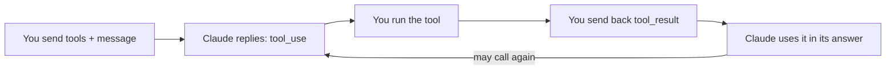

import Tabs from '@theme/Tabs';
import TabItem from '@theme/TabItem';

<LevelBadge level="intermediate" />

<VerifyNote lastVerified="2026-06-20" source="https://docs.anthropic.com/en/docs/build-with-claude/tool-use">
工具使用的请求/响应形态稳定但仍在演进——请在官方工具使用文档中确认字段。
</VerifyNote>

**工具使用** 让 Claude 调用 *你* 定义的函数——搜索、计算器、你的数据库、任意 API——并使用其结果。它是每一个 [智能体](/docs/api/building-agents) 的基础。

## 循环



1. 你包含一个 **工具定义** 列表（名称、描述、JSON-Schema 输入）。
2. 如果 Claude 决定使用某个工具，它会返回一个 `tool_use` 块（带参数）并停止。
3. **你执行** 该工具，并把输出作为 `tool_result` 发回去。
4. Claude 继续进行，可能调用更多工具，直到给出答案。

## 定义一个工具（Python）

```python
tools = [{
    "name": "get_weather",
    "description": "Get current weather for a city.",
    "input_schema": {
        "type": "object",
        "properties": {"city": {"type": "string"}},
        "required": ["city"],
    },
}]

msg = client.messages.create(
    model="claude-sonnet-4-6", max_tokens=1024,
    tools=tools,
    messages=[{"role": "user", "content": "What's the weather in Rome?"}],
)
# If msg.stop_reason == "tool_use": run the tool, then send a tool_result back.
```

## 提示

- **描述就是提示词。** 清晰的工具 `description` 和参数文档会极大地改善 Claude 何时/如何调用它。
- 在执行之前 **校验你收到的输入**——切勿盲目信任。
- **将错误作为结果返回。** 如果某个工具失败，发回一个描述该错误的 `tool_result`，让 Claude 能够恢复。
- **服务端工具。** Anthropic 还提供内置工具（例如网页搜索、代码执行、计算机使用）——查阅文档了解当前可用清单。

:::warning 工具 = 行动 = 风险
能采取真实行动的工具继承了一套安全模型。请套用最小权限，并对高风险调用保持人在回路——参见 [保护智能体与工具安全](/docs/security/securing-agents)。
:::

## 下一步

- [在 API 上构建智能体](/docs/api/building-agents)
- [结构化输出](/docs/api/structured-output)
- [MCP 与连接工具](/docs/api/mcp)
