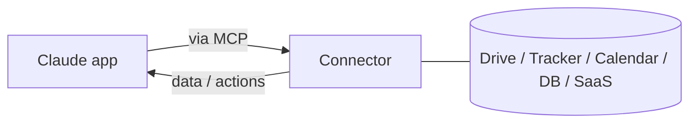

<LevelBadge level="intermediate" />

<VerifyNote lastVerified="2026-06-20" source="https://docs.anthropic.com">
存在哪些连接器，以及按方案划分的可用性，变化频繁——请在应用/帮助中心确认当前选项。
</VerifyNote>

**连接器**让 Claude 应用能够触达**聊天之外**——进入你的工具和数据（云盘、问题跟踪器、日历、数据库等等）——从而让 Claude 能基于真实系统作答并对其执行操作。在底层，它们由开放的 **[Model Context Protocol (MCP)](/docs/claude-code/mcp)** 驱动。

## 它们的作用

没有连接器时，Claude 只知道对话中的内容。有了连接器，它就能（在你授权的前提下）从已连接的服务中拉取相关信息——例如找到一份文档、读取最近的问题、查看日历——并在回答中加以使用。

## 同一套标准，处处通用

连接器是 MCP 的**面向应用**的形态。完全相同的协议也驱动着 [Claude Code 中的 MCP](/docs/claude-code/mcp) 和 [API 上的 MCP](/docs/api/mcp)。把这个概念学会一次，它就能在各个场景中通用。

## 设置与使用

1. **连接**服务（在支持的地方通过 OAuth 授权）。
2. **授予最小权限**——只授予任务所需的访问权限。
3. **自然地提问**——"找到我的第三季度规划文档并总结其中的风险。"

## 安全

:::warning 连接器 = 访问权限 +（有时）操作能力
- 只授权你信任的服务和权限范围。
- 从外部来源拉取的内容可能携带[提示词注入](/docs/security/prompt-injection)——当连接器读取不可信材料时要保持谨慎。
- 在启用第三方连接器之前，先审查它能做什么（[审查第三方代码](/docs/security/reviewing-third-party-code)）。
:::

## 下一步

- [Claude Code 中的 MCP 服务器](/docs/claude-code/mcp)
- [MCP 与连接到工具（API）](/docs/api/mcp)
- [在你现有的工具中使用 AI](/docs/claude-app/ai-in-your-tools)
