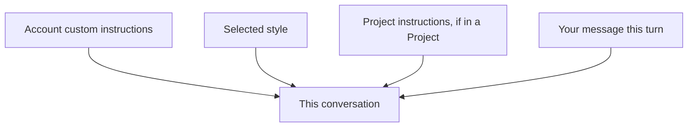

<LevelBadge level="beginner" />

<VerifyNote lastVerified="2026-06-20" source="https://www.anthropic.com">
Claude 应用中自定义指令和样式的确切名称与位置会变化——请在应用/帮助中心确认。
</VerifyNote>

厌倦了每次对话都重复"简洁一点"或"我是护士，请据此解释"？**自定义指令**和**样式**让你只需设定一次默认偏好，便可让它们处处生效。

## 自定义指令 = 你的个人系统提示词

设定固定的事实和偏好——你是谁、你做什么、你喜欢什么样的回答——Claude 会在各个对话中应用它们。这是[系统提示词](/docs/foundations/roles)的消费级应用版本（也是开发者用的 [CLAUDE.md](/docs/claude-code/claude-md) 的近亲）。

适合写进去的内容：
- **关于你的背景**（"我经营一家小面包店"；"我用 Python 写代码"）。
- **输出偏好**（"默认给出简短的要点回答"；"始终展示你的推理过程"）。
- **硬性规则**（"绝不使用 emoji"；"使用公制单位"）。

## 样式 = 呈现方式的预设

**样式**改变语气/格式（简洁、正式、解释性等），并且可以按对话切换。当你想为*这次对话换一种语气*而又不想重写固定指令时，就使用样式。

## 它们如何叠加

发生冲突时，越具体/越靠后的上下文往往胜出——所以[项目](/docs/claude-app/projects)的指令或你消息中的明确诉求可以覆盖你的全局默认设置。保持它们一致，以免出现意外。

## 小贴士

- **让指令简短且准确**——和 CLAUDE.md 一样，臃肿和过时的规则有害无益。
- **不要把机密信息**放进自定义指令。
- 随着需求变化，**偶尔回顾**它们。

## 下一步

- [系统、用户与助手角色](/docs/foundations/roles)
- [项目：持久化工作区](/docs/claude-app/projects)
- [CLAUDE.md 与记忆文件](/docs/claude-code/claude-md)
