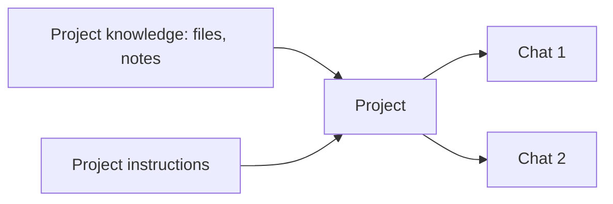

<LevelBadge level="beginner" />

<VerifyNote lastVerified="2026-06-20" source="https://www.anthropic.com">
项目的功能和限制因方案而异且会变化——请在应用/帮助中心确认当前行为。
</VerifyNote>

**项目**是 Claude.ai 中一个专属的工作区，它把**自己的文件、知识和指令**捆绑在一起。你不必每次对话都重新上传同样的文档、重新解释背景，只需设置一次——项目里的每一次对话开始时就已经掌握了情况。

## 为什么使用项目

- **有依据的回答。**添加你的文档（一本手册、规格说明、笔记），Claude 便会*基于它们*作答——这是 [RAG](/docs/foundations/rag) 的一种内置、无需写代码的形态。
- **持久的上下文。**项目指令的作用就像一个限定范围的[系统提示词](/docs/foundations/roles)，覆盖其中的一切。
- **井然有序。**关于同一个主题/客户/计划的所有对话都集中在一起。

## 设置一个项目

1. **创建一个项目**，并赋予它清晰的用途。
2. **添加知识**——它应当始终知晓的文件/文本。
3. **编写项目指令**——角色、约定、该做什么/避免什么。
4. **开始聊天**——每一次对话都会继承这些知识 + 指令。

## 绝佳的使用场景

- 一个**客户/账户**工作区（他们的文档 + 你的笔记）。
- 一个用于问答的**代码库或产品**知识库。
- 一个带有你的风格指南和过往作品的**写作项目**（让草稿契合你的语气）。
- 为某门课程**学习**，加载好教学大纲和材料。

## 小贴士

- **精选知识**——相关、最新的文件胜过把一切都倒进去（噪音会损害检索效果）。
- **让指令精炼且准确**（与[自定义指令](/docs/claude-app/custom-instructions)是同一条规则）。
- **不要添加**你不愿意存储的敏感数据——参见[隐私](/docs/foundations/privacy)。

## 下一步

- [自定义指令与样式](/docs/claude-app/custom-instructions)
- [跨对话记忆](/docs/claude-app/memory)
- [检索增强生成（RAG）](/docs/foundations/rag)
