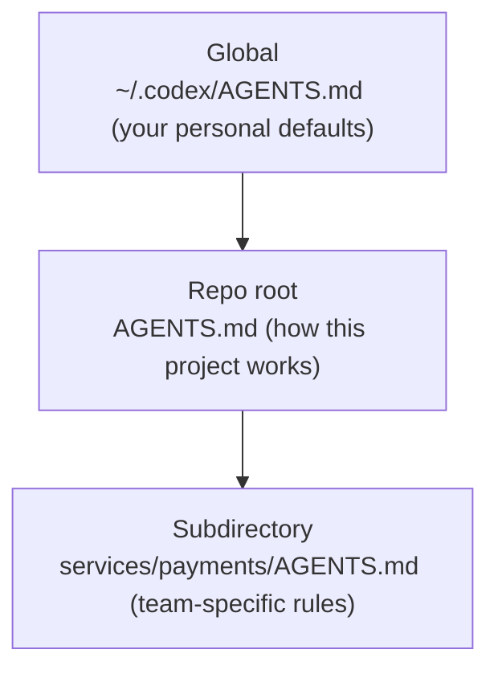

<LevelBadge level="intermediate" />

<VerifyNote lastVerified="2026-06-27" source="https://agents.md/">
AGENTS.md 的采用方列表以及 Claude Code 的导入/符号链接行为变化很快——请对照官方 AGENTS.md 站点和 Claude Code 内存文档确认具体细节。
</VerifyNote>

你已经了解了 [CLAUDE.md](/docs/claude-code/claude-md)——Claude Code 的项目说明文件。但你的仓库很可能不止被一个代理触及：队友在用 Codex，CI 用了一个编码机器人，还有人在 Cursor 里打开了这个仓库。`AGENTS.md` 就是这些工具一致同意会去读取的开放标准，因此你只需**编写一次**项目说明，而不必为每个工具维护一个不同的文件。

<Callout type="objectives" items={["AGENTS.md 是什么、由谁来管理", "为什么 Claude Code 读取 CLAUDE.md 而不读 AGENTS.md", "在各工具间保持单一可信来源的三种可靠方法", "嵌套和全局的 AGENTS.md 文件如何合并", "什么内容应该放进文件——什么应该排除在外"]} />

## AGENTS.md 是什么

`AGENTS.md` 是位于仓库根目录的一个纯 Markdown 文件——可以把它看作**一份写给代理而不是写给人类的 README**。它告诉编码代理如何构建、测试和参与该项目。这种格式没有必填字段：代理只是直接读取其中的文字。

它是一个开放标准，由 **Linux 基金会下属的 Agentic AI Foundation（AAIF）** 管理，截至 2026 年中，已被 6 万多个开源项目使用，并被 30 多个工具读取——包括 OpenAI Codex、Google 的 Jules 和 Gemini CLI、Cursor、Windsurf、Devin、Zed、Warp、Aider、goose、Amp，以及 GitHub Copilot 的编码代理。

<Callout type="info" items={["AGENTS.md 是一种约定，而不是运行时：每个工具自行决定如何发现、合并和注入该文件。", "没有强制的 schema——清晰的文字胜过僵化的结构。", "它是对你的 README 的补充；并不取代它。"]} />

## Claude Code 的那个坑

人们容易踩的地方在于：**Claude Code 读取 `CLAUDE.md`，而不是 `AGENTS.md`。** 如果你的仓库里只有一个 `AGENTS.md`，Claude Code 默认会忽略它。这不是一个 bug——它早于这个标准出现——但它意味着一个多工具的仓库需要一套刻意的同步策略，否则你的说明会悄悄地相互偏离。

<Callout type="warning" items={["不要假设 Claude Code 会回退到 AGENTS.md——它不会自动读取它。", "两个手工维护的文件（CLAUDE.md 和 AGENTS.md）会发生偏离。选定一个单一可信来源。", "在依赖任何回退说法之前，先在官方内存文档中确认当前行为。"]} />

## 保持单一可信来源

有三种模式能在不重复内容的情况下让 CLAUDE.md 和 AGENTS.md 保持同步。根据你团队的平台来选择。

<Steps items={[{title: "符号链接（最简单）", body: "把 CLAUDE.md 做成指向 AGENTS.md 的符号链接。Claude Code 会跟随符号链接并逐字节读取目标文件——只有一个真实文件，零合并逻辑。注意事项：在 Windows 上，创建符号链接需要开发者模式或管理员权限，因此跨平台团队可能更倾向于导入方法。"}, {title: "@import（跨平台）", body: "保留一个极简的 CLAUDE.md，它唯一的职责就是用 @AGENTS.md 导入来引入标准文件。Claude Code 会在启动时把被导入的文件展开到上下文中，因此 AGENTS.md 仍然是唯一来源，而且在 Windows 上也没有会断掉的符号链接。"}, {title: "/init（迁移）", body: "在一个已经有 AGENTS.md（或 .cursorrules / .windsurfrules）的仓库里初始化 Claude Code？运行 /init——它会读取那些文件，并把相关部分折叠进一个生成的 CLAUDE.md 中。"}]} />

<PromptCard title="把 CLAUDE.md 符号链接到共享标准文件（macOS / Linux）">{`ln -s AGENTS.md CLAUDE.md`}</PromptCard>

<PromptCard title="或者保留一个仅一行、用于导入它的 CLAUDE.md">{`@AGENTS.md`}</PromptCard>

<Callout type="tip" items={["当你整个团队都在 macOS/Linux 上时，使用符号链接——它需要维护的东西最少。", "当团队里有 Windows 贡献者时，使用 @import。", "无论你选择哪一种,都把它提交进仓库,这样整个团队都能获得相同的行为。"]} />

## 嵌套和全局文件如何合并

更完善的代理会以分层方式处理 AGENTS.md——和 [CLAUDE.md 内存层级](/docs/claude-code/claude-md) 是同一套心智模型。以 Codex 为例，它会从你主目录中的全局文件出发，向下经过 Git 根目录直到你当前的文件夹，一路拼接：

越靠近实际工作的文件越占上风，因为它们**最后**被拼接，会覆盖更早的指引。因此 `services/payments/AGENTS.md` 会继承仓库根目录的说明，并加入仅在该服务内部适用的规则——把专门的指引尽量放在离专门代码最近的地方。

<Flashcards title="互操作一览" cards={[{front: "谁读取 AGENTS.md？", back: "30 多个工具——Codex、Cursor、Windsurf、Devin、Zed、Gemini CLI、Copilot 的编码代理等等。默认情况下不包括 Claude Code。"}, {front: "谁读取 CLAUDE.md？", back: "Claude Code——而且只有 Claude Code。它不会自动读取 AGENTS.md。"}, {front: "Mac/Linux 团队的最佳同步方式", back: "把 CLAUDE.md 符号链接到 AGENTS.md。只有一个真实文件，不会偏离。"}, {front: "有 Windows 贡献者时的最佳同步方式", back: "一个仅一行、内容为 @AGENTS.md 的 CLAUDE.md——无需符号链接。"}, {front: "嵌套文件的合并顺序", back: "全局 → 仓库根目录 → 子目录。越靠近工作的文件越占上风，因为它们最后被拼接。"}]} />

## 该往里放什么

和一份好的 CLAUDE.md 是同样的纪律——这个标准只是建议了几个常见的小节：

- **项目概览**——这是什么，两句话讲清。
- **构建与测试命令**——如何运行、测试和检查代码风格。
- **代码风格**——代理无法推断的约定。
- **测试说明**——“完成”意味着什么。
- **安全注意事项**——永远不要触碰或提交什么。
- **提交 / PR 指南**——消息格式、分支规则。

<Callout type="warning" items={["代理会逐字遵循该文件——过时或一厢情愿的说明会实实在在地造成伤害，和 CLAUDE.md 完全一样。", "保持简短且真实；描述项目当下的实际运作方式。", "永远不要提交机密信息；引用大型文档，而不是把它们粘贴进来。"]} />

## 自我检验

<Quiz title="自我检验" questions={[{q: "Claude Code 会自动读取 AGENTS.md 吗？", options: ["会，它会回退到 AGENTS.md", "不会——它只读取 CLAUDE.md", "只在 Windows 上会"], answer: 1, explain: "Claude Code 读取 CLAUDE.md，并且默认忽略一个单独的 AGENTS.md，因此多工具仓库需要一套刻意的同步策略。"}, {q: "你的团队完全在 macOS 和 Linux 上。在 Claude Code 和 Codex 之间共享一份说明文件、维护成本最低的方式是什么？", options: ["手工维护 CLAUDE.md 和 AGENTS.md", "把 CLAUDE.md 符号链接到 AGENTS.md", "把 AGENTS.md 粘贴进一条注释里"], answer: 1, explain: "把 CLAUDE.md 符号链接到 AGENTS.md 让你只有一个真实文件；Claude Code 会跟随符号链接并逐字节读取目标文件。"}, {q: "当代理合并一个全局、一个仓库根目录和一个子目录的 AGENTS.md 时，发生冲突时哪一个占上风？", options: ["全局文件", "仓库根目录的文件", "离工作最近的子目录文件"], answer: 2, explain: "文件按 全局 → 根目录 → 子目录 的顺序拼接，因此离工作最近的文件出现在最后，会覆盖更早的指引。"}]} />

<Callout type="takeaways" items={["AGENTS.md 是由 Linux 基金会管理、被 30 多个编码代理读取的开放标准——一份写给代理的 README。", "Claude Code 读取 CLAUDE.md，而不是 AGENTS.md，因此多工具仓库必须让二者保持同步。", "在 Mac/Linux 上把 CLAUDE.md 符号链接到 AGENTS.md，或为跨平台团队使用一行 @AGENTS.md 导入。", "嵌套文件按 全局 → 根目录 → 子目录 合并，离得最近的文件占上风。", "像填写一份出色的 CLAUDE.md 那样填写它：概览、构建/测试命令、约定、安全和护栏——简短且真实。"]} />

## 下一步

- [CLAUDE.md 与内存文件](/docs/claude-code/claude-md)——同一理念在 Claude Code 一侧的体现
- [CLAUDE.md 模板](/docs/templates/claude-md)——可直接复用为 AGENTS.md 的现成起步模板
- [斜杠命令](/docs/claude-code/slash-commands)——包括用于迁移现有说明文件的 /init

## 来源与延伸阅读

- [AGENTS.md — 官方站点与规范](https://agents.md/)
- [OpenAI Codex — 使用 AGENTS.md 的自定义说明](https://developers.openai.com/codex/guides/agents-md)
- [Claude Code 内存文档](https://code.claude.com/docs/en/memory)
