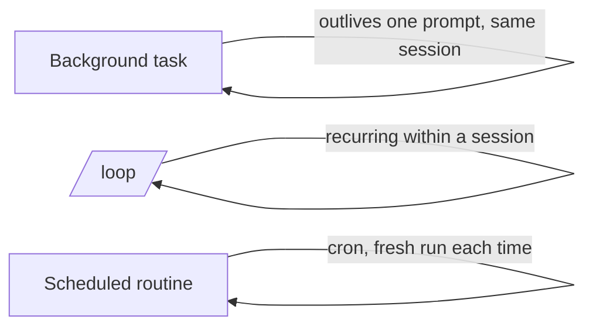

<LevelBadge level="advanced" />

<VerifyNote lastVerified="2026-06-20" source="https://code.claude.com/docs/en">
后台任务、/loop 和调度的确切命令与可用性在不同版本间会变化——请以官方文档为准。
</VerifyNote>

并非所有事情都是一次快速编辑。Claude Code 能运行**超出单次提示寿命**的工作：后台的长命令、周期性循环，以及定时运行。

## 后台任务

启动一个长时间运行的命令（开发服务器、测试监视器、构建）而**不阻塞**会话。Claude 继续工作，并在任务产生输出或完成时收到通知。凡是你平常会用 `&` 放到后台的，都可以用它——但它是受管的，因此 Claude 之后可以读取输出。

:::tip 不要忙等
在后台启动任务后继续做别的；让完成通知把你带回来，而不是在一个紧密循环里轮询。
:::

## 周期性循环（`/loop`）

`/loop` 会在一个会话内以**周期性间隔**运行某个提示或命令——例如"每 5 分钟检查一次部署状态"。给它一个间隔，或让 Claude 自行把控节奏。它非常适合盯着一次 CI 运行，或轮询一个 harness 无法另行通知你的外部作业。

## 定时云智能体

对于那些应当**按时钟、持续发生**的工作——"每天早上汇总新 issue"、"每小时检查新闻并更新文档"——请使用**定时任务 / 例程**（cron 风格）。每次运行都从头开始，因此它的指令必须**自包含**。

## 如何在它们之间选择

| 需求 | 使用 |
|---|---|
| 运行一个长命令，同时继续工作 | 后台任务 |
| 本次会话内每 N 分钟轮询一次某事 | `/loop` |
| 按计划无限期地做某事 | 定时例程 |

:::warning 自主性需要护栏
任何按计划无人值守执行的操作都应当范围严格、可逆。把它与严格的[权限](/docs/claude-code/permissions)搭配，并阅读[加固自主运行](/docs/security/hardening-autonomous-runs)。
:::

## 下一步

- [无头模式与 Agent SDK](/docs/claude-code/headless-and-agent-sdk)
- [权限与模式](/docs/claude-code/permissions)
- [加固自主运行](/docs/security/hardening-autonomous-runs)
