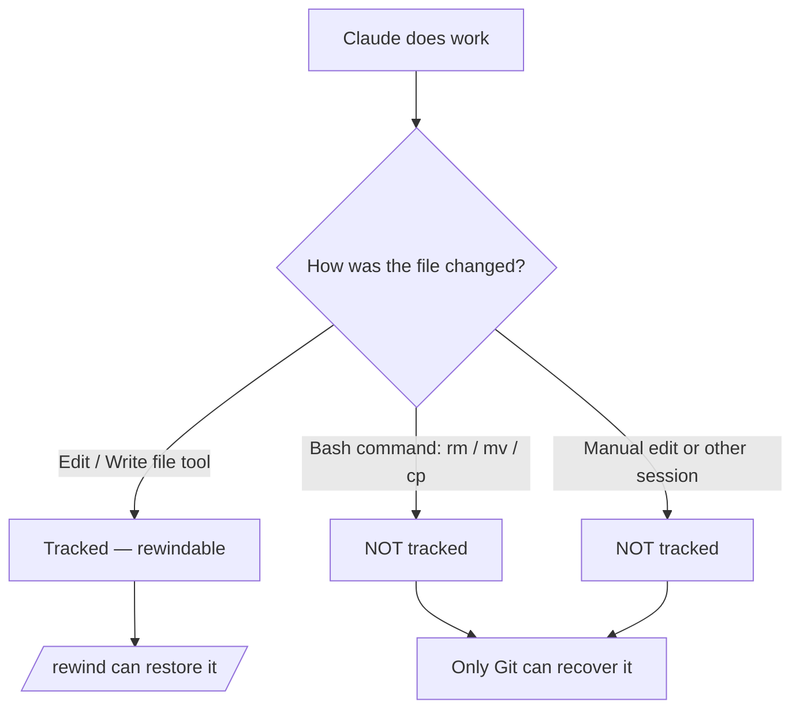

<LevelBadge level="intermediate" />

<Callout type="objectives" items={["理解检查点捕获了什么——以及它悄悄地没有捕获什么", "用两种方式打开回溯菜单，并每次都选对正确的恢复操作", "分清「恢复」（撤销状态）与「总结」（压缩上下文）", "确切知道为什么检查点是 Git 的补充，却永远无法取代它"]} />

<VerifyNote lastVerified="2026-07-09" source="https://code.claude.com/docs/en/checkpointing">
检查点行为、回溯菜单的操作、保留期限以及版本要求（例如跨越 `/clear` 恢复需要 Claude Code v2.1.191+）会随版本更新而变化——请在官方文档中确认。
</VerifyNote>

## 核心理念

当你放手让 Claude 进行一次大胆、大规模的改动时，最令人担心的问题是「如果它在第三次编辑深处出了岔子怎么办？」**检查点（Checkpointing）**就是答案：Claude Code 会在每次编辑前自动为你的代码拍下快照，这样你就能回溯到任意更早的状态，而不必手动去理清一个半成品的重构。

把它想象成**面向整个会话的本地撤销**——一张让你可以放心说「好，试试那个大胆的方案」的安全网。

## 检查点是如何创建的

你不需要创建检查点——它们会自动产生。

<Steps items={[{title: "每次提示 = 一个检查点", body: "每条用户提示都会在 Claude 的文件编辑工具运行之前捕获你的代码状态。无需命令、无需配置、无需任何仪式。"}, {title: "它们跨会话持久保留", body: "检查点在退出并恢复一次对话后依然存在，因此你可以在恢复的会话里回溯，而不仅限于正在进行的会话。"}, {title: "它们会自我清理", body: "检查点会在 30 天后（可配置）随其所属会话一并被删除。它们是会话级别的恢复手段，而非归档。"}]} />

## 打开回溯菜单

有两种进入方式：

<Steps items={[{title: "运行 /rewind", body: "在提示框中输入该斜杠命令。始终有效。"}, {title: "连按两次 Esc——但仅在输入为空时", body: "当提示框为空时，双击 Esc 会打开回溯菜单。如果框内有文字，双击 Esc 则会清除那段文字（被清除的文字会保存到输入历史中，之后按上箭头即可找回）。"}]} />

<PromptCard title="Open the rewind menu">{`/rewind`}</PromptCard>

菜单会列出**你本次会话发送过的每一条提示**。选中你想操作的那个点，然后选择一个操作。

## 恢复 vs. 总结：关键区别

人们正是在这里犯糊涂。菜单提供两*类*操作：

- **恢复（Restore）**操作会改变磁盘上和/或对话中的状态——它们是撤销。
- **总结（Summarize）**操作绝不会触碰你的文件——它们把对话压缩以释放上下文窗口空间。

<Callout type="warning" items={["恢复 = 撤销（还原代码、对话，或两者）。总结 = 压缩上下文（磁盘上的文件不受影响）。", "当某次编辑弄坏了东西时，选恢复。当会话臃肿但代码没问题时，选总结。"]} />

### 恢复类操作

<Steps items={[{title: "恢复代码与对话", body: "将你的文件和聊天记录都还原到所选的那个点——干净利落地「把时间倒回」那一刻。"}, {title: "恢复对话", body: "将聊天回溯到那条消息，但保留你当前的代码。适合在不丢失你想保留的编辑的前提下重新提问。"}, {title: "恢复代码", body: "还原文件改动但保留对话。撤销那些编辑，保留关于它们的讨论。"}]} />

在恢复对话之后（或选择「从此处开始总结」之后），所选消息中的原始提示会被放回输入框，方便你重新发送或编辑。

### 总结类操作

两者都会把对话的一部分压缩成 AI 生成的摘要——就像一个**有针对性的 `/compact`**，由你选择要压缩所选消息的哪一侧。

<Steps items={[{title: "从此处开始总结", body: "所选消息之前的消息保持完整。所选消息及其之后的一切会变成一段摘要。用它来舍弃一段旁支讨论，同时完整保留早期的上下文细节。"}, {title: "总结到此处为止", body: "所选消息之前的消息变成一段摘要；所选消息及其之后的内容保持完整。你依然停留在对话的末尾。用它来压缩早期的铺垫闲谈，同时逐字保留近期的工作。"}]} />

无论哪种方式，原始消息都会保留在会话的记录（transcript）里，因此 Claude 仍能引用这些细节。你可以输入可选的指令来引导摘要聚焦于什么。

关于整个流程，参见 [上下文管理](/docs/claude-code/context-management)——`/rewind` 的总结操作是手术刀，而 `/compact` 则是大笔刷。

## 跨越 `/clear` 进行回溯

如果你在同一个 Claude Code 进程中较早运行过 `/clear`，回溯菜单顶部会多出一个条目：`/resume <session-id> (previous session)`。选中它即可跳回 `/clear` 之前活跃的那个对话。

<VerifyNote lastVerified="2026-07-09" source="https://code.claude.com/docs/en/checkpointing">
从回溯菜单跨越 `/clear` 恢复需要 Claude Code v2.1.191 或更高版本。在更早的版本上，请运行 `/resume` 并从列表中挑选之前的会话。
</VerifyNote>

## 检查点的边界——那些会咬人的局限

检查点感觉很神奇，直到它不再神奇。有三个盲区值得注意：

<Steps items={[{title: "bash 改动是隐形的", body: "被 Claude 运行的 shell 命令触碰的文件——rm、mv、cp、代码生成器、格式化工具——都不会被追踪。只有通过 Claude 的文件编辑工具进行的直接编辑才会被记入检查点。就回溯而言，被 rm 删除的文件就是没了。"}, {title: "外部与并发改动是隐形的", body: "你在 Claude Code 之外手动做的编辑，以及来自其他并发会话的编辑，通常不会被捕获——除非它们恰好触碰了当前会话编辑过的同一批文件。"}, {title: "它是会话级别的，而非历史", body: "检查点是快速的本地恢复手段。它们不是提交、不是分支，也无法与你的团队共享。"}]} />

## 检查点 vs. Git：两者并用

它们解决的是不同的问题，所以要搭配使用。

| | 检查点（`/rewind`） | Git |
|---|---|---|
| 范围 | 单个会话 | 整个项目历史 |
| 粒度 | 每条提示，自动 | 每次提交，刻意为之 |
| 追踪 bash 造成的改动？ | 否 | 是（一旦暂存/提交） |
| 存续期 | 约 30 天，然后消失 | 永久 |
| 可共享 / 协作 | 否 | 是 |
| 心智模型 | 「本地撤销」 | 「永久历史」 |

<Callout type="tip" items={["在一次有风险的大规模运行之前，用 Git 提交可用的状态——那是你可靠的底线。", "在两次提交之间，用 /rewind 做快速的会话内恢复，而不污染你的 Git 历史。", "如果 Claude 会运行破坏性的 bash（rm/mv）或生成器，就依靠 Git——回溯救不了那些文件。"]} />

## 何时该动用它

<Steps items={[{title: "探索备选方案", body: "尝试一个大胆的实现，如果不满意，就把代码与对话恢复到分岔点，再试另一个。"}, {title: "从糟糕的编辑中恢复", body: "某次编辑在三条提示之前引入了 bug？把代码恢复到它之前，而不是去调试那堆残骸。"}, {title: "迭代某个功能", body: "尝试各种变体，始终知道一个已知可用的状态只需一次 /rewind 即可回到。"}, {title: "释放上下文空间", body: "一段冗长的调试岔路吃掉了你的上下文窗口？从中点往后总结，同时完整保留你最初的指令细节。"}]} />

<Quiz title="Check yourself" questions={[{q: "Claude 通过 bash 命令运行了 `rm config.old.json`，你想把它找回来。`/rewind` 能恢复它吗？", options: ["能——Claude 做的每一处改动都被记入检查点", "不能——bash 造成的改动不被追踪；只有直接的文件工具编辑才被追踪", "只有在你 30 秒内运行 /rewind 时才能"], answer: 1, explain: "检查点只捕获通过 Claude 文件编辑工具做出的编辑。被 bash 命令（rm、mv、cp）改动的文件不被追踪——这正是 Git 的用武之地。"}, {q: "你的代码没问题，但一段冗长的调试岔路把上下文窗口填满了。哪个操作合适？", options: ["把代码与对话恢复到岔路之前", "恢复代码", "在岔路起点处「从此处开始总结」"], answer: 2, explain: "总结类操作在不触碰文件的情况下压缩对话。「从此处开始总结」会把这段岔路变成摘要，同时保留你更早的上下文完好无损——在零代码改动的情况下释放上下文空间。"}, {q: "检查点是如何创建的？", options: ["你手动运行 /checkpoint", "自动地，在每次编辑之前——每条提示都会创建一个", "只有当你在 Git 中提交时"], answer: 1, explain: "检查点是自动的：每条用户提示都会捕获你代码在编辑前的状态。没有手动步骤。"}]} />

<Flashcards title="Checkpoints & rewind vocabulary" cards={[{front: "检查点（Checkpoint）", back: "在每次编辑之前自动拍下的代码快照，每条提示一次。会话作用域，保留约 30 天。"}, {front: "/rewind", back: "打开回溯菜单，列出本次会话的每一条提示，让你从任意点恢复或总结。也可在输入为空时通过双击 Esc 到达。"}, {front: "恢复操作（Restore action）", back: "把状态——代码、对话或两者——还原到所选的那个点。这就是「撤销」。"}, {front: "总结操作（Summarize action）", back: "把对话的一部分压缩成 AI 摘要以释放上下文。磁盘上的文件绝不会被触碰。"}, {front: "bash 盲区", back: "被 shell 命令（rm/mv/cp）改动的文件不会被记入检查点——只有直接的文件工具编辑才会。那些改动请用 Git。"}]} />

<Callout type="takeaways" items={["检查点是自动的、每条提示一次的代码快照——面向整个会话的本地撤销，保留约 30 天。", "用 /rewind 或在输入为空时双击 Esc 打开回溯菜单；它会列出你发送过的每一条提示。", "恢复操作撤销状态（代码、对话或两者）；总结操作压缩上下文且绝不触碰文件。", "bash 造成的、外部的以及并发的改动都不被追踪——只有直接的文件工具编辑才被追踪。", "检查点是 Git 的补充，而非替代：把它想成「本地撤销」对「永久、可共享的历史」。"]} />

## 下一步

- [上下文管理](/docs/claude-code/context-management) —— `/compact`、`/clear`，以及总结如何契合更大的图景
- [规划模式](/docs/claude-code/plan-mode) —— 在编辑运行之前调查并批准一个计划，从而减少回溯的次数
- [权限](/docs/claude-code/permissions) —— 安全地运行大胆任务的另一半
