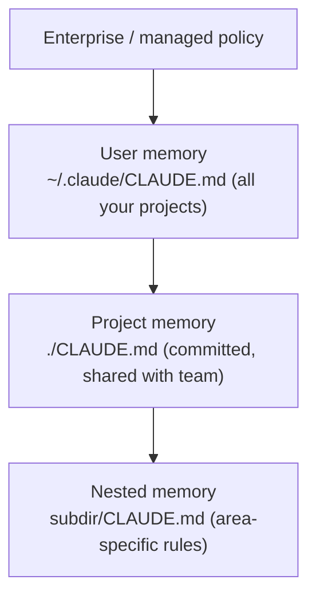

<LevelBadge level="beginner" />

<VerifyNote lastVerified="2026-06-20" source="https://code.claude.com/docs/en/memory">
记忆文件的位置和导入语法可能会变化——具体细节请以 Claude Code 官方记忆文档为准。
</VerifyNote>

如果你只做**一件**事来让 [Claude Code](/docs/claude-code/what-is-claude-code) 变得更好，那就做这件。`CLAUDE.md` 是一个纯文本文件，Claude 会在每次会话开始时读取它——它是你项目的常驻简报。

## 为什么它是收益最高的设置

没有它，你每次会话都要重新解释你的项目（"我们用 pnpm，测试在 `__tests__` 里，别碰 `/generated`……"）。有了它，Claude 早已知晓。这里写好的指令会一次性改善*未来每一次*交互。

## 记忆层级

Claude Code 会从多个位置读取记忆并将它们合并，大致从最全局到最具体：

- **用户记忆**——你在所有项目中的个人偏好。
- **项目记忆**（`./CLAUDE.md`，已提交）——*这个*仓库如何运作。与团队共享。
- **嵌套记忆**——在子文件夹里放一个 `CLAUDE.md`，规则只在那里生效。

## 生成一个起点

在项目里运行 `/init`，Claude 会通过检查代码起草一份 `CLAUDE.md`。然后**精简它**——这份草稿是起点，而不是终点。

## 应该写什么

- 用两句话说明项目是什么。
- 技术栈，以及如何**运行 / 测试 / lint**。
- Claude 推断不出来的约定（命名、结构、提交风格）。
- **护栏**："声明完成前先跑测试"、"绝不编辑 `/vendor`"、"绝不提交密钥"。

从 [CLAUDE.md 模板](/docs/templates/claude-md)里取一份现成的起始模板。

## 不应该写什么

:::warning 简短且真实，胜过冗长且理想化
Claude 会*字面地*遵循 `CLAUDE.md`。过时、含糊或一厢情愿的指令反而有害。描述项目**当下实际**的运作方式，保持精简，并定期复查。
:::

避免：粘贴巨大的文档（改用 `@imports` 引用文件），密钥，以及你实际并不遵循的规则。

## 导入

引入已有文档而不是复制它们——例如用 `@path/to/file` 导入引用你的风格指南，这样就只有一个权威来源。确切语法见[官方记忆文档](https://code.claude.com/docs/en/memory)。

## 下一步

- [规划模式](/docs/claude-code/plan-mode)——安全的首次改动
- [权限与模式](/docs/claude-code/permissions)——Claude 可以无人值守做哪些事
- [实战演练：为真实仓库定制 Claude Code](/docs/walkthroughs/customize-claude-code)
