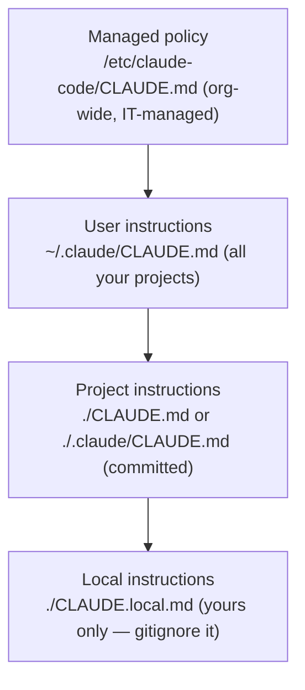

<LevelBadge level="beginner" />

<VerifyNote lastVerified="2026-10-06" source="https://code.claude.com/docs/en/memory">
文件位置、加载顺序和导入语法均来自官方记忆文档（「Claude 如何记住你的项目」），该文档现在描述了**两种**机制：由你编写的 CLAUDE.md 文件，以及 Claude 自己编写的**自动记忆**。导入最多解析到四跳深度。具体细节请在那里确认——这些细节会变化。
</VerifyNote>

如果你只做**一件**事来让 [Claude Code](/docs/claude-code/what-is-claude-code) 变得更好，那就做这件。`CLAUDE.md` 是一个纯文本文件，Claude 会在每次会话开始时读取它——它是你项目的常驻简报。

<Callout type="objectives" items={["为什么 CLAUDE.md 是收益最高的单一 Claude Code 设置", "记忆层级如何加载，从托管策略一直到 CLAUDE.local.md", "自动记忆与你自己编写的 CLAUDE.md 有何不同", "如何用 /init 生成一份起始文件并精简它", "什么内容应该写进 CLAUDE.md——以及什么应该排除在外", "@imports 如何让你引用文档而无需重复其内容"]} />

## 为什么它是收益最高的设置

没有它，你每次会话都要重新解释你的项目（「我们用 pnpm，测试在 `__tests__` 里，别碰 `/generated`……」）。有了它，Claude 早已知晓。这里写好的指令会一次性改善*未来每一次*交互。

## 记忆层级

Claude Code 会从多个位置加载记忆，并按加载顺序合并它们，作用域最宽泛的在前——因此项目指令会*在*用户指令*之后*进入上下文：

```mermaid
flowchart TD
  A["Managed policy<br/>/etc/claude-code/CLAUDE.md (org-wide, IT-managed)"] --> B["User instructions<br/>~/.claude/CLAUDE.md (all your projects)"]
  B --> C["Project instructions<br/>./CLAUDE.md or ./.claude/CLAUDE.md (committed)"]
  C --> D["Local instructions<br/>./CLAUDE.local.md (yours only — gitignore it)"]
```

- **托管策略**——由你的 IT/DevOps 团队分发的组织级指令。路径因操作系统而异：macOS 上是 `/Library/Application Support/ClaudeCode/CLAUDE.md`，Linux 和 WSL 上是 `/etc/claude-code/CLAUDE.md`，Windows 上是 `C:\Program Files\ClaudeCode\CLAUDE.md`。
- **用户指令**（`~/.claude/CLAUDE.md`）——你在所有项目中的个人偏好。
- **项目指令**（`./CLAUDE.md` *或* `./.claude/CLAUDE.md`，已提交）——*这个*仓库如何运作。与团队共享。如果你的仓库使用 [`AGENTS.md`](/docs/claude-code/agents-md)，它可以代替这些文件加载，也可以与它们一起加载。
- **本地指令**（`./CLAUDE.local.md`）——只属于你自己的项目专属笔记，比如一个沙箱 URL。把它加进 `.gitignore`。

位于你工作目录*之上*的目录层级中的文件会在启动时加载；而**子目录中的文件按需加载**——当 Claude 接触到那个区域里的东西时才加载。

<Callout type="tip" items={["一个文件已经不够用了？把指令拆分到 .claude/rules/*.md——每个文件一个主题，会被递归发现。没有 paths frontmatter 的规则会在启动时加载，优先级与 .claude/CLAUDE.md 相同；加上 paths frontmatter 之后，规则只在 Claude 处理匹配的文件时才加载，这能节省上下文。"]} />

<Flashcards title="了解你的记忆层级" cards={[{front: "托管策略", back: "组织级、由 IT 管理的 CLAUDE.md——最宽泛的一层，在用户指令和项目指令之前加载。"}, {front: "用户指令", back: "~/.claude/CLAUDE.md——你在所有项目中通用的个人偏好。"}, {front: "项目指令", back: "./CLAUDE.md 或 ./.claude/CLAUDE.md——已提交并与团队共享；描述这个仓库如何运作。"}, {front: "本地指令", back: "./CLAUDE.local.md——个人的项目专属偏好。把它加进 gitignore。"}, {front: ".claude/rules/*.md", back: "面向较大项目的「每个文件一个主题」式指令。带上 paths frontmatter 后，它们只会在处理匹配的文件时加载。"}, {front: "子目录中的 CLAUDE.md", back: "按需加载——当 Claude 在树的那一部分工作时——而不是在启动时。"}]} />

## 另一半：自动记忆

CLAUDE.md 是记忆中由*你*编写的那一半。Claude Code 还会保留**自动记忆**——Claude 从你的纠正和偏好中自己写下的笔记，按仓库存储，并在每次会话中与你的 CLAUDE.md 文件一起加载。

| | CLAUDE.md 文件 | 自动记忆 |
| --- | --- | --- |
| **谁来编写** | 你 | Claude |
| **包含什么** | 指令和规则 | 学到的经验和模式 |
| **作用范围** | 项目、用户或组织 | 按仓库，跨 worktree 共享 |

两者都是*上下文*，而不是强制约束：Claude 把它们当作可以权衡的指引，而不是必须服从的配置。如果要无论 Claude 怎么决定都硬性拦截某个操作，请改用 [PreToolUse 钩子](/docs/claude-code/hooks)。

<Callout type="warning" items={["自动记忆只会加载它的前 200 行或 25 KB——一个臃肿的 MEMORY.md 会被静默截断。完整的启动开销拆解见上下文预算审计。"]} />

## 生成一个起点

<Steps items={[{title: "在项目里运行 /init", body: "Claude 会检查代码并自动为你起草一份 CLAUDE.md。"}, {title: "把它精简下来", body: "草稿只是起点，而非终点。把它修剪成真实且有用的内容。"}, {title: "借用一个模板", body: "从 CLAUDE.md 模板页面取一份现成的起始模板，并按你的仓库进行调整。"}]} />

<PromptCard title="生成一份 CLAUDE.md 草稿">{`/init`}</PromptCard>

从 [CLAUDE.md 模板](/docs/templates/claude-md)里取一份现成的起始模板。

## 应该写什么

- 用两句话说明项目是什么。
- 技术栈，以及如何**运行 / 测试 / lint**。
- Claude 推断不出来的约定（命名、结构、提交风格）。
- **护栏**：「声明完成前先跑测试」、「绝不编辑 `/vendor`」、「绝不提交密钥」。

## 不应该写什么

<Callout type="warning" items={["Claude 会字面地遵循 CLAUDE.md——过时、含糊或一厢情愿的指令反而有害。", "描述项目当下实际的运作方式；简短且真实，胜过冗长且理想化。", "避免粘贴巨大的文档（改用 @imports），避免密钥，避免你实际并不遵循的规则。", "定期复查它，让它随项目演进而保持准确。"]} />

## 导入

引入已有文档而不是复制它们——例如用 `@path/to/file` 导入引用你的风格指南，这样就只有一个权威来源。相对路径和绝对路径都可以；相对路径是相对于*包含该导入的那个文件*解析的，**而不是**相对于你的工作目录。被导入的文件还可以再导入其他文件，最多到**四跳**深度。

在被坑到之前，有两个语法陷阱值得先知道：

- **空格需要反斜杠。** `@Design\ Docs/api-conventions.md` 可以工作；没有反斜杠的话，路径会在第一个空格处截断。而用引号把它包起来则完全不会导入该文件。
- **反引号表示退出解析。** 导入解析会跳过代码片段和围栏代码块，所以 `` `@README` `` 仍然是字面文本，而单独写 `@README` 则会导入该文件。你就是这样在*提到*一个路径时不去加载它。

完整参考见[官方记忆文档](https://code.claude.com/docs/en/memory)。

<Callout type="tip" items={["单一权威来源：用 @imports 引用文件，而不是把它的内容粘贴进 CLAUDE.md。", "如果文档已经存在，链接它——别复制它。副本会逐渐过时。"]} />

## 自测一下

<Quiz title="自测一下" questions={[{q: "Claude Code 在每次会话开始时读取哪个文件作为你项目的常驻简报？", options: ["README.md", "CLAUDE.md", "package.json"], answer: 1, explain: "CLAUDE.md 是 Claude 在每次会话开始时读取的纯文本记忆文件。"}, {q: "在项目里运行 /init 会做什么？", options: ["它会把 CLAUDE.md 提交到团队的仓库", "它通过检查代码起草一份 CLAUDE.md，然后由你精简", "它会删除过时的记忆文件"], answer: 1, explain: "/init 通过检查代码起草一份起始 CLAUDE.md——草稿只是起点，所以你之后要把它精简下来。"}, {q: "包含像风格指南这样的大型已有文档，推荐的做法是什么？", options: ["把整份文档粘贴进 CLAUDE.md", "用 @path/to/file 导入引用它", "把它作为密钥存储"], answer: 1, explain: "用 @imports 指向该文件，这样就只有一个权威来源，而不是一份会逐渐过时的重复副本。"}, {q: "个人的、项目专属的笔记——那些你不想提交的——应该放在哪里？", options: ["~/.claude/CLAUDE.md", "./CLAUDE.local.md", "./.claude/CLAUDE.md"], answer: 1, explain: "./CLAUDE.local.md 就是本地那一层：项目专属，但只属于你一个人。把它加进 gitignore。~/.claude/CLAUDE.md 适用于你的所有项目，而 ./.claude/CLAUDE.md 是已提交的团队指令。"}, {q: "自动记忆是谁编写的？", options: ["你，手工编写", "Claude，根据你的纠正和偏好", "你的 IT 管理员"], answer: 1, explain: "自动记忆是 Claude 自己编写的那一半——学到的经验和模式，按仓库存储。CLAUDE.md 是你编写的那一半。"}, {q: "子目录里的 CLAUDE.md 在什么时候加载？", options: ["在启动时，和其他所有记忆文件一起", "按需加载，当 Claude 在树的那一部分工作时", "只有当你 @import 它的时候"], answer: 1, explain: "位于你工作目录之上的文件会在启动时加载；子目录中的文件按需加载——当 Claude 接触到那个区域里的东西时才加载。"}]} />

<Callout type="takeaways" items={["CLAUDE.md 是收益最高的设置：它会一次性改善未来每一次会话。", "记忆按最宽泛优先加载：先是托管策略，然后是用户（~/.claude/CLAUDE.md）、项目（./CLAUDE.md 或 ./.claude/CLAUDE.md），最后是本地（./CLAUDE.local.md）。子目录中的文件按需加载。", "自动记忆是另一半——Claude 自己的笔记，按仓库存储，每次会话都会加载。两者都是上下文，而不是强制约束：要硬性拦截某件事，请用钩子。", "一个文件已经不够用了？把它拆分到 .claude/rules/*.md，并用 paths frontmatter 限定规则的适用范围。", "从 /init 开始，然后把草稿精简成真正真实的内容。", "保持简短且真实——大型文档用 @imports（最多四跳），并且绝不提交密钥。"]} />

## 下一步

- [AGENTS.md 与跨工具互操作](/docs/claude-code/agents-md)——让每个编码代理共享同一份指令文件
- [规划模式](/docs/claude-code/plan-mode)——安全的首次改动
- [权限与模式](/docs/claude-code/permissions)——Claude 可以无人值守做哪些事
- [实战演练：为真实仓库定制 Claude Code](/docs/walkthroughs/customize-claude-code)
