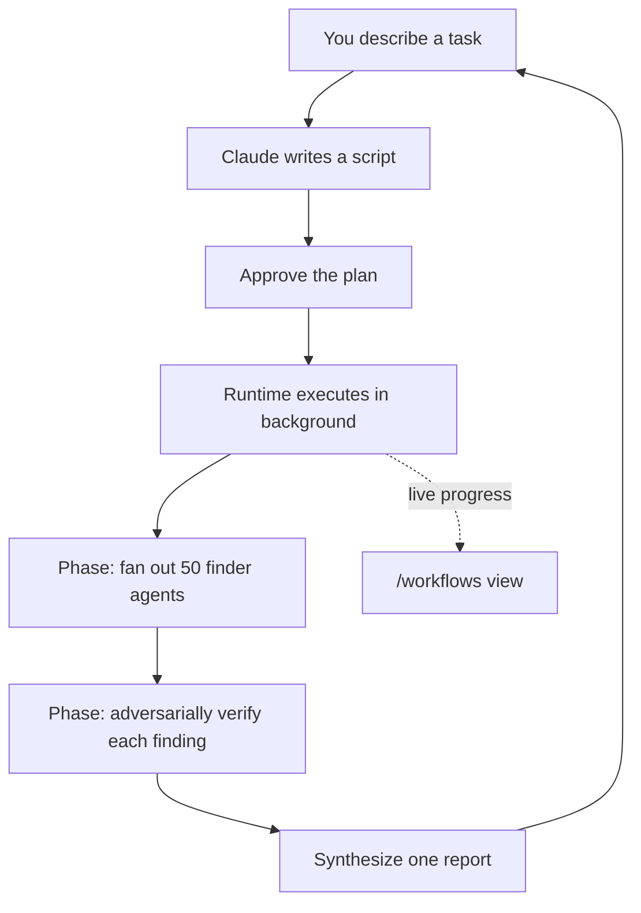

<LevelBadge level="advanced" />

<VerifyNote lastVerified="2026-06-28" source="https://code.claude.com/docs/en/workflows">
动态工作流是一项快速迭代的功能：触发关键词、审批选项、代理上限和可用性会随 Claude Code 版本而变化——请在官方文档中确认具体细节。它们需要 Claude Code v2.1.154+ 和付费方案。
</VerifyNote>

<Callout type="objectives" items={["通过谁掌握计划来区分工作流与子代理、技能和代理团队", "用内置的 /deep-research 命令在 30 秒内见识一个", "用三种方式启动你自己的工作流：ultracode 关键词、/effort ultracode 或已保存的命令", "在按下「是」之前，了解审批提示在保护你免受什么", "用切片和允许清单将成本和无人值守的运行控制住"]} />

**动态工作流**是一段 JavaScript 脚本，用于大规模编排[子代理](/docs/claude-code/subagents)。你描述一个任务；Claude *编写脚本*；运行时在后台执行它，同时你的会话保持可响应。普通的多步骤任务逐回合地存在于 Claude 的上下文窗口中，而工作流则把**计划搬进代码**——循环、分支和每一个中间结果都存放在脚本变量里，所以你的上下文只保留最终答案。

正是这一个转变让工作流能扩展到一次运行中*数十或数百个*代理，而普通的委派最多只能处理少数几个。

## 何时该动用工作流

Claude Code 给你四种运行多步骤工作的方式。真正的问题是**谁掌握计划**：

| | [子代理](/docs/claude-code/subagents) | [技能](/docs/claude-code/skills) | 代理团队 | **工作流** |
| :-- | :-- | :-- | :-- | :-- |
| 它是什么 | Claude 派生的工作者 | Claude 遵循的指令 | 一个负责人监督多个对等会话 | 运行时执行的脚本 |
| 谁决定接下来运行什么 | Claude，逐回合 | Claude，依据提示 | 负责人，逐回合 | **脚本** |
| 结果存放在哪里 | 上下文窗口 | 上下文窗口 | 共享的任务列表 | **脚本变量** |
| 规模 | 每回合少数几个 | 与子代理相同 | 少数几个对等会话 | **数十到数百** |
| 中断时 | 重启该回合 | 重启该回合 | 队友继续运行 | **可在会话内恢复** |

当一个任务需要**比单次对话所能协调的更多代理**时，或者当你希望把编排**编纂成一段可读、可重新运行的脚本**时，请使用工作流。典型场景：

- **全代码库的缺陷排查**——让一个查找器在每个模块上扇出，然后让独立的代理在报告每项发现之前对其进行对抗式核验。
- **500 个文件的迁移**——每个文件一个代理，各自在自己的工作树中，并带有一个验证阶段。
- 一个**研究问题**，其中各个来源必须**彼此交叉核验**，而不仅仅是被汇总。
- 一个值得从多个独立角度起草的**艰难计划**，先彼此权衡再做决定。

最后一点常被低估：工作流可以应用一种*可重复的质量模式*（对抗式评审、多角度起草、多数投票验证），所以你得到的结果比单次处理更可信——而不仅仅是更多代理。



## 见识工作流最快的方式：/deep-research

Claude Code 内置了一个工作流，这样你不必自己编写就能试用这个模型。在任何问题上运行它：

<PromptCard title="用一条命令试用工作流">{`/deep-research What changed in the Node.js permission model between v20 and v22?`}</PromptCard>

它从多个角度扇出网络搜索，抓取并**交叉核验**来源，对每个论断进行投票，并返回一份**带引用的报告，其中未经受住交叉核验的论断会被过滤掉**。在收到提示时批准，然后用 `/workflows` 观察它工作。（它需要 WebSearch 工具可用。）

## 启动你自己工作流的三种方式

**1. 在一条提示中请求。**包含关键词 `ultracode`，或者只用平白的话请求（"use a workflow"、"run a workflow"）。Claude 会为那一个任务编写脚本，而不改变你会话的努力级别：

<PromptCard title="把一个任务作为工作流运行">{`ultracode: audit every API endpoint under src/routes/ for missing auth checks`}</PromptCard>

该关键词会在你的输入中高亮显示。不是这个意思？按 `Option+W`（macOS）或 `Alt+W`（Windows/Linux）取消该提示的高亮。

:::note 关键词历史
在 v2.1.160 之前，字面触发词是 `workflow`；它被重命名为 `ultracode`，这样常用词 "workflow" 就不会触发一次运行。自然语言请求（"run a workflow"）在**两个**版本中都有效。
:::

**2. 让 Claude 自行决定——ultracode 努力级别。**把会话设为 ultracode，Claude 就会为*每个*实质性任务规划一个工作流，自行决定何时有必要使用：

<PromptCard title="为本次会话打开自动编排">{`/effort ultracode`}</PromptCard>

Ultracode 把 `xhigh` 的[推理努力](/docs/api/thinking-and-effort)与自动编排结合起来。单个请求可以变成接连数个工作流——一个用来理解代码，一个用来做出更改，一个用来验证它。此后每个任务都会用更多 token 并耗时更长，所以对于例行工作请用 `/effort high` 退回去。它只在当前会话内有效。

**3. 运行一个已保存或内置的命令。**`/deep-research`，或者你保存过的任何工作流（见下文），都会像任何斜杠命令一样出现在 `/` 自动补全中。

## 在它运行之前批准

工作流可能派生大量代理，所以 CLI 会先把规划好的各阶段展示给你并征求同意：

- **是，运行它**——开始运行
- **是，并且不再为 `[path]` 中的 `[name]` 询问**——开始并在本项目中为该工作流跳过提示
- **查看原始脚本**（`Ctrl+G` 会在你的编辑器中打开它）——在决定前阅读
- **否**——取消（`Tab` 让你先调整提示）

是否会向你提示取决于你的[权限模式](/docs/claude-code/permissions)：**Default / accept-edits** 每次运行都会提示（除非你已为该工作流选择退出）；**Auto** 仅在首次启动时提示；**bypass / `claude -p` / Agent SDK** 从不提示——运行会立即开始。

:::warning 子代理不继承你会话的模式
无论你会话的权限模式是什么，工作流派生的代理始终在 **`acceptEdits`** 中运行，并继承你的[工具允许清单](/docs/claude-code/permissions)——文件编辑会被自动批准。*不在*你允许清单上的 Shell 命令、网络抓取和 MCP 工具仍然可能暂停运行以向你提示。在一次长时间无人值守的运行中，**在开始前把代理需要的命令加入你的允许清单**，这样它就不会停下来等你。参见[加固自主运行](/docs/security/hardening-autonomous-runs)。
:::

## 一次运行如何执行

运行时在一个**隔离环境**中运行脚本，与你的对话分离——中间结果留在脚本变量里，从不触及 Claude 的上下文。脚本本身**没有直接的文件系统或 Shell 访问权限**：*代理*负责读取、写入和运行命令；脚本只负责协调它们。

每次运行都会把它的脚本写入 `~/.claude/projects/` 下你会话目录中的一个文件，Claude 会拿到该路径。所以你可以向 Claude 索要脚本、阅读它编写的编排、把它与之前的运行做差异比较，或者编辑它并让 Claude 从你编辑后的版本重新启动。

运行时强制执行若干上限，使得糟糕的脚本不会失控：

| 约束 | 原因 |
| :-- | :-- |
| 运行中途不接受用户输入（只有代理权限提示会暂停它） | 若需在各阶段之间签字确认，请把每个阶段作为各自的工作流运行 |
| 脚本没有直接的文件系统/Shell 访问权限 | 代理做实际工作；脚本负责协调 |
| 最多 **16 个并发**代理（在低核心数机器上更少） | 限制本地资源使用 |
| 每次运行总计 **1,000 个代理** | 防止失控循环 |

## 观察并管理运行

运行 `/workflows` 来列出正在运行和已完成的运行，然后选择其中一个以打开它的进度视图——每个阶段都带有其代理数量、token 总量和已用时间。深入一个阶段，再深入一个代理，以阅读它的提示、最近的工具调用和结果。关键控制键：

| 按键 | 操作 |
| :-- | :-- |
| `↑` / `↓` | 选择一个阶段或代理 |
| `Enter` / `→` | 深入；`Esc` 退出 |
| `f` | 按状态筛选代理（v2.1.186+） |
| `p` | 暂停或恢复运行 |
| `x` | 停止选中的代理——当焦点在整个运行上时则停止整个运行 |
| `r` | 重启选中的正在运行的代理 |
| `s` | 把本次运行的脚本**保存**为命令 |

在你的输入框下方的任务面板中也会出现一行进度摘要；按下箭头键聚焦它，按 Enter 展开。

**恢复：**停止一次运行并稍后恢复它（`p`）——已经完成的代理返回缓存结果，其余的实时运行。恢复**在同一会话内**有效；在运行中途退出 Claude Code，下一个会话会重新从头开始。

## 保存工作流以便复用

当 Claude 为你将重复进行的某件事编写了一个好的编排时——一个你在每个分支上运行的评审——在 `/workflows` 中按 `s` 来保存该运行的脚本。`Tab` 切换保存位置：

- 你项目中的 `.claude/workflows/`——与克隆该仓库的每个人共享
- 你主目录中的 `~/.claude/workflows/`——在任何地方都可用，只有你能看到

它随后会在未来的会话中作为 `/[name]` 运行。一个已保存的工作流可以通过 `args` 全局变量接收输入，所以你可以在调用时参数化它，而不必编辑脚本：

```text
> Run /triage-issues on issues 1024, 1025, and 1030
```

Claude 把列表作为结构化数据传入，所以脚本直接在 `args` 上调用数组/对象方法。

## 留意成本

工作流会派生许多代理，所以一次运行可能比在对话中做同样的任务用**明显更多的 token**，并且它会计入你方案的用量和速率限制。两个习惯能让这件事保持理智：

- **先切片。**先在一个目录（而不是整个仓库）或一个狭窄的问题上运行，以估算花费；`/workflows` 会实时显示每个代理的 token 用量，而且你可以随时停止而不丢失已完成的工作。
- **为模型选择合适的规格。**除非脚本把某个阶段路由到别处，否则每个代理都使用你会话的模型。在大规模运行前检查 `/model`，并且当你描述任务时，请让 Claude 为**不需要最强模型的阶段使用更小的模型**。参见[成本与延迟](/docs/foundations/cost-and-latency)和[选择模型](/docs/api/choosing-a-model)。

## 常见错误

- **期待运行中途有人在环。**没有运行中途的输入。如果一个任务需要你在各阶段之间签字确认，请把它拆分成单独的工作流。
- **在无人值守的运行中忘记允许清单。**一个长工作流会在某个代理碰到不在允许清单上的 Shell 命令的那一刻停滞。预先授权代理所需的内容。
- **在子代理就够用时却动用工作流。**每回合少数几个委派任务正是[子代理](/docs/claude-code/subagents)的用途。工作流要在*舰队*规模时，或当你想把编排保存为可重新运行的脚本时，才值回它的开销。
- **整个会话都用 ultracode 努力级别来做例行编辑。**它会为一切规划一个工作流——对艰难的工作很棒，但对一行小修改却是浪费。退回到 `/effort high`。

<Quiz title="自我检查" questions={[{q: "工作流与子代理、技能或代理团队之间的决定性区别是什么？", options: ["工作流可以派生代理；其他的不能", "计划存在于运行时执行的脚本里，而不是逐回合存在于 Claude 的上下文中", "工作流是唯一在后台运行的"], answer: 1, explain: "四者都能运行多步骤工作。在工作流中，循环、分支和中间结果都存放在脚本变量里——Claude 的上下文只保留最终答案——这正是让它能扩展到数十或数百个代理的原因。"}, {q: "你运行一个长时间无人值守的工作流，代理需要一个不在你允许清单上的 Shell 命令。会发生什么？", options: ["代理会自动批准它，因为它们在 acceptEdits 中运行", "运行会停滞，等待你的批准", "运行会跳过该命令并继续"], answer: 1, explain: "工作流代理在 acceptEdits 中运行，所以文件编辑会被自动批准，但不在你允许清单上的 Shell 命令、网络抓取和 MCP 工具仍会暂停运行以向你提示。在无人值守的运行前预先授权代理所需的内容。"}, {q: "在投入之前，估算一个大型工作流将花费多少的最便宜方式是哪个？", options: ["先阅读已保存的脚本", "在一个狭窄的切片上运行它——一个目录或一个问题——并在 /workflows 中观察每个代理的 token", "把整个会话切换到一个更小的模型"], answer: 1, explain: "先切片：在一个目录或一个狭窄的问题上运行，在 /workflows 中观察实时的每个代理 token 用量，并随时停止而不丢失已完成的工作。"}]} />

<Callout type="takeaways" items={["工作流把计划搬进代码——脚本掌握循环和中间结果，所以运行能扩展到数十或数百个代理。", "用 /deep-research 立刻试一个；用 ultracode 关键词、/effort ultracode 或一个已保存的 /command 启动你自己的。", "审批提示存在是因为一次运行可能派生许多代理——Default 和 accept-edits 每次运行都提示；Auto 提示一次；bypass 和无头模式从不提示。", "派生的代理在 acceptEdits 中以你的允许清单运行，所以在无人值守的运行前预先授权它们所需的命令。", "工作流的 token 成本明显更高——先切片，为每个阶段选择合适规格的模型，并把 ultracode 努力级别退回到 /effort high 以处理例行编辑。"]} />

## 关闭工作流

在 `/config` 中把**动态工作流**关闭，在 `~/.claude/settings.json` 中设置 `"disableWorkflows": true`，或者设置 `CLAUDE_CODE_DISABLE_WORKFLOWS=1` 环境变量。组织可以在[受管设置](/docs/claude-code/settings)中禁用它们。关闭后，内置的工作流命令会消失，`ultracode` 不再触发运行，也不再出现在 `/effort` 菜单中。

## 下一步

- [子代理与并行代理](/docs/claude-code/subagents)——工作流所编排的工作者原语
- [设计一个多子代理工作流（演练）](/docs/walkthroughs/multi-subagent-workflow)
- [长时间运行的代理框架](/docs/frontiers/long-running-agent-harnesses)——持久多代理运行背后的设计原则
- [加固自主运行](/docs/security/hardening-autonomous-runs)
