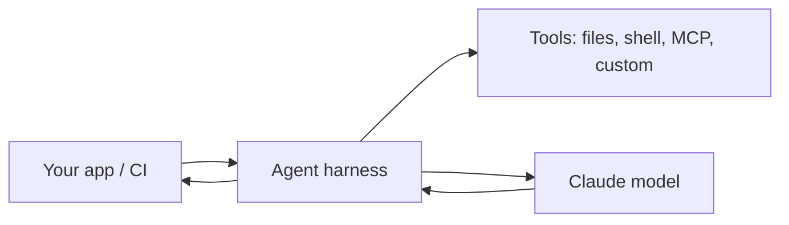

<LevelBadge level="advanced" />

<VerifyNote lastVerified="2026-06-20" source="https://docs.anthropic.com/en/docs/claude-code/sdk">
SDK 名称、包名和无头模式标志会演进——请以官方的 Claude Agent SDK / Claude Code 文档为准。
</VerifyNote>

Claude Code 不只是交互式的。你可以**无头**运行它（非交互、可脚本化），还可以用 **Agent SDK** 在同一套底层底座上构建**你自己的智能体**。

## 无头模式

非交互地运行单条提示并捕获输出——非常适合脚本、提交前钩子和 CI：

```bash
claude -p "Review the staged diff and list any bugs as a Markdown checklist"
```

把输入用管道传入，把结果取出。配合设置为安全、非交互姿态的[权限](/docs/claude-code/permissions)，使它永不挂起等待批准——并且**锁紧它**，让自动化运行无法触碰密钥（见[加固自主运行](/docs/security/hardening-autonomous-runs)）。

一个经典用法：一个让 Claude 审查每个拉取请求的 CI 作业——见 [PR 审查实战演练](/docs/walkthroughs/pr-review-action)。

## Agent SDK

**Claude Agent SDK**（Python 和 TypeScript）让你在驱动 Claude Code 的同一个循环之上构建生产级智能体——工具使用、文件/shell 访问、权限、上下文管理——只不过接入到了*你自己的*应用里。



当你已经超出了单次 API 调用或手写循环的承载力，想要一个开箱即用的智能体运行时时，就该用它。关于各种选项的谱系——单次调用 → 工作流 → 自定义智能体 → 受管——见[在 API 上构建智能体](/docs/api/building-agents)。

## 无头/SDK vs 交互式

| 模式 | 适用于 |
|---|---|
| 交互式 Claude Code | 有人参与回路的日常开发 |
| 无头（`claude -p`） | 脚本、提交前、CI 一次性任务 |
| Agent SDK | 嵌入到你软件中的生产级智能体 |

## 下一步

- [审查每个 PR 的 GitHub Action（实战演练）](/docs/walkthroughs/pr-review-action)
- [在 API 上构建智能体](/docs/api/building-agents)
- [加固自主运行](/docs/security/hardening-autonomous-runs)
