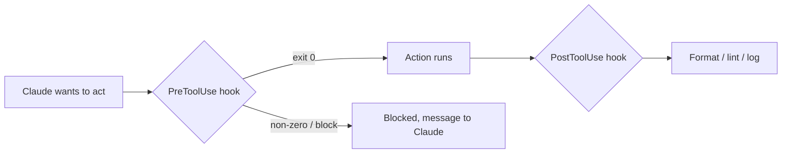

<LevelBadge level="advanced" />

<VerifyNote lastVerified="2026-06-23" source="https://code.claude.com/docs/en/hooks">
确切的钩子事件名称、stdin 负载以及拦截协议会演进——在依赖某个具体事件或字段之前，请对照官方钩子文档确认。
</VerifyNote>

钩子是 **Claude Code 在其生命周期的指定节点自动运行的 shell 命令**。[权限](/docs/claude-code/permissions)决定某个操作*是否*被允许，而钩子让*你*在其前后运行确定性逻辑——格式化、校验、日志、关卡。它们是把行为从“请记得做”变成必然发生的方式。

## 何时该用钩子

- 每次文件编辑后**自动格式化 / lint**（`PostToolUse`）。
- 在某个违规操作运行*之前***拦截**它（`PreToolUse`）。
- 会话结束或任务完成时**通知或记录**（`Stop`）。
- 在会话开始时**注入上下文**。

## 它们如何工作

你在 [`settings.json`](/docs/claude-code/settings) 里注册钩子，匹配一个**事件**（通常还配上一个工具匹配器）。当事件触发时，Claude 运行你的命令，并在 **stdin 上传入一个 JSON 负载**（工具名、它的输入、会话）。你命令的退出码和输出决定接下来发生什么。

```json
{
  "hooks": {
    "PostToolUse": [
      {
        "matcher": "Edit|Write",
        "hooks": [
          { "type": "command", "command": "jq -r '.tool_input.file_path' | xargs npx prettier --write" }
        ]
      }
    ]
  }
}
```

上面这个钩子从 stdin 的 JSON 里读出被编辑文件的路径（`.tool_input.file_path`）并对其格式化。不要假设某个环境变量持有该路径——**从 stdin 读取它。** 像 `${CLAUDE_PROJECT_DIR}` 这样有用的路径占位符*是*可用的，用于定位脚本。

## 钩子如何拦截

有两种方式，取决于事件：

- **退出码 2** — 钩子让该操作失败，它写到 **stderr** 的任何内容会成为 Claude 看到的消息。简单，且对命令钩子有效。
- **stdout 上的 JSON（退出 0）** — 返回一个结构化决策。对 `PreToolUse` 来说，那是一个值为 `deny` 的 `permissionDecision`；对 `PostToolUse`/`Stop`/等等来说，它是 `{"decision": "block", "reason": "…"}`。

```bash
#!/usr/bin/env bash
# PreToolUse hook on the Bash tool: refuse to delete things.
command=$(jq -r '.tool_input.command' < /dev/stdin)
if [[ "$command" == rm\ * || "$command" == *"rm -rf"* ]]; then
  echo "Blocked: destructive 'rm' is not allowed by policy." >&2
  exit 2
fi
exit 0
```

## 心智模型



## 良好实践

- **让钩子又快又幂等**——它们会频繁运行。
- **对真正的问题大声报错**，但不要因为表面问题就拦截。
- **把钩子输出当作给 Claude 的反馈**——一条清晰的消息能帮它自我纠正。
- 钩子以你 shell 的权限运行——对任何不是你自己写的钩子都要审查（[审查第三方代码](/docs/security/reviewing-third-party-code)）。

## 常见错误

- **从环境变量读取文件路径。** 路径在 stdin 的 JSON 里（`.tool_input.file_path`），而不在 `$CLAUDE_FILE_PATH`。把 stdin 通过 `jq` 管道传入。
- **静默拦截。** 如果一个 `PreToolUse` 钩子以退出码 2 退出却在 stderr 上什么都没写，Claude 被拦住了却不知道*为什么*，也无法适应。永远写一个清晰的理由。
- **慢钩子。** 一个 `PostToolUse` 钩子在*每一次*匹配的编辑后都会运行。一个 3 秒的 linter 会让整个会话感觉迟钝——保持钩子快速，且最好只对发生变化的内容动作。
- **过于宽泛的匹配器。** `matcher: ".*"` 会在每个工具上触发。用一个精确的名字、一个 `Edit|Write` 列表，或每个处理器的 `if` 字段（例如 `"if": "Bash(git push *)"`）来收窄。
- **信任不是你自己写的钩子。** 一个钩子会以你的权限运行任意 shell。先审查任何来自插件或模板的钩子——见[审查第三方代码](/docs/security/reviewing-third-party-code)。

可复制粘贴的起始模板见[钩子与 settings.json 配方](/docs/templates/hooks-settings)。

## 下一步

- [settings.json](/docs/claude-code/settings) · [权限](/docs/claude-code/permissions)
- [技能](/docs/claude-code/skills)——专长与自动化的区别
- [加固自主运行](/docs/security/hardening-autonomous-runs)
