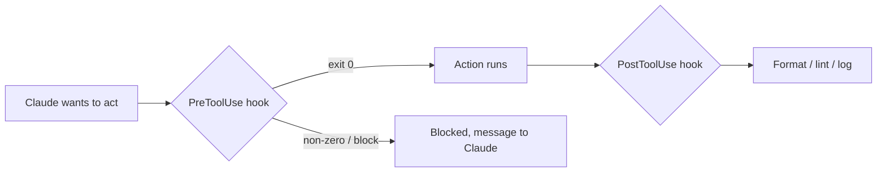

<LevelBadge level="advanced" />

<VerifyNote lastVerified="2026-06-20" source="https://code.claude.com/docs/en/hooks">
确切的钩子事件名称和配置结构会演进——在依赖某个具体事件之前，请对照官方钩子文档确认。
</VerifyNote>

钩子是 **Claude Code 在其生命周期的指定节点自动运行的 shell 命令**。[权限](/docs/claude-code/permissions)决定某个操作*是否*被允许，而钩子让*你*在操作前后运行确定性逻辑——格式化、校验、日志、关卡。它们是把行为从"请记得做"变成"必然发生"的方式。

## 何时该用钩子

- 每次文件编辑后**自动格式化 / lint**（`PostToolUse`）。
- 在某个违规操作运行*之前***拦截**它（`PreToolUse`）。
- 会话结束或任务完成时**通知或记录**（`Stop`）。
- 在会话开始时**注入上下文**。

## 它们如何工作

你在 [`settings.json`](/docs/claude-code/settings) 里注册钩子，匹配一个**事件**（通常还配上一个工具匹配器）。当事件触发时，Claude 运行你的命令并读取其结果——非零退出码或特定输出可以**拦截**该操作，并把一条消息反馈给 Claude。

```json
{
  "hooks": {
    "PostToolUse": [
      {
        "matcher": "Edit|Write",
        "hooks": [
          { "type": "command", "command": "npx prettier --write \"$CLAUDE_FILE_PATH\"" }
        ]
      }
    ]
  }
}
```

钩子通过环境变量/stdin 接收上下文（例如文件路径、工具名）——确切的负载因事件而异，详见文档。

## 心智模型



## 良好实践

- **让钩子又快又幂等**——它们会频繁运行。
- **对真正的问题大声报错**，但不要因为表面问题就拦截。
- **把钩子输出当作给 Claude 的反馈**——一条清晰的消息能帮它自我纠正。
- 钩子以你 shell 的权限运行——对任何不是你自己写的钩子都要审查（[审查第三方代码](/docs/security/reviewing-third-party-code)）。

可复制粘贴的起始模板见[钩子与 settings.json 配方](/docs/templates/hooks-settings)。

## 下一步

- [settings.json](/docs/claude-code/settings) · [权限](/docs/claude-code/permissions)
- [技能](/docs/claude-code/skills)——专长与自动化的区别
- [加固自主运行](/docs/security/hardening-autonomous-runs)
