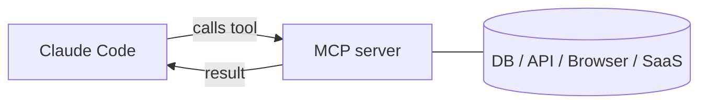

<LevelBadge level="advanced" />

<VerifyNote lastVerified="2026-06-23" source="https://code.claude.com/docs/en/mcp">
`claude mcp` 命令、配置作用域以及传输方式会演进——请以 Claude Code 官方 MCP 文档以及 modelcontextprotocol.io 为准。
</VerifyNote>

**模型上下文协议（MCP）**是一个把 AI 连接到外部工具和数据的开放标准。一个 **MCP 服务器**暴露各种能力（查询数据库、打开一个 GitHub PR、驱动浏览器）；Claude Code 连接到它，就能在会话中**调用那些工具**。这就是你把 Claude 扩展到文件系统和 shell 之外的方式。

## 它的大致形态



你声明 Claude 可以使用哪些服务器；每个服务器发布一组带 schema 的工具；Claude 像挑选和调用任何其他工具一样挑选并调用它们。

## 传输方式

- **stdio**——一个由 Claude 启动的本地进程（非常适合本地工具/CLI）。
- **远程（HTTP/SSE）**——一个托管的服务器，通常带 OAuth。

## 配置服务器

最快的途径是 `claude mcp add` 命令——它会替你写好配置：

```bash
# A local stdio server (everything after -- is the launch command)
claude mcp add github -- npx -y @modelcontextprotocol/server-github

# A remote HTTP server, shared with everyone on the project
claude mcp add --transport http --scope project linear https://mcp.linear.app/mcp
```

在底层这其实就是 JSON。一个 **project** 作用域的服务器落在仓库根目录的 `.mcp.json` 里——把它提交进去，你的整个团队就得到同一套工具：

```json
{
  "mcpServers": {
    "github": { "command": "npx", "args": ["-y", "@modelcontextprotocol/server-github"] }
  }
}
```

**作用域决定谁能看到这个服务器：**

| 作用域 | 存放于 | 用于 |
|---|---|---|
| `local`（默认） | 你的用户设置，仅限本项目 | 个人试验、机密信息 |
| `project` | 仓库中的 `.mcp.json`（已提交） | 整个团队都该共享的工具 |
| `user` | 你的用户设置，所有项目 | 你想到处都用的服务器 |

运行 `claude mcp list` 查看已连接的内容，在会话内运行 `/mcp` 来检视工具并对远程服务器进行认证。可复制粘贴的起始模板见 [MCP 配置与服务器脚手架](/docs/templates/mcp-config)。

## 实战示例：把你的数据库交给 Claude

假设你想让 Claude 针对一个本地 Postgres 回答问题，而不是你去粘贴查询结果。添加这个服务器（project 作用域，这样队友也能继承）：

```bash
claude mcp add --scope project db -- npx -y @modelcontextprotocol/server-postgres "postgresql://localhost/app"
```

现在在会话里你可以问：*“How many users signed up last week? Check the DB.”* Claude 调用该服务器的 `query` 工具，拿回数据行，然后作答——没有复制粘贴的循环。因为它是 project 作用域的，一个拉取了仓库的队友在打开 Claude Code 的那一刻就获得了同样的能力。如果你只想要读，就让连接字符串保持只读。

## 信任与安全

:::warning 把 MCP 服务器当作安装软件来对待
一个 MCP 服务器会运行代码，能读取数据并采取行动。只连接你信任的服务器，给它们所需的**最小权限**，并记住它们返回的任何外部内容都可能携带[提示注入](/docs/security/prompt-injection)。先审查第三方服务器——见[审查第三方代码](/docs/security/reviewing-third-party-code)。
:::

## 应用里也有 MCP

MCP 同样为 Claude 应用里的**连接器（Connectors）**提供动力——同一个标准，不同的载体。见[应用中的连接器（MCP）](/docs/claude-app/connectors)，至于 API 部分，见 [MCP 与连接工具](/docs/api/mcp)。

## 常见错误

- **作用域错了。** 一个以 `local` 作用域添加的服务器不会对队友出现；一个你只想自己用的，不该以 `project` 作用域提交。要有意识地选择。
- **服务器太多、工具太多。** 每个连接的服务器都会把它的工具 schema 加进上下文。连接任务所需的，而非你的整份目录。
- **权限过高的连接。** 给数据库服务器一个只读角色，除非 Claude 确实需要写。MCP 把能力变成现实——把它们的范围收窄。
- **忘了注入风险。** 服务器返回的任何东西（一个网页、一个 issue 正文、一行数据）都是不可信文本，可能携带[提示注入](/docs/security/prompt-injection)。不要在没有想清楚的情况下，把一个强大的、能写的服务器接在一个不可信的、能读的服务器旁边。

## 下一步

- [构建并接入你的第一个 MCP 服务器（实战演练）](/docs/walkthroughs/first-mcp-server)
- [MCP 配置与服务器脚手架](/docs/templates/mcp-config)
- [保护智能体与工具](/docs/security/securing-agents)
