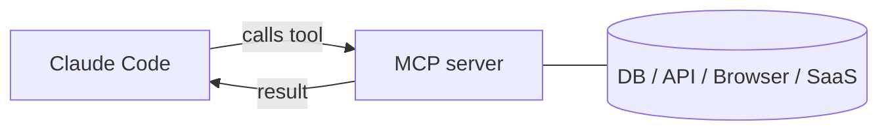

<LevelBadge level="advanced" />

<VerifyNote lastVerified="2026-06-20" source="https://docs.anthropic.com/en/docs/claude-code/mcp">
MCP 的配置语法、作用域和传输方式会演进——请以 Claude Code 官方 MCP 文档以及 modelcontextprotocol.io 为准。
</VerifyNote>

**模型上下文协议（MCP）**是一个把 AI 连接到外部工具和数据的开放标准。一个 **MCP 服务器**暴露各种能力（查询数据库、打开一个 GitHub PR、驱动浏览器）；Claude Code 连接到它，就能在会话中**调用那些工具**。这就是你把 Claude 扩展到文件系统和 shell 之外的方式。

## 它的大致形态



你声明 Claude 可以使用哪些服务器；每个服务器发布一组带 schema 的工具；Claude 像挑选和调用任何其他工具一样挑选并调用它们。

## 传输方式

- **stdio**——一个由 Claude 启动的本地进程（非常适合本地工具/CLI）。
- **远程（HTTP/SSE）**——一个托管的服务器，通常带 OAuth。

## 配置服务器

服务器通过命令/URL 及任何认证信息来配置（通常在 `.mcp.json` 中和/或通过设置）。作用域控制一个服务器在哪里可用（仅你自己，还是与项目共享）。可复制粘贴的起始模板见 [MCP 配置与服务器脚手架](/docs/templates/mcp-config)。

```json
{
  "mcpServers": {
    "github": { "command": "npx", "args": ["-y", "@modelcontextprotocol/server-github"] }
  }
}
```

## 信任与安全

:::warning 把 MCP 服务器当作安装软件来对待
一个 MCP 服务器会运行代码，能读取数据并采取行动。只连接你信任的服务器，给它们所需的**最小权限**，并记住它们返回的任何外部内容都可能携带[提示注入](/docs/security/prompt-injection)。先审查第三方服务器——见[审查第三方代码](/docs/security/reviewing-third-party-code)。
:::

## 应用里也有 MCP

MCP 同样为 Claude 应用里的**连接器（Connectors）**提供动力——同一个标准，不同的载体。见[应用中的连接器（MCP）](/docs/claude-app/connectors)，至于 API 部分，见 [MCP 与连接工具](/docs/api/mcp)。

## 下一步

- [构建并接入你的第一个 MCP 服务器（实战演练）](/docs/walkthroughs/first-mcp-server)
- [MCP 配置与服务器脚手架](/docs/templates/mcp-config)
- [保护智能体与工具](/docs/security/securing-agents)
