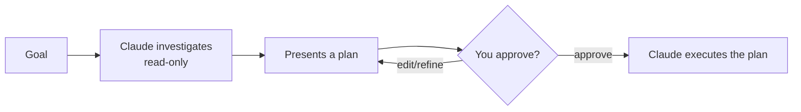

<LevelBadge level="beginner" />

<VerifyNote lastVerified="2026-06-20" source="https://docs.anthropic.com/en/docs/claude-code">
进入规划模式的方式（快捷键/标志）在不同版本间可能变化——请查阅 Claude Code 官方文档。
</VerifyNote>

**规划模式**让 Claude Code 变为**只读**：它可以浏览你的代码库、运行搜索、进行推理——但它**不会编辑文件或运行改变状态的命令**。相反，它产出一份方案并等待你的批准。

## 为什么它是最安全的起步方式

对于任何大型、有风险或不熟悉的事情，你都会想在 Claude 触碰你的仓库之前看清它*打算*做什么。规划模式把**思考**和**动手**分开：

你能在错误的假设变成错误的代码*之前*就抓住它们。

## 何时使用

- 对于大型或跨多文件的改动、迁移或重构，**总是**使用。
- 当你在一个尚未完全熟悉的代码库里工作时。
- 当你想要一份可审阅的方案，与队友分享时。

对于细小、显而易见的编辑，你可以跳过它——但拿不准时，先规划。

## 实践中如何工作

1. 进入规划模式并陈述你的目标。
2. Claude 读取相关文件并提出澄清问题。
3. 它返回一份逐步方案：要改哪些文件、采用什么方法、以及如何验证。
4. 你批准（或要求改进）。只有到那时它才切换到进行改动。

:::tip 与 CLAUDE.md 搭配
一份好的 [CLAUDE.md](/docs/claude-code/claude-md) 能让方案更精准——Claude 在规划时就已把你的约定和护栏考虑在内。
:::

## 规划模式 vs 权限

它们解决不同的问题，且协同工作：

- **规划模式** = "先调查并提方案，暂不动手。"（本页内容。）
- **[权限](/docs/claude-code/permissions)** = 一旦动手，*哪些*操作可以不经询问就执行。

## 下一步

- [权限与权限模式](/docs/claude-code/permissions)
- [上下文管理](/docs/claude-code/context-management)——让长会话保持高效
- [实战演练：为真实仓库定制 Claude Code](/docs/walkthroughs/customize-claude-code)
