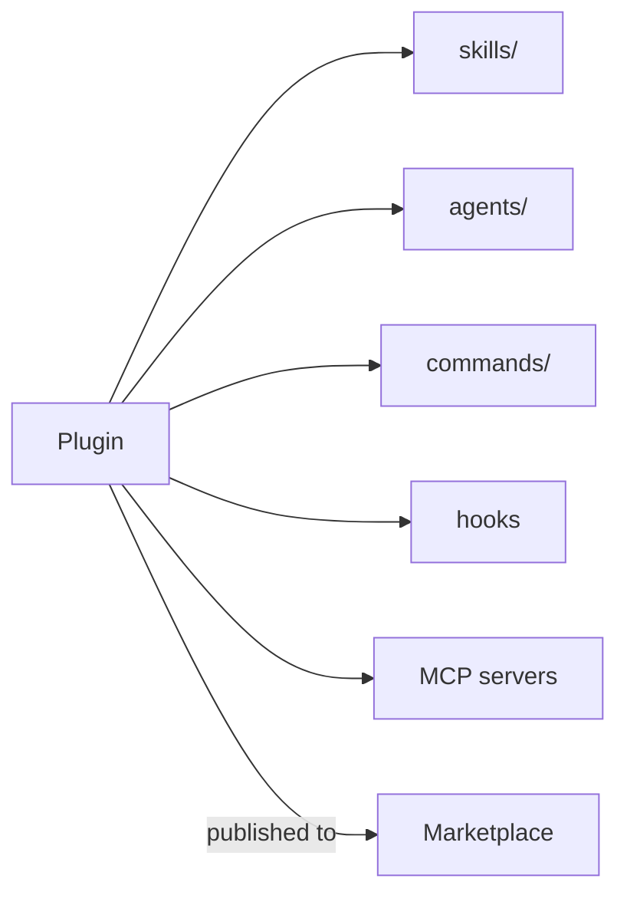

<LevelBadge level="advanced" />

<VerifyNote lastVerified="2026-06-20" source="https://docs.anthropic.com/en/docs/claude-code">
插件结构和市场机制演进很快——具体细节请以 Claude Code 官方文档为准。
</VerifyNote>

一个**插件**把若干定制项——[技能](/docs/claude-code/skills)、[子智能体](/docs/claude-code/subagents)、[斜杠命令](/docs/claude-code/slash-commands)、[钩子](/docs/claude-code/hooks)和 [MCP 服务器](/docs/claude-code/mcp)——打包成一个单一、带版本、可安装的单元。一个**市场**则是供人们发现并安装插件的目录。

## 为什么插件很重要

- **一步即可分发团队工具集。** 与其让每个人都去复制五个文件，不如发布一个插件；队友安装后即可获得相同的命令、钩子、智能体和 MCP 连接。
- **版本管理。** 更新插件，所有人都能拉取到新版本。
- **分发。** 市场让你（或他人）的工具集变得易于被发现。

## 里面通常有什么

插件是一个结构化的文件夹（一份清单加上它所附带的各个部件）。最少时它可以只装载技能；最多时则包含上面提到的全套内容。让每个插件保持**内聚**——比如一个"团队约定"插件、一个"Python 工具集"插件——而不是大杂烩。

## 安装前先信任

:::warning 插件可能附带可执行代码
插件里的钩子和 MCP 服务器会以你的权限运行。请只从你信任的来源安装，并先审查插件的行为——见[审查第三方代码](/docs/security/reviewing-third-party-code)。
:::

## 扩展你的配置之路

自然的演进路径：一份 `CLAUDE.md` → 几个[技能](/docs/claude-code/skills)和[命令](/docs/claude-code/slash-commands) → 把它们打包成插件 → 发布到市场，供你的团队或社区使用。最后这一步正是 AILmanac 希望助力生态成长的方式之一。

## 下一步

- [技能](/docs/claude-code/skills) · [子智能体](/docs/claude-code/subagents) · [MCP](/docs/claude-code/mcp)
- [审查第三方代码](/docs/security/reviewing-third-party-code)
- AILmanac 的[技能包](/docs/templates/skills)
