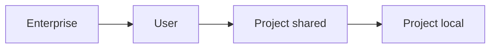

<LevelBadge level="intermediate" />

<VerifyNote lastVerified="2026-06-20" source="https://docs.anthropic.com/en/docs/claude-code/settings">
确切的键名和文件位置最好以 Claude Code 官方 settings 文档为准。
</VerifyNote>

`settings.json` 是 Claude Code 配置的所在之处——[权限](/docs/claude-code/permissions)、[钩子](/docs/claude-code/hooks)、环境变量、模型默认值等等。理解**层级**是关键。

## 层级（从最全局 → 最具体）

更靠后（更具体）的层级会覆盖更靠前的：

1. **企业 / 受管**——由组织管理员设定的策略。压倒一切。
2. **用户**——`~/.claude/settings.json`。你跨所有项目的默认值。
3. **项目（共享）**——`.claude/settings.json`，提交到仓库。全团队生效。
4. **项目（个人）**——`.claude/settings.local.json`，被 git 忽略。你对这个仓库的覆盖项。

:::tip 提交共享文件，忽略本地文件
把团队约定放进 `.claude/settings.json`（提交）。把个人微调和机器特定路径放进 `.claude/settings.local.json`（被 git 忽略）。这样既能保持团队一致，又不会把你的偏好强加于人。
:::

## 你通常会设置什么

- **`permissions`**——allow/ask/deny 规则。见[权限](/docs/claude-code/permissions)。
- **`hooks`**——在生命周期事件运行的命令。见[钩子](/docs/claude-code/hooks)。
- **`env`**——会话的环境变量。
- **模型 / 行为默认值**——例如首选模型。

## 安全地编辑

- 保持有效的 JSON（一个多余的逗号就会破坏它）。
- 优先使用**窄范围**的权限规则，而非宽泛的。
- 绝不要把密钥放进已提交的文件——改用 `env` 引用或密钥管理器。

可直接复制的起始文件见[钩子与 settings.json 配方](/docs/templates/hooks-settings)。

## 下一步

- [权限与权限模式](/docs/claude-code/permissions)
- [钩子：确定性自动化](/docs/claude-code/hooks)
- [自定义斜杠命令](/docs/claude-code/slash-commands)
