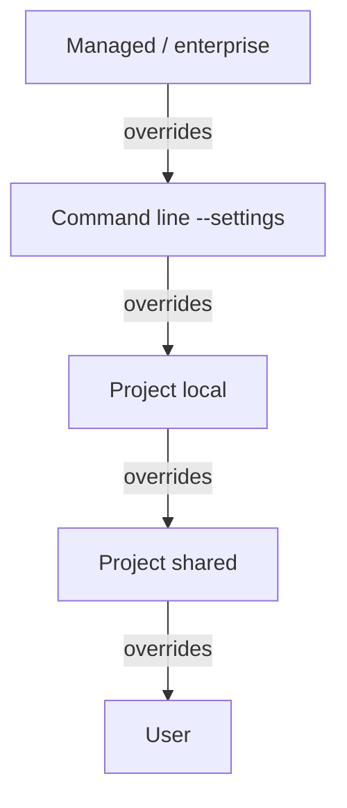

<LevelBadge level="intermediate" />

<VerifyNote lastVerified="2026-09-23" source="https://code.claude.com/docs/en/settings">
五级优先级栈（受管 → 命令行 → 项目本地 → 项目共享 → 用户）以及“环境变量不是一个层级”的规则，来自官方页面 [Settings files and precedence](https://code.claude.com/docs/en/settings)。按键的覆盖规则列在[设置参考](https://code.claude.com/docs/en/settings-reference)中。
</VerifyNote>

`settings.json` 是 Claude Code 配置的所在之处——[权限](/docs/claude-code/permissions)、[钩子](/docs/claude-code/hooks)、环境变量、模型默认值等等。理解**层级**是关键。

## 层级（优先级从高到低）

当同一个键在多个位置被设置时，Claude Code 使用设置了它的最高层级的值:

1. **受管 / 企业** — `managed-settings.json`、MDM 策略，或来自 claude.ai 控制台的服务器托管设置。除少数安全敏感的例外情况外，你设置的任何内容都无法覆盖它们。
2. **命令行** — `claude --settings '<json-or-path>'`，仅对单次会话生效。位于除受管之外的所有文件之上，且不写入任何文件。
3. **项目（个人）** — `.claude/settings.local.json`，被 git 忽略。你对这个仓库的覆盖设置。
4. **项目（共享）** — `.claude/settings.json`，提交到仓库。面向整个团队。
5. **用户** — `~/.claude/settings.json`。你在所有项目中的默认值。

```mermaid
flowchart TB
  M[Managed / enterprise] -->|overrides| C[Command line --settings]
  C -->|overrides| L[Project local]
  L -->|overrides| P[Project shared]
  P -->|overrides| U[User]
```

:::note 环境变量不是一个层级
它们位于这个栈之外，按键逐个解析。例如 `ANTHROPIC_MODEL` 优先于任何文件中的 `model` 键，而 `ANTHROPIC_DEFAULT_MODEL` 仅在没有任何文件设置 `model` 时才生效。
:::

:::tip 提交共享文件，忽略本地文件
把团队约定放进 `.claude/settings.json`（提交）。把个人微调和机器特定路径放进 `.claude/settings.local.json`（被 git 忽略）。这样既能保持团队一致，又不会把你的偏好强加于人。
:::

## 你通常会设置什么

- **`permissions`**——allow/ask/deny 规则。见[权限](/docs/claude-code/permissions)。
- **`hooks`**——在生命周期事件运行的命令。见[钩子](/docs/claude-code/hooks)。
- **`env`**——会话的环境变量。
- **模型 / 行为默认值**——例如首选模型。

## 安全地编辑

- 保持有效的 JSON（一个多余的逗号就会破坏它）。
- 优先使用**窄范围**的权限规则，而非宽泛的。
- 绝不要把密钥放进已提交的文件——改用 `env` 引用或密钥管理器。

可直接复制的起始文件见[钩子与 settings.json 配方](/docs/templates/hooks-settings)。

## 下一步

- [权限与权限模式](/docs/claude-code/permissions)
- [钩子：确定性自动化](/docs/claude-code/hooks)
- [自定义斜杠命令](/docs/claude-code/slash-commands)
