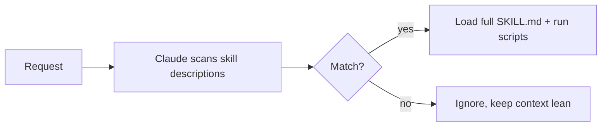

<LevelBadge level="advanced" />

<VerifyNote lastVerified="2026-06-20" source="https://docs.anthropic.com/en/docs/claude-code/skills">
技能文件的布局以及技能在哪里运行（Claude Code、Claude.ai、Cowork）都在演进——请以官方技能文档为准。
</VerifyNote>

一个**技能**打包了专长——指令外加可选的脚本和资源——Claude **仅在相关时**才加载它。与其把一切都塞进 [CLAUDE.md](/docs/claude-code/claude-md)，不如给 Claude 一个能力库，让它按需取用。

## 结构剖析

一个技能是一个含有 `SKILL.md` 的文件夹：YAML 前置元数据 + 指令。

```markdown
---
name: pdf-forms
description: Use when the user needs to fill, read, or generate PDF forms.
---

# PDF Forms
Steps and rules for working with PDF forms…
(optionally reference scripts/ or resources/ in this folder)
```

**`description` 就是触发器**——Claude 读取它来决定*何时*激活该技能。把它写成"Use when……"，具体到既能在恰当的时机加载、又不会在别的时候误触发。

## 渐进式披露（技能为何可扩展）

Claude 不会一开始就加载每个技能的完整正文——它看到的是轻量的 `name` + `description`，只有当请求匹配时才拉入完整指令（并运行脚本）。这让上下文即便在安装了很多技能时也能保持精简。



## 它们存放在哪里

- 个人：`~/.claude/skills/<name>/SKILL.md`
- 项目（可共享）：`.claude/skills/<name>/SKILL.md`
- 打包进一个[插件](/docs/claude-code/plugins-marketplaces)以供团队分发。

AILmanac 提供了 [7 个现成的技能包](/docs/templates/skills)——拷贝一个进来试试。

## 技能 vs 命令 vs 子智能体 vs MCP

| 工具 | 它是什么 | 由你还是 Claude 触发 |
|---|---|---|
| [斜杠命令](/docs/claude-code/slash-commands) | 一段保存好的提示 | **你**调用它 |
| **技能** | 按需的专长 + 脚本 | **Claude** 在相关时加载它 |
| [子智能体](/docs/claude-code/subagents) | 一个拥有自身上下文的受委派智能体 | Claude 委派 |
| [MCP](/docs/claude-code/mcp) | 到外部工具/数据的连接 | 提供可调用的工具 |

## 下一步

- [编写你的第一个技能（实战演练）](/docs/walkthroughs/first-skill)
- [SKILL.md 模板](/docs/templates/skills)
- [插件与市场](/docs/claude-code/plugins-marketplaces)
